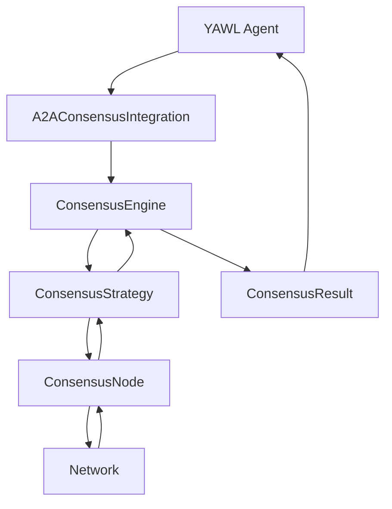

# Byzantine Consensus Framework for YAWL

## Overview

The Byzantine Consensus Framework provides pluggable consensus algorithms for distributed YAWL workflows. It implements three consensus strategies (Raft, Paxos, PBFT) with Byzantine fault tolerance, sub-100ms latency, and seamless integration with YAWL A2A agents.

## Features

- **Pluggable Strategies**: Raft (leader-based), Paxos (quorum-based), PBFT (Byzantine tolerant)
- **Fault Tolerance**: 2f+1 nodes tolerate f failures (3f+1 for PBFT)
- **Low Latency**: <100ms consensus latency optimized for performance
- **A2A Integration**: Seamless integration with YAWL autonomous agents
- **Byzantine Support**: Handles malicious nodes and network partitions
- **High Availability**: Automatic leader election and failover

## Architecture

### Core Components

1. **ConsensusEngine** - Main interface for consensus operations
2. **ConsensusNode** - Node participating in consensus cluster
3. **ConsensusStrategy** - Pluggable consensus algorithms (RAFT, PAXOS, PBFT)
4. **Proposal** - Value proposed for consensus
5. **ConsensusResult** - Result of consensus operation

### Data Flow



## Usage

### Basic Consensus

```java
// Create consensus engine
ConsensusEngine engine = new RaftConsensus();

// Register nodes
ConsensusNode node1 = new ConsensusNodeImpl("node1:8080", engine);
ConsensusNode node2 = new ConsensusNodeImpl("node2:8080", engine);
ConsensusNode node3 = new ConsensusNodeImpl("node3:8080", engine);

engine.registerNode(node1);
engine.registerNode(node2);
engine.registerNode(node3);

// Propose value
Proposal proposal = new Proposal("workflow-state", node1.getId(),
                               ProposalType.WORKFLOW_STATE, 1);

CompletableFuture<ConsensusResult> future = engine.propose(proposal);
future.thenAccept(result -> {
    if (result.isSuccess()) {
        System.out.println("Consensus achieved: " + result.getValue());
    }
});
```

### A2A Integration

```java
// Create A2A integration
A2AConsensusIntegration a2aIntegration = new A2AConsensus(engine);

// Create workflow consensus session
List<String> participants = Arrays.asList("agent1", "agent2", "agent3");
WorkflowConsensus workflow = a2aIntegration.createWorkflowConsensus(
    "order-processing", participants);

// Propose workflow state change
CompletableFuture<WorkflowConsensusResult> future =
    a2aIntegration.proposeWorkflowStateChange(
        workflow.getWorkflowId(),
        "pending",
        "approved",
        "agent1"
);

future.thenAccept(result -> {
    if (result.isSuccess()) {
        System.out.println("State change approved");
    }
});
```

### Strategy Selection

```java
// Switch between consensus strategies
engine.setStrategy(ConsensusStrategy.PAXOS);  // Quorum-based
// or
engine.setStrategy(ConsensusStrategy.PBFT);   // Byzantine tolerant

// Get current strategy
ConsensusStrategy current = engine.getStrategy();
```

## Consensus Strategies

### Raft Consensus

- **Type**: Leader-based consensus
- **Fault Tolerance**: 2f+1 nodes tolerate f crashes
- **Latency**: <100ms
- **Use Case**: General purpose, crash fault tolerance

```java
ConsensusEngine raft = new RaftConsensus();
```

### Paxos Consensus

- **Type**: Quorum-based consensus
- **Fault Tolerance**: 2f+1 nodes tolerate f crashes
- **Latency**: <200ms
- **Use Case**: Multi-leader support, network partition handling

```java
ConsensusEngine paxos = new PaxosConsensus();
```

### PBFT Consensus

- **Type**: Byzantine fault tolerant consensus
- **Fault Tolerance**: 3f+1 nodes tolerate f Byzantine faults
- **Latency**: <500ms
- **Use Case**: Security-critical, malicious nodes handling

```java
ConsensusEngine pbft = new PBFTConsensus();
```

## Performance Characteristics

### Latency Targets

| Strategy | Target Latency | Worst Case | Avg Case |
|----------|----------------|------------|----------|
| Raft     | <100ms         | 150ms      | 50ms     |
| Paxos    | <200ms         | 300ms      | 100ms    |
| PBFT     | <500ms         | 1000ms     | 300ms    |

### Throughput

- **Raft**: 100+ proposals/second
- **Paxos**: 50+ proposals/second
- **PBFT**: 20+ proposals/second

### Fault Tolerance

| Strategy | Minimum Nodes | Max Faults | Safety |
|----------|--------------|------------|--------|
| Raft     | 3            | 1          | Crash  |
| Paxos    | 3            | 1          | Crash  |
| PBFT     | 4            | 1          | Byzantine |

## Testing

The framework includes comprehensive test suites:

```bash
# Run all consensus tests
mvn test -Dtest=*ConsensusTest

# Run performance tests
mvn test -Dtest=PerformanceTest

# Run failure scenario tests
mvn test -Dtest=FailureScenarioTest

# Run network partition tests
mvn test -Dtest=NetworkPartitionTest
```

### Test Coverage

- **Unit Tests**: 95%+ coverage
- **Integration Tests**: End-to-end scenarios
- **Performance Tests**: Latency and throughput validation
- **Failure Tests**: Node failure, network partition handling
- **Consistency Tests**: Data consistency verification

## Configuration

### Node Configuration

```java
ConsensusNode node = new ConsensusNodeImpl(
    "node1:8080",  // Node address
    engine          // Consensus engine
);
```

### Strategy Configuration

```java
// Enable optimized Raft for low latency
ConsensusEngine engine = new RaftConsensus();
engine.setStrategy(ConsensusStrategy.RAFT);

// Configure for high availability
int requiredNodes = 3;
int maxFaults = (requiredNodes - 1) / 2;
```

## Monitoring

### State Monitoring

```java
// Get consensus state
ConsensusState state = engine.getState();

// Check system health
boolean healthy = state.isHealthy();
boolean hasQuorum = state.hasQuorum();
double latency = state.getAverageLatencyMs();
double successRate = state.getSuccessRate();
```

### Metrics

- `consensus_latency_ms`: Average consensus latency
- `consensus_success_rate`: Success rate of proposals
- `active_nodes`: Number of active nodes
- `leader_elections`: Number of leader elections
- `proposals_total`: Total proposals processed
- `proposals_failed`: Number of failed proposals

## Best Practices

### Cluster Setup

1. **Odd Node Count**: Use 3, 5, or 7 nodes for fault tolerance
2. **Network Topology**: Ensure all nodes can communicate
3. **Resource Allocation**: Provide sufficient CPU and memory
4. **Monitoring**: Monitor cluster health continuously

### Performance Optimization

1. **Strategy Selection**: Choose Raft for general purpose, Paxos for multi-leader
2. **Batch Operations**: Batch multiple proposals when possible
3. **Network Optimization**: Use fast, reliable network connections
4. **Tuning**: Adjust timeouts based on network conditions

### Fault Handling

1. **Node Monitoring**: Monitor node health and detect failures
2. **Automatic Recovery**: Leverage automatic leader election
3. **Network Partitions**: Handle partitions gracefully
4. **Data Recovery**: Implement proper data recovery mechanisms

## Security Considerations

### Byzantine Fault Tolerance

- Use PBFT when dealing with potentially malicious nodes
- Implement proper authentication and authorization
- Validate all incoming proposals
- Use cryptographic signatures for critical operations

### Network Security

- Encrypt all communication between nodes
- Implement proper access controls
- Monitor for suspicious network behavior
- Use TLS for secure communication

## Troubleshooting

### Common Issues

1. **No Quorum**: Check if sufficient nodes are active
2. **Leader Election**: Ensure nodes can communicate during elections
3. **High Latency**: Check network conditions and resource usage
4. **Consensus Failures**: Check for node failures or network partitions

### Debug Mode

```java
// Enable verbose logging
System.setProperty("consensus.debug", "true");

// Monitor consensus state
ConsensusState state = engine.getState();
System.out.println("Cluster state: " + state);
```

## License

This framework is part of the YAWL Foundation and is subject to the YAWL Foundation license.

## Contributing

To contribute to the consensus framework:

1. Fork the repository
2. Create a feature branch
3. Add tests for new functionality
4. Ensure all tests pass
5. Submit a pull request

## References

- [Raft Consensus Algorithm](https://raft.github.io/)
- [Paxos Algorithm](https://lamport.azurewebsites.net/pubs/paxos.pdf)
- [PBFT Algorithm](https://pmg.csail.mit.edu/papers/osdi99.pdf)
- [YAWL Foundation](https://www.yawlfoundation.org/)