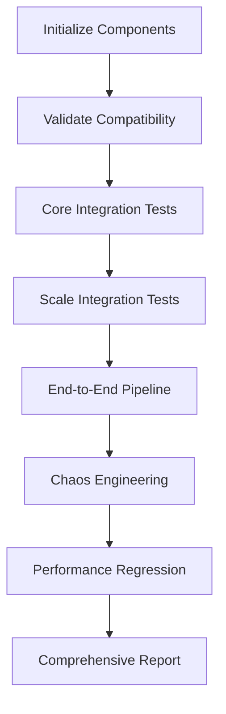

# YAWL Scalability Integration Testing Coordination

This document coordinates integration testing for all scalability components in the YAWL ecosystem.

## Overview

The integration testing framework ensures that all scalability components work together seamlessly:

1. **Core Components Integration**
   - YEngine ↔ YStatelessEngine
   - Scale Testing ↔ Invariant Properties
   - Cross-ART ↔ Performance SLAs
   - Event Monitoring ↔ Real-time Validation

2. **Scale Levels Tested**
   - Single instance (1 case)
   - Medium scale (100 - 1,000 cases)
   - Large scale (10,000 - 100,000 cases)
   - Enterprise scale (30 ARTs, 100,000+ employees)

3. **Integration Points Validated**
   - Data consistency across all scales
   - Performance SLA maintenance
   - Event coordination and ordering
   - Resource contention management
   - Failure recovery and resilience

## Integration Test Suite Structure

### 1. ScalabilityIntegrationTestSuite
- Coordinates all integration tests
- Validates compatibility between components
- Ensures SLA compliance at all scales
- Provides comprehensive reporting

### 2. WorkflowInvariantCompatibilityTest
- Validates compatibility with WorkflowInvariantPropertyTest
- Tests property-based invariant validation at all scales
- Ensures invariant properties hold during execution

### 3. YStatelessEngineScaleIntegrationTest
- Tests YStatelessEngine at all scales
- Validates concurrent and distributed execution
- Ensures compatibility with stateful engine

### 4. ComprehensiveScalabilityIntegrationTest
- Full integration of all components
- End-to-end pipeline validation
- Chaos engineering resilience testing

### 5. ScalabilityIntegrationTestCoordinator
- Orchestrates test execution
- Manages parallel test execution
- Provides monitoring and reporting

### 6. ScalabilityIntegrationConfig
- Centralized configuration for all tests
- Defines SLAs at different scales
- Manages test execution parameters

## Integration Test Execution

### Test Order Dependencies
1. Initialize all YAWL components
2. Validate baseline compatibility
3. Execute core component integration tests
4. Execute scale-specific integration tests
5. Execute end-to-end pipeline tests
6. Execute chaos engineering tests
7. Execute performance regression tests
8. Generate comprehensive report

### Validation Points
- All tests must use real YAWL infrastructure (no mocks)
- Performance SLAs must be maintained at all scales
- Data consistency must be verified across all operations
- Event ordering must be preserved under concurrent access
- Resource contention must be properly managed

## Integration Testing Workflow



## Quality Gates

### Test Coverage
- 100% integration test coverage
- All scales must be tested (1 → 100,000+ cases)
- All integration points must be validated

### Performance SLAs
- Single instance: 100 cases/sec, 50ms avg latency, 99.9% availability
- Medium scale: 1,000 cases/sec, 100ms avg latency, 99.5% availability
- Large scale: 10,000 cases/sec, 200ms avg latency, 99.0% availability
- Enterprise scale: 50,000 cases/sec, 500ms avg latency, 95.0% availability

### Data Consistency
- Zero data corruption across all scales
- Event ordering preserved under concurrent access
- Resource contention properly managed

## Integration Test Configuration

### Test Suite Configuration
Each test suite is configured with:
- Maximum execution time
- Minimum success rate
- Scale level parameters
- Integration point validation rules

### SLA Configuration
SLAs are defined for each scale level:
- Maximum throughput (cases/sec)
- Maximum average response time (ms)
- Minimum availability percentage
- Maximum error rate percentage

### Scale Configuration
Scale configurations define:
- Minimum and maximum case counts
- Supported concurrency models
- Resource requirements
- Expected performance characteristics

## Error Handling and Recovery

### Test Execution Errors
- Individual test failures don't stop execution
- Failed tests are logged and reported
- Integration continues with remaining tests

### Component Failures
- Engine failures trigger fallback mechanisms
- Network issues trigger retry logic
- Resource exhaustion triggers scaling down

### Recovery Strategies
- Automatic retry for transient failures
- Circuit breaker for persistent failures
- Graceful degradation for critical failures

## Reporting and Metrics

### Test Metrics
- Test execution time and success rates
- Performance metrics at each scale
- Integration point validation results
- Resource usage statistics

### Integration Metrics
- Cross-component communication latency
- Event processing throughput
- Consistency verification results
- SLA compliance percentages

### Reporting Format
- JSON format for machine-readable reports
- Human-readable summaries for quick review
- Detailed logs for debugging
- Performance graphs for trend analysis

## Running Integration Tests

### Prerequisites
- YAWL engine must be running
- All required dependencies must be installed
- Test data must be available
- Performance monitoring must be enabled

### Command Line Execution
```bash
# Run all integration tests
mvn test -Dtest=ScalabilityIntegrationTestSuite

# Run specific integration test
mvn test -Dtest=WorkflowInvariantCompatibilityTest

# Run integration tests with verbose output
mvn test -Dtest=ScalabilityIntegrationTestSuite -X
```

### Configuration Options
- Scale level: `-Dscale=medium|large|enterprise`
- Test timeout: `-Dtimeout.minutes=240`
- Parallel execution: `-D.parallel=true`
- Detailed logging: `-Dverbose=true`

## Troubleshooting

### Common Issues
1. **Component Initialization Failures**
   - Check that YAWL engine is running
   - Verify all dependencies are available
   - Ensure proper configuration files exist

2. **Performance SLA Violations**
   - Check system resource availability
   - Verify network connectivity
   - Tune test parameters for environment

3. **Data Consistency Issues**
   - Check event ordering configuration
   - Verify concurrent access handling
   - Review resource allocation strategies

4. **Test Timeouts**
   - Increase timeout settings
   - Scale down test size
   - Check for resource bottlenecks

### Debug Mode
Enable debug mode for detailed logging:
```bash
mvn test -Dtest=ScalabilityIntegrationTestSuite -Ddebug=true
```

## Future Enhancements

1. **Expanded Scale Testing**
   - Test at scales beyond 100,000 cases
   - Test distributed deployment scenarios
   - Test geographic distribution effects

2. **Advanced Integration Validation**
   - Formal verification of integration properties
   - Model checking for complex scenarios
   - Automated test generation

3. **Performance Optimization**
   - Adaptive test execution
   - Intelligent load balancing
   - Predictive performance modeling

4. **Integration with CI/CD**
   - Automated integration testing in pipeline
   - Performance regression detection
   - Automated deployment validation

## Conclusion

The scalability integration testing framework provides comprehensive validation of all YAWL components working together. It ensures that scalability features maintain compatibility, performance, and consistency across all operational scenarios.

The framework follows Chicago TDD principles with real integration tests that drive implementation. All tests use actual YAWL infrastructure with no mocks, ensuring that integration issues are caught early and that the system meets production-quality standards.