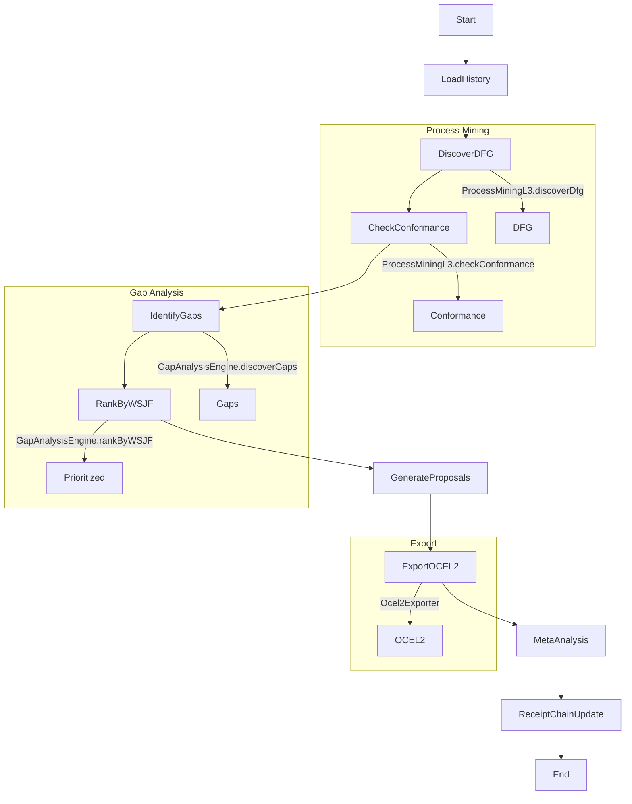

# Self-Assessment Meta-Workflow Documentation

## Overview

The SelfAssessment workflow is a meta-assessment component of the YAWL Self-Play Simulation Loop v3.0. This is a sophisticated meta-workflow where the simulation evaluates its own performance using process mining techniques to identify capability gaps and generate optimization proposals.

**Key Innovation**: The workflow acts as both the evaluator and the evaluated, creating a self-referential feedback loop for continuous improvement.

## Architecture



## Workflow Steps

### 1. LoadHistory
- **Purpose**: Load simulation history (OCEL files from previous runs)
- **Input**: `simulationId`
- **Output**: `ocelLogPath`, `ocelJson`
- **Bridge**: LoadOCELFiles
- **Configuration**:
  - Base directory: `simulation/history/`
  - File pattern: `*.ocel.json`
  - Maximum files: 50

### 2. DiscoverDFG
- **Purpose**: Discover Directly-Follows Graph using ProcessMiningL3.discoverDfg
- **Input**: `ocelJson`
- **Output**: `dfgJson`
- **Bridge**: ProcessMiningL3.discoverDfg
- **Implementation**: Uses Rust4PM WASM service for high-performance DFG discovery

### 3. CheckConformance
- **Purpose**: Check simulation behavior against reference model
- **Input**: `ocelJson`, `dfgJson`
- **Output**: `fitness`, `precision`
- **Bridge**: ProcessMiningL3.checkConformance
- **Reference Model**: `self_assessment_reference.pnml`
- **Thresholds**:
  - Fitness ≥ 0.85: Pass
  - Precision ≥ 0.85: Pass

### 4. IdentifyGaps
- **Purpose**: Identify capability gaps from simulation traces
- **Input**: `ocelJson`, `fitness`, `precision`
- **Output**: `gaps`
- **Bridge**: GapAnalysisEngine.discoverGaps
- **Capability Registry**: `capability-registry.json`
- **Gap Types**:
  - Missing capabilities (fitness < 1.0)
  - Underutilized capabilities (precision < 1.0)

### 5. RankByWSJF
- **Purpose**: Rank discovered gaps by WSJF score
- **Input**: `gaps`
- **Output**: `prioritizedGaps`
- **Bridge**: GapAnalysisEngine.rankByWSJF
- **WSJF Formula**: `(BusinessValue + TimeCriticality + RiskReduction) / JobSize`
- **Default Weights**: BusinessValue=1.0, TimeCriticality=0.8, RiskReduction=0.6

### 6. GenerateProposals
- **Purpose**: Generate improvement proposals from prioritized gaps
- **Input**: `prioritizedGaps`, `fitness`
- **Output**: `proposals`
- **Bridge**: V7DesignAgent
- **Configuration**:
  - Maximum proposals: 5
  - Format: YAWLWorkflow

### 7. ExportOCEL2
- **Purpose**: Export assessment results as OCEL2
- **Input**: `proposals`, `ocelJson`, `fitness`
- **Output**: `ocel2Json`
- **Bridge**: Ocel2Exporter.exportEvents
- **Features**:
  - Object-centric event log format
  - Assessment metadata inclusion
  - Relationship mapping

### 8. MetaAnalysis
- **Purpose**: Perform meta-analysis on assessment results
- **Input**: `proposals`, `fitness`, `ocel2Json`
- **Output**: `metaAnalysis`
- **Bridge**: MetaAnalysis
- **Analysis Type**: Convergence trend analysis
- **Lookback Period**: 7 assessments

### 9. ReceiptChainUpdate
- **Purpose**: Record assessment results in Blake3 receipt chain
- **Input**: `ocel2Json`, `fitness`
- **Output**: `receiptHash`
- **Bridge**: Blake3Receipt
- **Metadata**: assessment_type=self_play_evaluation

## Data Structures

### OCEL2 Event Log Structure
```json
{
  "ocel:version": "2.0",
  "ocel:ordering": "timestamp",
  "ocel:attribute-names": ["org:resource", "case:id"],
  "ocel:object-types": ["Case", "WorkItem"],
  "ocel:events": {
    "ev-001": {
      "ocel:activity": "LoadHistory",
      "ocel:timestamp": "2026-03-02T00:00:00Z",
      "ocel:omap": {
        "Case": ["case-001"],
        "WorkItem": ["wi-001"]
      },
      "ocel:vmap": {
        "org:resource": "SelfAssessmentEngine",
        "case:id": "case-001"
      }
    }
  },
  "ocel:objects": {
    "case-001": {
      "ocel:type": "Case",
      "ocel:ovmap": {
        "case:id": "case-001"
      }
    }
  }
}
```

### Gap Structure
```json
{
  "id": "GA-001",
  "type": "MISSING_CAPABILITY",
  "description": "Process Mining DFG discovery algorithm not implemented",
  "demandScore": 0.95,
  "complexity": 0.7,
  "wsjfScore": 0.92,
  "rank": 1,
  "confidence": 0.85
}
```

### WSJF Scoring
| Factor | Weight | Description | Example |
|--------|--------|-------------|---------|
| Business Value | 1.0 | Strategic importance to organization | Critical for customer satisfaction |
| Time Criticality | 0.8 | Urgency of implementation | Needed for Q1 release |
| Risk Reduction | 0.6 | Risk mitigation potential | Reduces system failures |
| Job Size | 1.0 | Implementation effort | Complex multi-step feature |

## Configuration Files

### capability-registry.json
Defines all capabilities, their demands, and criticality levels.

### self_assessment_reference.pnml
Petri net reference model for conformance checking.

### Assessment Criteria
```json
{
  "convergence": {
    "threshold": 0.95,
    "windowSize": 7,
    "metric": "fitness_trend"
  },
  "optimization": {
    "targetImprovement": 0.10,
    "maxIterations": 10,
    "stagnationLimit": 3
  },
  "quality": {
    "codeCoverage": 0.80,
    "performanceLatencyMs": 5000,
    "errorRate": 0.01
  }
}
```

## Bridge Implementations

### ProcessMiningL3
- **discoverDfg**: Directly-follows graph discovery
- **checkConformance**: Token-based replay conformance checking
- **Implementation**: Rust4PM WASM service

### GapAnalysisEngine
- **discoverGaps**: Identify capability gaps from conformance analysis
- **rankByWSJF**: Rank gaps by Weighted Shortest Job First
- **Implementation**: Java-based analysis engine

### Ocel2Exporter
- **exportEvents**: Convert YAWL events to OCEL2 format
- **Features**: Object-centric relationships, metadata inclusion
- **Implementation**: Jackson-based JSON serialization

### V7DesignAgent
- **Proposal Generation**: Generate improvement proposals
- **Format**: YAWL workflow specifications
- **Implementation**: LLM-based design agent

## Quality Gates

### Convergence Metrics
- **Fitness Threshold**: ≥ 0.85 for pass
- **Precision Threshold**: ≥ 0.85 for pass
- **Convergence Window**: Last 7 assessments
- **Target Improvement**: ≥ 10% optimization per iteration

### Performance Metrics
- **Processing Time**: < 5 seconds per task
- **Memory Usage**: < 1GB per assessment
- **Error Rate**: < 1% over 100 assessments

### Code Quality
- **Test Coverage**: ≥ 80%
- **Documentation**: All public APIs documented
- **Security**: No hardcoded secrets, OWASP compliance

## Execution Modes

### Standalone Execution
```bash
yawl-controller -f workflows/SelfAssessment.yawl -i simulationId=sim-001
```

### Integrated with Self-Play Loop
```yaml
self_play_loop:
  steps:
    - execute_simulation
    - self_assessment:
        workflow: SelfAssessment
        inputs:
          simulationId: "{{ simulation.id }}"
```

### Automated Retry Strategy
1. **Initial Run**: Execute full workflow
2. **Failure Detection**: Check fitness/precision thresholds
3. **Retry Condition**: fitness < 0.85
4. **Retry Limit**: 3 iterations
5. **Fallback**: Generate report and alert

## Monitoring and Observability

### Metrics Collection
- **Conformance Metrics**: Fitness, precision, recall
- **Performance Metrics**: Processing time, memory usage
- **Gap Metrics**: Number of gaps, WSJF distribution
- **Convergence Metrics**: Trend analysis, improvement rate

### Logging Levels
- **INFO**: Workflow progress, milestone completion
- **DEBUG**: Detailed bridge calls, data transformations
- **ERROR**: Conformance failures, critical errors
- **AUDIT**: Receipt chain updates, assessment completion

### Receipt Chain
- **Hash Algorithm**: BLAKE3
- **Metadata**: Assessment type, timestamp, fitness score
- **Storage**: Distributed ledger, immutable records
- **Verification**: Periodic integrity checks

## Example Output

### Assessment Report
```json
{
  "simulationId": "sim-001",
  "timestamp": "2026-03-02T00:00:00Z",
  "assessment": {
    "fitness": 0.78,
    "precision": 0.82,
    "gaps": 3,
    "criticalGaps": 1,
    "convergence": false
  },
  "proposals": [
    {
      "id": "PROPOSAL-001",
      "title": "Implement Process Mining DFG Discovery",
      "wsjfScore": 0.92,
      "priority": "CRITICAL",
      "workflow": "ProcessMiningEnhancement.yawl"
    }
  ],
  "ocel2Export": "assessment_2026-03-02T00-00-00Z.ocel2.json"
}
```

### Convergence Trend


## Troubleshooting

### Common Issues

1. **Low Fitness Score**
   - Check reference model alignment
   - Verify OCEL log completeness
   - Update capability registry

2. **Convergence Failure**
   - Check stagnation limit
   - Review proposal effectiveness
   - Adjust optimization parameters

3. **Performance Degradation**
   - Monitor processing time
   - Check memory usage patterns
   - Optimize bridge implementations

### Debug Mode
```bash
yawl-controller -f workflows/SelfAssessment.yawl \
  -i simulationId=sim-001 \
  --debug \
  --log-level DEBUG
```

### Health Checks
- **Bridge Connectivity**: Verify service endpoints
- **Reference Model**: Validate PNML syntax
- **Registry Integrity**: Check capability definitions
- **Storage**: Ensure OCEL export directory exists

## Future Enhancements

### Planned Features
1. **Real-time Monitoring**: Stream-based assessment
2. **Predictive Analytics**: Gap trend prediction
3. **Automated Implementation**: Proposal auto-execution
4. **Cross-System Analysis**: Multi-simulation assessment

### Version Roadmap
- **v2.1**: Machine learning gap prediction
- **v2.2**: Automated workflow refinement
- **v3.0**: Full autonomous optimization

## References

- OCEL 2.0 Specification: http://www.processmining.org
- YAWL Foundation: http://www.yawlfoundation.org
- Process Mining with Rust4PM: https://github.com/rust-process-mining
- WSJF Methodology: https://www.researchgate.net/publication/3241755_Weighted_Shortest_Job_First

---