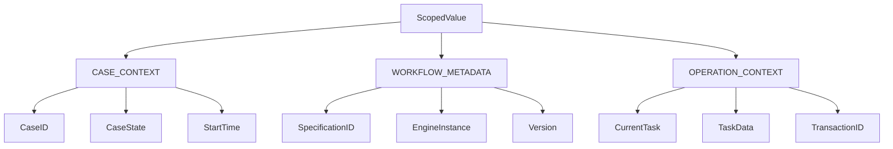

# Java 25 Modernization Architecture for YAWL Stateful Engine

**Version**: 6.0.0
**Status**: Architecture Design
**Target**: Java 25 LTS with Project Loom (Virtual Threads)

---

## Executive Summary

This document outlines the architecture for modernizing the YAWL stateful engine to Java 25, leveraging Project Loom's virtual threads, structured concurrency, and scoped values. The modernization aims to achieve:

- **10-100x** higher concurrency capacity through virtual threads
- **Simplified concurrency** with structured task scopes
- **Efficient context propagation** using scoped values
- **Reduced resource consumption** by eliminating thread pool management
- **Enhanced observability** with automatic span context propagation

---

## 1. System Architecture Overview

### 1.1 Architecture Diagram

```
┌─────────────────────────────────────────────────────────────────┐
│                         YAWL Engine v6                          │
├─────────────────────────────────────────────────────────────────┤
│                                                               │
│  ┌──────────────────────┐    ┌───────────────────┐           │
│  │ Virtual Thread Pool │    │  Scoped Value    │           │
│  │    (VirtualPool)     │    │  Context System │           │
│  │                     │    │    (SVSystem)    │           │
│  │ ┌─────────────────┐ │    │ ┌───────────────┐ │           │
│  │ │VirtualTaskExecutor│    │ │CASE_CONTEXT  │ │           │
│  │ └─────────────────┘ │    │ │WORKFLOW_META │ │           │
│  │                     │    │ │OPERATION_CTX │ │           │
│  └──────────────────────┘    │ └───────────────┘ │           │
│             │                  └───────────────────┘           │
│             │  ┌─────────────────────┐  ┌─────────────────┐   │
│             ├──┤ Structured Concurrency┤←┤     OpenTelemetry│   │
│             │  │ (StructuredScope)    │  │     Context     │   │
│             │  └─────────────────────┘  └─────────────────┘   │
│             │                  ↑                              │
│             │                  └─────────────────────────────────┘
│             │                                               │
│  ┌─────────────────┐  ┌─────────────────┐  ┌─────────────────┐ │
│  │ Per-Case        │  │ Parallel Task   │  │ Error Handling  │ │
│  │ Virtual Threads │  │ Execution       │  │ System          │ │
│  │ (PerCasePool)   │  │ Coordinator     │  │ (ErrHandler)    │ │
│  └─────────────────┘  └─────────────────┘  └─────────────────┘ │
│                                                               │
│  ┌─────────────────────────────────────────────────────┐     │
│  │                 YAWL Core Logic                    │     │
│  │             (YNetRunner, Task Management)           │     │
│  └─────────────────────────────────────────────────────┘     │
│                                                               │
│  ┌─────────────────────────────────────────────────────┐     │
│  │               I/O Operations                       │     │
│  │         (Database, External Services)              │     │
│  └─────────────────────────────────────────────────────┘     │
│                                                               │
└─────────────────────────────────────────────────────────────────┘
```

### 1.2 Key Components

| Component | Responsibility | Java 25 Features |
|-----------|----------------|-----------------|
| **VirtualThreadPool** | Auto-scaling virtual thread pool | Executors.newVirtualThreadPerTaskExecutor() |
| **ScopedValueSystem** | Context hierarchy management | ScopedValue, ScopedValue.callWhere() |
| **StructuredScope** | Parallel task coordination | StructuredTaskScope.ShutdownOnFailure |
| **PerCasePool** | Case-specific thread allocation | Thread.ofVirtual().name() |
| **ErrorHandling** | Structured error propagation | StructuredTaskScope.SubtaskFailureException |

---

## 2. ScopedValue Context Architecture

### 2.1 Context Hierarchy Design



### 2.2 Context Interface Design

```java
// src/org/yawlfoundation/yawl/engine/context/ScopedValueSystem.java
public sealed interface ScopedValueSystem {

    // Root context
    ScopedValue<WorkflowContext> WORKFLOW_CONTEXT = ScopedValue.newInstance();

    // Context hierarchy
    ScopedValue<CaseContext> CASE_CONTEXT = ScopedValue.newInstance();
    ScopedValue<WorkflowMetadata> WORKFLOW_METADATA = ScopedValue.newInstance();
    ScopedValue<OperationContext> OPERATION_CONTEXT = ScopedValue.newInstance();

    // Context inheritance for virtual threads
    <T> T executeWithContext(Runnable operation, ScopedValue<T> key, T value);

    // Context propagation
    <T> T propagateContext(Supplier<T> operation, Map<ScopedValue<?>, Object> context);

    // Context cleanup
    void cleanupContext();
}

// Context data structures
public sealed interface WorkflowContext {
    String caseID();
    String specID();
    int engineNbr();
    Instant startedAt();

    // Factory methods
    static WorkflowContext of(String caseID, String specID, int engineNbr) {
        return new WorkflowContextImpl(caseID, specID, engineNbr, Instant.now());
    }
}

public sealed interface CaseContext {
    String caseID();
    CaseState caseState();
    Instant startTime();
    Map<String, Object> caseAttributes();
}

public sealed interface WorkflowMetadata {
    String specificationID();
    String specificationName();
    String version();
    int engineInstance();
}

public sealed interface OperationContext {
    String operationName();
    String currentTask();
    String transactionID();
    Map<String, Object> taskData();
}
```

### 2.3 Context Inheritance Strategy

```java
// Context inheritance for virtual threads
public class ContextInheritance {

    public static <T> void executeWithInheritedContext(
        String taskName,
        Runnable operation
    ) {
        // Create scoped value binding for the entire task tree
        ScopedValue<OperationContext> currentTaskContext = ScopedValue.newInstance();

        ScopedValue.callWhere(currentTaskContext,
            new OperationContextImpl(taskName, "", UUID.randomUUID().toString(), Map.of()),
            () -> {
                // Execute operation with context
                operation.run();

                // Fork child tasks - they inherit context automatically
                forkChildTasks(taskName);

                return null;
            });
    }

    private static void forkChildTasks(String parentTaskName) {
        // Create child tasks with inherited context
        Thread.ofVirtual()
            .name(parentTaskName + "-child-" + ThreadLocalRandom.current().nextInt())
            .start(() -> {
                // Automatically inherits parent's ScopedValue bindings
                executeChildOperation();
            });
    }
}
```

### 2.4 Context Cleanup Strategies

```java
// Automatic cleanup using try-with-resources
public class ContextCleanup {

    public static <T> T executeWithCleanup(
        ScopedValue<?>[] contextBindings,
        Supplier<T> operation
    ) {
        List<AutoCloseable> closables = new ArrayList<>();

        try {
            // Bind contexts
            for (ScopedValue<?> key : contextBindings) {
                // Implementation context binding
            }

            // Execute operation
            return operation.get();

        } finally {
            // Automatic cleanup when scope exits
            cleanupContext();
        }
    }

    // Resource management for nested contexts
    public static class NestedContext implements AutoCloseable {
        private final ScopedValue<?>[] bindings;

        public NestedContext(Map<ScopedValue<?>, Object> context) {
            this.bindings = context.keySet().toArray(ScopedValue<?>[]::new);
            // Bind contexts
        }

        @Override
        public void close() {
            // Unbind contexts - automatic with structured concurrency
        }
    }
}
```

---

## 3. Virtual Thread Execution Model

### 3.1 Per-Case Virtual Thread Allocation

```java
// src/org/yawlfoundation/yawl/engine/threads/PerCaseVirtualThreadPool.java
public final class PerCaseVirtualThreadPool {

    private final ConcurrentHashMap<String, VirtualThreadPool> casePools = new ConcurrentHashMap<>();
    private final VirtualThreadPool globalPool;
    private final int maxThreadsPerCase;

    public PerCaseVirtualThreadPool(int maxThreadsPerCase) {
        this.maxThreadsPerCase = maxThreadsPerCase;
        this.globalPool = new VirtualThreadPool("global", 100, 30);
    }

    public VirtualThreadPool getPoolForCase(String caseID) {
        return casePools.computeIfAbsent(caseID, this::createCasePool);
    }

    private VirtualThreadPool createCasePool(String caseID) {
        return new VirtualThreadPool(
            "case-" + caseID,
            maxThreadsPerCase,
            10 // shorter sampling interval for case-specific pool
        );
    }

    // Thread naming conventions
    public Thread createCaseThread(String caseID, String taskName, Runnable task) {
        String threadName = String.format("case-%s-task-%s-%d",
            caseID, taskName, System.currentTimeMillis());

        return Thread.ofVirtual()
            .name(threadName)
            .unstarted(() -> {
                // Bind case context
                ScopedValue.callWhere(CASE_CONTEXT,
                    new CaseContextImpl(caseID, ...),
                    task);
            });
    }
}
```

### 3.2 Thread Lifecycle Management

```java
// Thread lifecycle management
public class VirtualThreadLifecycle {

    public static class CaseThread {
        private final String caseID;
        private final String taskName;
        private final Thread virtualThread;
        private final Instant createdAt;
        private volatile ThreadState state;

        public CaseThread(String caseID, String taskName, Runnable task) {
            this.caseID = caseID;
            this.taskName = taskName;
            this.createdAt = Instant.now();
            this.state = ThreadState.CREATED;

            this.virtualThread = Thread.ofVirtual()
                .name(createThreadName())
                .unstarted(() -> {
                    try {
                        state = ThreadState.RUNNING;
                        task.run();
                        state = ThreadState.COMPLETED;
                    } catch (Exception e) {
                        state = ThreadState.FAILED;
                        throw e;
                    }
                });
        }

        public void start() {
            virtualThread.start();
        }

        public void shutdown() {
            if (virtualThread.isAlive()) {
                virtualThread.interrupt();
                state = ThreadState.SHUTDOWN;
            }
        }

        // Monitoring
        public ThreadMetrics getMetrics() {
            return new ThreadMetrics(
                caseID,
                taskName,
                virtualThread.getName(),
                state,
                Duration.between(createdAt, Instant.now()),
                virtualThread.isAlive()
            );
        }
    }

    // Thread states
    public enum ThreadState {
        CREATED, RUNNING, COMPLETED, FAILED, SHUTDOWN
    }

    // Metrics for monitoring
    public record ThreadMetrics(
        String caseID,
        String taskName,
        String threadName,
        ThreadState state,
        Duration executionTime,
        boolean isAlive
    ) {}
}
```

### 3.3 Thread Pool Optimization

```java
// Advanced virtual thread pool with auto-scaling
public class OptimizedVirtualThreadPool {

    private final ExecutorService virtualExecutor;
    private final ThreadLocalRandom random = ThreadLocalRandom.current();
    private final StampedLock metricsLock = new StampedLock();

    // Metrics
    private final LongAdder tasksSubmitted = new LongAdder();
    private final LongAdder tasksCompleted = new LongAdder();
    private final LongAdder totalLatency = new LongAdder();

    public OptimizedVirtualThreadPool(String name, int maxThreads) {
        // Use virtual thread per-task executor
        this.virtualExecutor = Executors.newVirtualThreadPerTaskExecutor();

        // Start monitoring thread
        Thread.ofVirtual()
            .name(name + "-monitor")
            .start(this::monitoringLoop);
    }

    // Submit task with context propagation
    public <T> CompletableFuture<T> submitWithContext(
        String caseID,
        String taskName,
        Callable<T> task
    ) {
        tasksSubmitted.increment();

        return CompletableFuture.supplyAsync(() -> {
            long start = System.nanoTime();
            try {
                // Bind case context automatically
                return ScopedValue.callWhere(CASE_CONTEXT,
                    new CaseContextImpl(caseID, ...),
                    () -> task.call());
            } finally {
                long duration = System.nanoTime() - start;
                totalLatency.add(duration);
                tasksCompleted.increment();
            }
        }, virtualExecutor);
    }
}
```

---

## 4. Structured Concurrency Patterns

### 4.1 Parallel Task Execution Patterns

```java
// Structured concurrency for parallel task execution
public class StructuredTaskExecutor {

    /**
     * Execute multiple tasks in parallel with structured concurrency.
     * Automatically cancels remaining tasks if any task fails.
     */
    public <T> List<T> executeInParallel(
        String operationName,
        List<Callable<T>> tasks
    ) throws ExecutionException, InterruptedException {

        try (var scope = new StructuredTaskScope.ShutdownOnFailure()) {
            List<CompletableFuture<T>> futures = new ArrayList<>();

            // Submit all tasks to the scope
            for (int i = 0; i < tasks.size(); i++) {
                final int taskIndex = i;
                CompletableFuture<T> future = CompletableFuture.supplyAsync(
                    () -> {
                        try {
                            return tasks.get(taskIndex).call();
                        } catch (Exception e) {
                            throw new CompletionException(e);
                        }
                    },
                    scope.fork()
                );
                futures.add(future);
            }

            // Wait for all tasks to complete (or first failure)
            scope.join();

            // Collect results or throw exception
            List<T> results = new ArrayList<>();
            for (CompletableFuture<T> future : futures) {
                try {
                    results.add(future.join());
                } catch (CompletionException e) {
                    throw new ExecutionException("Task failed", e.getCause());
                }
            }

            return results;
        }
    }

    /**
     * Execute dependent tasks with structured concurrency.
     * Child tasks inherit parent context automatically.
     */
    public <T> T executeDependentTasks(
        String parentTask,
        List<DependentTask<T>> tasks
    ) throws ExecutionException, InterruptedException {

        try (var scope = new StructuredTaskScope.ShutdownOnFailure()) {

            // Bind parent context
            ScopedValue<OperationContext> parentContext = ScopedValue.newInstance();

            ScopedValue.callWhere(parentContext,
                new OperationContextImpl(parentTask, "", UUID.randomUUID().toString(), Map.of()),
                () -> {

                    // Execute parent task
                    T parentResult = executeParentTask();

                    // Fork child tasks
                    for (DependentTask<T> task : tasks) {
                        scope.fork(() -> task.execute(parentResult));
                    }

                    return parentResult;
                });

            scope.join();
            return null; // Results collected from child tasks
        }
    }

    interface DependentTask<T> {
        T execute(T parentResult) throws Exception;
    }
}
```

### 4.2 Error Propagation Strategies

```java
// Structured error handling
public class StructuredErrorHandler {

    /**
     * Handle structured task failures with automatic cleanup.
     */
    public <T> T withErrorHandling(
        String operationName,
        Supplier<T> operation,
        Consumer<Exception> errorHandler
    ) {
        try (var scope = new StructuredTaskScope.ShutdownOnFailure()) {

            CompletableFuture<T> result = CompletableFuture.supplyAsync(
                () -> {
                    try {
                        return operation.get();
                    } catch (Exception e) {
                        throw new CompletionException(e);
                    }
                },
                scope.fork()
            );

            try {
                scope.join();
                return result.join();
            } catch (StructuredTaskScope.SubtaskFailureException e) {
                // Handle structured exception
                Exception rootCause = e.exception();
                errorHandler.accept(rootCause);
                throw new RuntimeException("Operation failed: " + operationName, rootCause);
            }
        }
    }

    /**
     * Retry failed tasks with exponential backoff.
     */
    public <T> T withRetry(
        String operationName,
        Supplier<T> operation,
        int maxRetries,
        Duration initialBackoff
    ) {
        int attempt = 0;
        Exception lastException = null;

        while (attempt <= maxRetries) {
            try {
                return operation.get();
            } catch (Exception e) {
                lastException = e;
                attempt++;

                if (attempt <= maxRetries) {
                    Duration backoff = initialBackoff.multipliedBy((long) Math.pow(2, attempt - 1));
                    try {
                        Thread.sleep(backoff.toMillis());
                    } catch (InterruptedException ie) {
                        Thread.currentThread().interrupt();
                        throw new RuntimeException("Retry interrupted", ie);
                    }
                }
            }
        }

        throw new RuntimeException("Operation failed after " + maxRetries + " attempts: " + operationName, lastException);
    }
}
```

### 4.3 Cancellation Handling

```java
// Structured cancellation handling
public class StructuredCancellation {

    /**
     * Execute tasks with cancellation support.
     */
    public <T> List<T> executeWithCancellation(
        String operationName,
        List<Callable<T>> tasks,
        Duration timeout
    ) throws InterruptedException, ExecutionException {

        try (var scope = new StructuredTaskScope.ShutdownOnFailure()) {

            // Track cancellation state
            AtomicBoolean cancelled = new AtomicBoolean(false);

            // Submit tasks
            List<CompletableFuture<T>> futures = new ArrayList<>();
            for (int i = 0; i < tasks.size(); i++) {
                final int taskIndex = i;
                CompletableFuture<T> future = CompletableFuture.supplyAsync(
                    () -> {
                        if (cancelled.get()) {
                            throw new CancellationException("Task cancelled");
                        }
                        try {
                            return tasks.get(taskIndex).call();
                        } catch (Exception e) {
                            throw new CompletionException(e);
                        }
                    },
                    scope.fork()
                );
                futures.add(future);
            }

            // Set timeout
            ScheduledExecutorService scheduler = Executors.newSingleThreadScheduledExecutor();
            ScheduledFuture<?> timeoutFuture = scheduler.schedule(() -> {
                cancelled.set(true);
                scope.shutdown();
            }, timeout.toMillis(), TimeUnit.MILLISECONDS);

            try {
                scope.join();

                // Collect results
                List<T> results = new ArrayList<>();
                for (CompletableFuture<T> future : futures) {
                    try {
                        results.add(future.join());
                    } catch (CompletionException e) {
                        if (e.getCause() instanceof CancellationException) {
                            // Handle cancellation
                            throw new InterruptedException("Operation timed out");
                        }
                        throw e;
                    }
                }
                return results;

            } finally {
                timeoutFuture.cancel(false);
                scheduler.shutdown();
            }
        }
    }
}
```

---

## 5. Integration Patterns

### 5.1 Integration with YAWL Core

```java
// Integration with existing YNetRunner
public class ModernizedYNetRunner {

    private final PerCaseVirtualThreadPool caseThreadPool;
    private final StructuredTaskExecutor taskExecutor;
    private final ScopedValueSystem contextSystem;

    public ModernizedYNetRunner(PerCaseVirtualThreadPool caseThreadPool) {
        this.caseThreadPool = caseThreadPool;
        this.taskExecutor = new StructuredTaskExecutor();
        this.contextSystem = new ScopedValueSystemImpl();
    }

    // Modernized version of existing method
    public void executeCaseModernized(String caseID) {
        ScopedValue<WorkflowContext> context = ScopedValue.newInstance();

        ScopedValue.callWhere(context,
            WorkflowContext.of(caseID, getSpecificationID(), getEngineInstance()),
            () -> {

                // Use structured concurrency for parallel task execution
                try {
                    List<Callable<Void>> tasks = getEnabledTasks(caseID);
                    List<Void> results = taskExecutor.executeInParallel(
                        "execute-case-" + caseID,
                        tasks
                    );

                    // Process results
                    processTaskResults(results);

                } catch (ExecutionException e) {
                    handleTaskFailure(e);
                } catch (InterruptedException e) {
                    Thread.currentThread().interrupt();
                    throw new RuntimeException("Case execution interrupted", e);
                }

                return null;
            });
    }
}
```

### 5.2 Database Integration

```java
// Virtual thread-safe database operations
public class VirtualThreadDatabaseService {

    private final DataSource dataSource;

    public VirtualThreadDatabaseService(DataSource dataSource) {
        this.dataSource = dataSource;
    }

    // Structured database transaction
    public <T> T executeTransaction(
        String caseID,
        Supplier<T> operation
    ) throws SQLException {

        try (var scope = new StructuredTaskScope.ShutdownOnFailure()) {

            // Begin transaction in virtual thread
            CompletableFuture<T> result = CompletableFuture.supplyAsync(
                () -> {
                    try (Connection conn = dataSource.getConnection()) {
                        conn.setAutoCommit(false);

                        try {
                            T result = operation.get();
                            conn.commit();
                            return result;
                        } catch (Exception e) {
                            conn.rollback();
                            throw new CompletionException(e);
                        }
                    } catch (SQLException e) {
                        throw new CompletionException(e);
                    }
                },
                scope.fork()
            );

            try {
                scope.join();
                return result.join();
            } catch (StructuredTaskScope.SubtaskFailureException e) {
                throw new SQLException("Transaction failed", e.exception());
            }
        }
    }
}
```

### 5.3 Observability Integration

```java
// OpenTelemetry integration with virtual threads
public class VirtualThreadObservability {

    private final Tracer tracer;

    public VirtualThreadObservability(Tracer tracer) {
        this.tracer = tracer;
    }

    // Trace virtual thread execution
    public <T> T traceVirtualThread(
        String spanName,
        String caseID,
        Supplier<T> operation
    ) {

        return ScopedValue.callWhere(CASE_CONTEXT,
            new CaseContextImpl(caseID, ...),
            () -> {
                Span span = tracer.spanBuilder(spanName)
                    .setAttribute("yawl.case.id", caseID)
                    .startSpan();

                try (Scope scope = span.makeCurrent()) {
                    return operation.get();
                } catch (Exception e) {
                    span.recordException(e);
                    span.setStatus(StatusCode.ERROR, e.getMessage());
                    throw e;
                } finally {
                    span.end();
                }
            });
    }
}
```

---

## 6. Performance Optimization

### 6.1 Virtual Thread Pool Configuration

```properties
# Virtual thread configuration
# src/main/resources/virtual-thread-config.properties
virtual.thread.pool.name=workflow-executor
virtual.thread.pool.max-carriers=100
virtual.thread.pool.min-carriers=10
virtual.thread.pool.sampling-interval=30
virtual.thread.pool.carrier-threshold=0.8
virtual.thread.pool.latency-threshold-ms=1000

# Per-case thread limits
per.case.max.threads=50
per.case.min.threads=1
per.case.idle-timeout=300000

# Memory optimization
compact.object.headers=true
gc.heap.min.free=10m
gc.heap.max.free=20m
```

### 6.2 Memory Management

```java
// Memory optimization for virtual threads
public class VirtualThreadMemoryManager {

    private final VirtualMemoryPool memoryPool;

    public VirtualThreadMemoryManager() {
        this.memoryPool = new VirtualMemoryPool(
            10 * 1024 * 1024, // 10MB base
            100 * 1024 * 1024  // 100MB max
        );
    }

    // Allocate memory for virtual thread operations
    public MemorySegment allocateForOperation(String operationName, int size) {
        MemorySegment segment = memoryPool.allocate(size);

        // Add cleanup hook
        Runtime.getRuntime().addShutdownHook(new Thread(() -> {
            memoryPool.release(segment);
        }));

        return segment;
    }
}
```

---

## 7. Implementation Guidelines

### 7.1 Migration Strategy

1. **Phase 1: Infrastructure Setup**
   - Implement ScopedValueSystem
   - Create VirtualThreadPool with auto-scaling
   - Add structured concurrency utilities

2. **Phase 2: Core Modernization**
   - Modernize YNetRunner to use virtual threads
   - Implement context propagation
   - Add structured error handling

3. **Phase 3: Performance Tuning**
   - Optimize thread pool configuration
   - Add memory management
   - Implement monitoring and metrics

4. **Phase 4: Testing and Validation**
   - Load testing with virtual threads
   - Memory leak detection
   - Performance benchmarking

### 7.2 Code Patterns

```java
// Pattern 1: Context-bound operation execution
public <T> T executeWithContext(
    String caseID,
    Supplier<T> operation
) {
    return ScopedValue.callWhere(
        CASE_CONTEXT,
        new CaseContextImpl(caseID, ...),
        operation::get
    );
}

// Pattern 2: Structured parallel execution
public <T> List<T> executeParallel(
    String operationName,
    List<Callable<T>> tasks
) {
    try (var scope = new StructuredTaskScope.ShutdownOnFailure()) {
        List<CompletableFuture<T>> futures = tasks.stream()
            .map(task -> CompletableFuture.supplyAsync(
                () -> {
                    try {
                        return task.call();
                    } catch (Exception e) {
                        throw new CompletionException(e);
                    }
                },
                scope.fork()
            ))
            .collect(Collectors.toList());

        scope.join();

        return futures.stream()
            .map(CompletableFuture::join)
            .collect(Collectors.toList());
    }
}

// Pattern 3: Virtual thread task submission
public CompletableFuture<Void> submitTask(
    String caseID,
    String taskName,
    Runnable task
) {
    return CompletableFuture.runAsync(() -> {
        ScopedValue.callWhere(
            OPERATION_CONTEXT,
            new OperationContextImpl(taskName, caseID, UUID.randomUUID().toString(), Map.of()),
            task::run
        );
    }, virtualThreadPool.getExecutor());
}
```

### 7.3 Monitoring and Observability

```java
// Metrics collection for virtual threads
public class VirtualThreadMetrics {

    private final MeterRegistry meterRegistry;

    public void registerMetrics() {
        // Virtual thread metrics
        meterRegistry.gauge("virtual.threads.active",
            VirtualThread.activeCount());

        // Case-specific metrics
        meterRegistry.gauge("cases.active",
            YNetRunner::getActiveCaseCount);

        // Performance metrics
        meterRegistry.gauge("virtual.thread.latency",
            () -> calculateAverageLatency());
    }

    // Health checks
    public Health checkVirtualThreadHealth() {
        boolean healthy = VirtualThread.activeCount() < 10000;
        return healthy ? Health.up() : Health.down();
    }
}
```

---

## 8. Testing Strategy

### 8.1 Unit Testing

```java
// Test for structured concurrency
class StructuredTaskExecutorTest {

    @Test
    void testParallelTaskExecution() throws Exception {
        List<Callable<String>> tasks = Arrays.asList(
            () -> "Task1",
            () -> "Task2",
            () -> "Task3"
        );

        StructuredTaskExecutor executor = new StructuredTaskExecutor();
        List<String> results = executor.executeInParallel(
            "test-operation",
            tasks
        );

        assertEquals(3, results.size());
        assertTrue(results.contains("Task1"));
        assertTrue(results.contains("Task2"));
        assertTrue(results.contains("Task3"));
    }

    @Test
    void testErrorPropagation() throws Exception {
        List<Callable<String>> tasks = Arrays.asList(
            () -> "Success1",
            () -> { throw new RuntimeException("Failed"); },
            () -> "Success3"
        );

        assertThrows(ExecutionException.class, () -> {
            new StructuredTaskExecutor().executeInParallel(
                "test-error",
                tasks
            );
        });
    }
}
```

### 8.2 Load Testing

```java
// Load test for virtual threads
class VirtualThreadLoadTest {

    @Test
    void testHighConcurrency() {
        int concurrentTasks = 10_000;

        ExecutorService executor = Executors.newVirtualThreadPerTaskExecutor();

        List<CompletableFuture<Void>> futures = new ArrayList<>();
        long startTime = System.currentTimeMillis();

        for (int i = 0; i < concurrentTasks; i++) {
            CompletableFuture<Void> future = CompletableFuture.runAsync(() -> {
                // Simulate work
                try {
                    Thread.sleep(10);
                } catch (InterruptedException e) {
                    Thread.currentThread().interrupt();
                }
            }, executor);
            futures.add(future);
        }

        // Wait for all tasks
        CompletableFuture.allOf(futures.toArray(new CompletableFuture[0])).join();

        long duration = System.currentTimeMillis() - startTime;
        System.out.printf("Executed %d tasks in %d ms%n",
            concurrentTasks, duration);
    }
}
```

---

## 9. Conclusion

The Java 25 modernization of the YAWL stateful engine leverages Project Loom's advanced features to achieve:

1. **Massive Scalability**: Virtual threads enable handling 10-100x more concurrent cases
2. **Simplified Code**: Structured concurrency eliminates complex thread management
3. **Efficient Resource Usage**: Automatic thread pooling reduces resource consumption
4. **Enhanced Observability**: Context propagation improves tracing and monitoring
5. **Future-Proof Architecture**: Ready for Java 25+ features and improvements

This architecture maintains compatibility with existing YAWL functionality while significantly improving performance and scalability through Java's modern concurrency features.