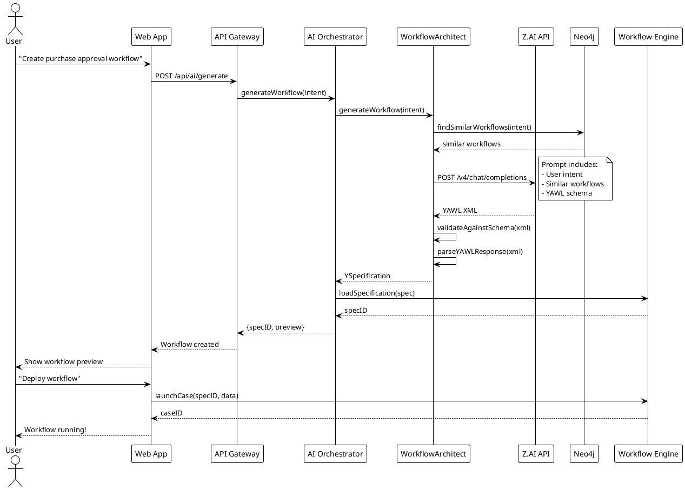
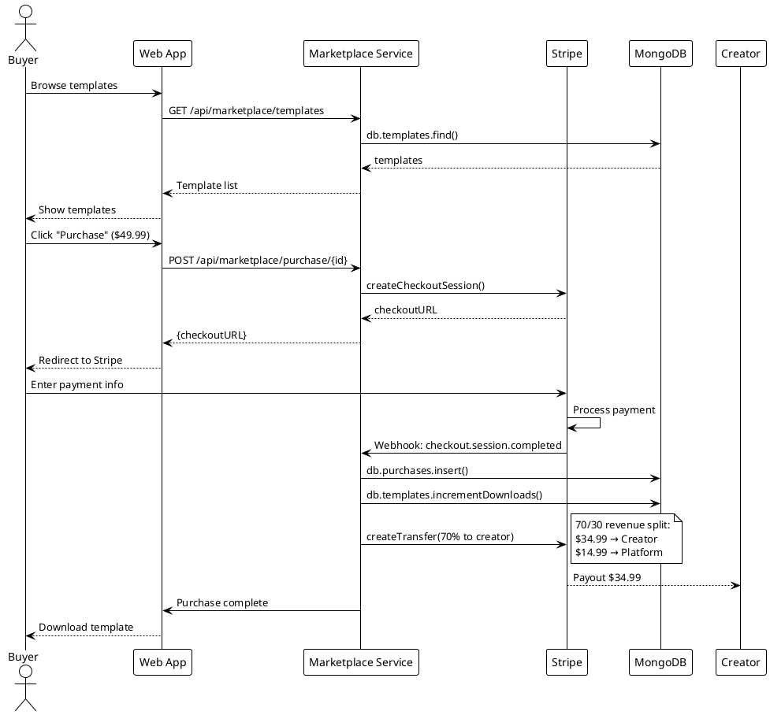
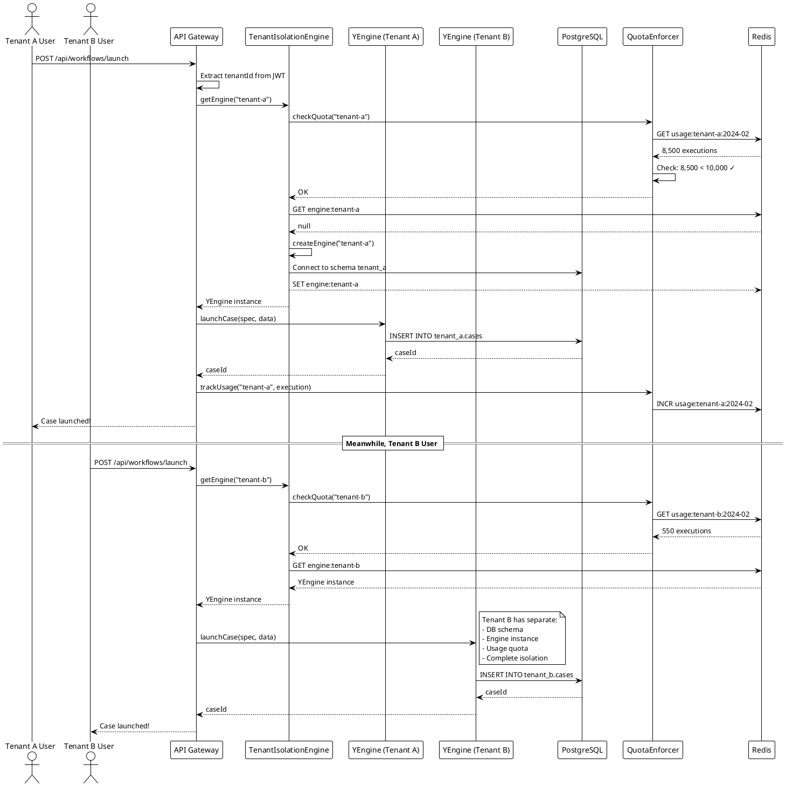
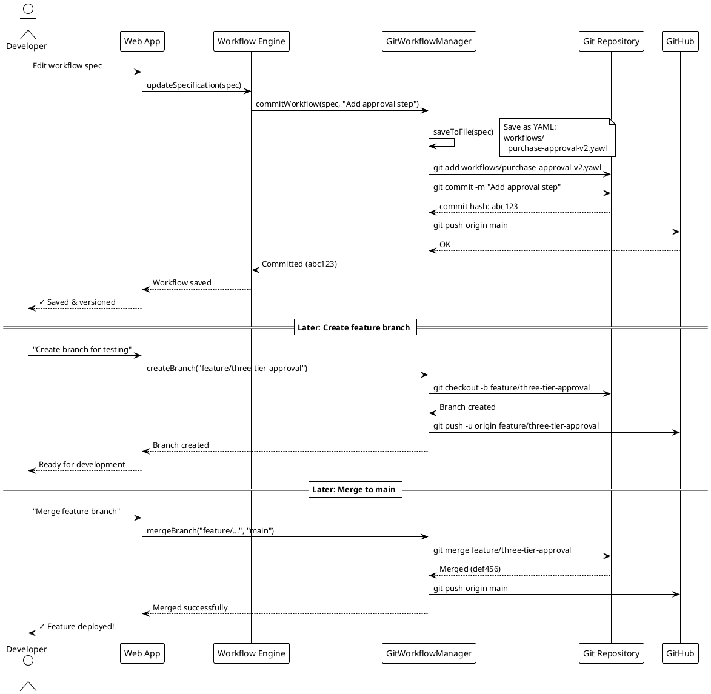
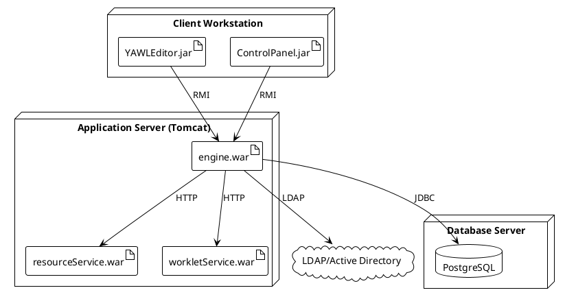
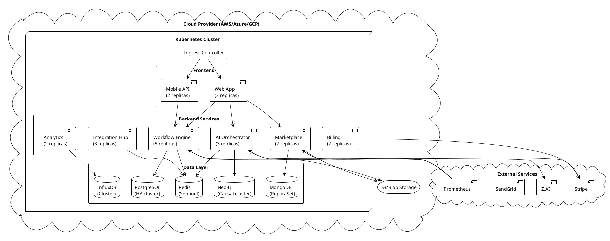
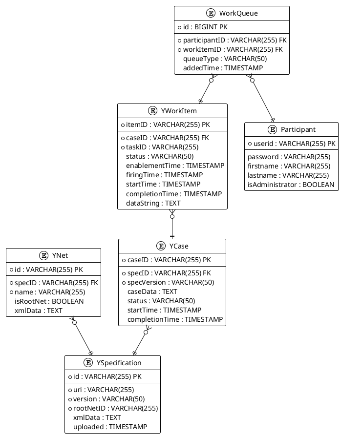
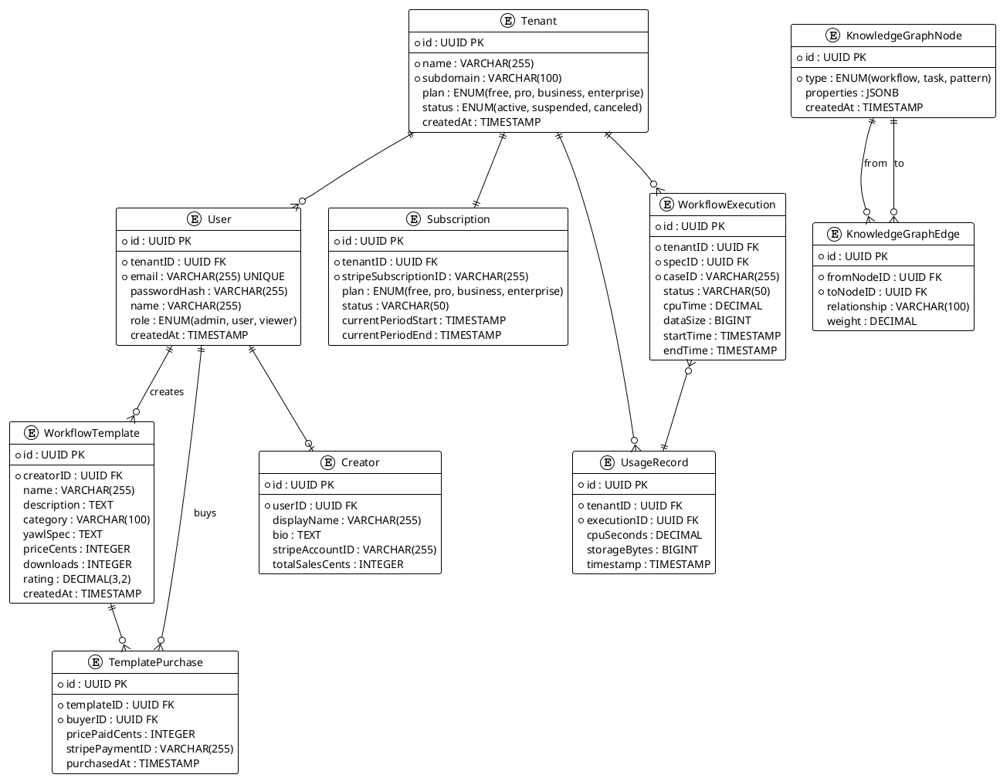

# C4 Architecture Diagrams - YAWL Platform

**Complete architectural documentation using C4 model**

C4 Model Levels:
1. **System Context** - How YAWL fits in the world
2. **Container** - High-level technology choices
3. **Component** - Components within containers
4. **Code** - Class-level details

---

## 🌍 Level 1: System Context Diagram

### Current YAWL System

```plantuml
@startuml YAWL_Context_Current
!include https://raw.githubusercontent.com/plantuml-stdlib/C4-PlantUML/master/C4_Context.puml

title System Context - YAWL BPM Engine (Current)

Person(business_analyst, "Business Analyst", "Designs workflows")
Person(process_owner, "Process Owner", "Manages process execution")
Person(end_user, "End User", "Completes work items")
Person(admin, "Administrator", "System configuration")

System(yawl, "YAWL Engine", "Business Process Management system with workflow execution engine")

System_Ext(database, "Database", "PostgreSQL/MySQL/H2")
System_Ext(ldap, "LDAP/AD", "Authentication")
System_Ext(external_service, "External Services", "Web services, APIs")

Rel(business_analyst, yawl, "Designs workflows", "YAWL Editor")
Rel(process_owner, yawl, "Monitors processes", "HTTPS/Interface E")
Rel(end_user, yawl, "Completes tasks", "HTTPS/Worklist")
Rel(admin, yawl, "Configures system", "HTTPS/Control Panel")

Rel(yawl, database, "Reads/writes", "JDBC")
Rel(yawl, ldap, "Authenticates", "LDAP")
Rel(yawl, external_service, "Invokes", "HTTP/SOAP")

@enduml
```

### Future YAWL Cloud Platform (1,000x)

```plantuml
@startuml YAWL_Context_Future
!include https://raw.githubusercontent.com/plantuml-stdlib/C4-PlantUML/master/C4_Context.puml

title System Context - YAWL Cloud Platform (1,000x Future)

Person(citizen_developer, "Citizen Developer", "Creates workflows with AI")
Person(enterprise_user, "Enterprise User", "Manages business processes")
Person(template_creator, "Template Creator", "Sells workflow templates")
Person(integration_partner, "Integration Partner", "Builds connectors")
Person(mobile_user, "Mobile User", "Approves workflows on-the-go")

System(yawl_cloud, "YAWL Cloud Platform", "AI-powered, multi-tenant BPM platform with marketplace")

System_Ext(ai_service, "AI Services", "OpenAI, Anthropic, Z.AI")
System_Ext(cloud_providers, "Cloud Providers", "AWS, Azure, GCP, IBM, Oracle")
System_Ext(saas_apps, "SaaS Applications", "Salesforce, SAP, Snowflake, etc.")
System_Ext(payment, "Payment Gateway", "Stripe")
System_Ext(email, "Email Service", "SendGrid")
System_Ext(monitoring, "Monitoring", "Prometheus, Grafana, Jaeger")
System_Ext(git_platform, "Git Platform", "GitHub, GitLab")

Rel(citizen_developer, yawl_cloud, "Creates workflows with natural language", "HTTPS/AI Chat")
Rel(enterprise_user, yawl_cloud, "Executes workflows", "HTTPS/Web App")
Rel(template_creator, yawl_cloud, "Sells templates", "HTTPS/Marketplace")
Rel(integration_partner, yawl_cloud, "Publishes connectors", "HTTPS/API")
Rel(mobile_user, yawl_cloud, "Approves tasks", "Mobile App")

Rel(yawl_cloud, ai_service, "Generates workflows", "HTTPS/API")
Rel(yawl_cloud, cloud_providers, "Deploys to", "Kubernetes API")
Rel(yawl_cloud, saas_apps, "Integrates with", "REST/GraphQL")
Rel(yawl_cloud, payment, "Processes payments", "Stripe API")
Rel(yawl_cloud, email, "Sends notifications", "SMTP/API")
Rel(yawl_cloud, monitoring, "Reports metrics", "Prometheus/OTLP")
Rel(yawl_cloud, git_platform, "Version controls workflows", "Git Protocol")

@enduml
```

---

## 🏗️ Level 2: Container Diagram

### Current YAWL System

```plantuml
@startuml YAWL_Container_Current
!include https://raw.githubusercontent.com/plantuml-stdlib/C4-PlantUML/master/C4_Container.puml

title Container Diagram - YAWL Engine (Current)

Person(user, "User", "Workflow participant")
Person(admin, "Administrator", "System admin")

System_Boundary(yawl_system, "YAWL System") {
    Container(engine, "YAWL Engine", "Java WAR/Tomcat", "Core workflow execution engine")
    Container(resource_service, "Resource Service", "Java WAR/Tomcat", "Human resource allocation")
    Container(worklet_service, "Worklet Service", "Java WAR/Tomcat", "Dynamic workflow adaptation")
    Container(monitor_service, "Monitor Service", "Java WAR/Tomcat", "Process monitoring")
    Container(scheduling_service, "Scheduling Service", "Java WAR/Tomcat", "Calendar-based scheduling")
    Container(cost_service, "Cost Service", "Java WAR/Tomcat", "Cost tracking")
    Container(editor, "YAWL Editor", "Java Swing", "Visual workflow designer")
    Container(control_panel, "Control Panel", "Java Swing", "System configuration")
}

ContainerDb(database, "Database", "PostgreSQL/MySQL/H2", "Stores specifications, cases, work items")
ContainerDb(hibernate, "Hibernate", "ORM Layer", "Object-relational mapping")

Rel(user, engine, "Uses", "HTTPS/Interface B")
Rel(user, resource_service, "Gets work items", "HTTPS/REST")
Rel(admin, editor, "Designs workflows", "RMI")
Rel(admin, control_panel, "Manages system", "RMI")

Rel(engine, resource_service, "Allocates resources", "Interface B")
Rel(engine, worklet_service, "Adapts workflows", "Interface X")
Rel(engine, monitor_service, "Reports events", "Interface E")
Rel(engine, scheduling_service, "Schedules tasks", "REST")
Rel(engine, cost_service, "Tracks costs", "REST")

Rel(engine, hibernate, "Persists data", "JDBC")
Rel(resource_service, hibernate, "Persists data", "JDBC")
Rel(worklet_service, hibernate, "Persists data", "JDBC")
Rel(hibernate, database, "Reads/writes", "SQL")

@enduml
```

### Future YAWL Cloud Platform (1,000x)

```plantuml
@startuml YAWL_Container_Future
!include https://raw.githubusercontent.com/plantuml-stdlib/C4-PlantUML/master/C4_Container.puml

title Container Diagram - YAWL Cloud Platform (1,000x)

Person(user, "User", "Platform user")

System_Boundary(yawl_cloud, "YAWL Cloud Platform") {
    Container(web_app, "Web Application", "Next.js/React", "SPA for workflow management")
    Container(mobile_app, "Mobile App", "React Native", "iOS/Android app")
    Container(api_gateway, "API Gateway", "Kong/AWS API Gateway", "API management & auth")

    Container(ai_orchestrator, "AI Orchestrator Service", "Java/Spring Boot", "AI workflow generation & optimization")
    Container(workflow_engine, "Workflow Engine Service", "Java/Spring Boot", "Multi-tenant YAWL engine")
    Container(marketplace, "Marketplace Service", "Java/Spring Boot", "Template marketplace")
    Container(integration_hub, "Integration Hub", "Java/Spring Boot", "1,000+ connectors")
    Container(analytics, "Analytics Service", "Python/FastAPI", "AI-powered insights")
    Container(billing, "Billing Service", "Node.js/Express", "Subscription & usage tracking")
    Container(notification, "Notification Service", "Node.js/Express", "Email, SMS, push")

    ContainerDb(postgres, "PostgreSQL", "Relational DB", "Workflow specs, cases, users")
    ContainerDb(mongodb, "MongoDB", "Document DB", "Templates, audit logs")
    ContainerDb(neo4j, "Neo4j", "Graph DB", "Workflow knowledge graph")
    ContainerDb(redis, "Redis", "Cache/Queue", "Session, cache, job queue")
    ContainerDb(influxdb, "InfluxDB", "Time-series DB", "Metrics & analytics")
    ContainerDb(elasticsearch, "Elasticsearch", "Search Engine", "Full-text search")
}

System_Ext(stripe, "Stripe", "Payment processing")
System_Ext(zai, "Z.AI", "AI model (GLM-4.7)")
System_Ext(sendgrid, "SendGrid", "Email delivery")
System_Ext(s3, "S3", "Object storage")

Rel(user, web_app, "Uses", "HTTPS")
Rel(user, mobile_app, "Uses", "HTTPS")

Rel(web_app, api_gateway, "API calls", "HTTPS/REST")
Rel(mobile_app, api_gateway, "API calls", "HTTPS/REST")

Rel(api_gateway, ai_orchestrator, "Routes requests", "HTTP/gRPC")
Rel(api_gateway, workflow_engine, "Routes requests", "HTTP/gRPC")
Rel(api_gateway, marketplace, "Routes requests", "HTTP/gRPC")
Rel(api_gateway, integration_hub, "Routes requests", "HTTP/gRPC")
Rel(api_gateway, analytics, "Routes requests", "HTTP/gRPC")
Rel(api_gateway, billing, "Routes requests", "HTTP/gRPC")

Rel(ai_orchestrator, zai, "Generates workflows", "HTTPS")
Rel(ai_orchestrator, neo4j, "Queries knowledge graph", "Bolt")
Rel(workflow_engine, postgres, "Persists workflows", "JDBC")
Rel(workflow_engine, redis, "Caches state", "Redis Protocol")
Rel(marketplace, mongodb, "Stores templates", "MongoDB Protocol")
Rel(marketplace, stripe, "Processes payments", "HTTPS")
Rel(integration_hub, redis, "Queues jobs", "Redis Protocol")
Rel(analytics, influxdb, "Stores metrics", "InfluxDB Line Protocol")
Rel(analytics, elasticsearch, "Indexes data", "HTTPS")
Rel(billing, stripe, "Manages subscriptions", "HTTPS")
Rel(notification, sendgrid, "Sends emails", "HTTPS")

@enduml
```

---

## 🧩 Level 3: Component Diagram

### AI Orchestrator Service (Key Innovation)

```plantuml
@startuml AI_Orchestrator_Component
!include https://raw.githubusercontent.com/plantuml-stdlib/C4-PlantUML/master/C4_Component.puml

title Component Diagram - AI Orchestrator Service

Container(api_gateway, "API Gateway", "Kong", "Routes requests")

Container_Boundary(ai_orchestrator, "AI Orchestrator Service") {
    Component(api_controller, "API Controller", "Spring REST", "REST endpoints")
    Component(workflow_architect, "WorkflowArchitect", "Java", "NL → YAWL generation")
    Component(workflow_optimizer, "WorkflowOptimizer", "Java", "Performance optimization")
    Component(anomaly_detector, "AnomalyDetector", "Java", "Error prediction")
    Component(multi_agent, "MultiAgentCoordinator", "Java", "Agent collaboration")
    Component(zai_client, "ZaiHttpClient", "Java", "Z.AI API client")
    Component(cache_manager, "CacheManager", "Java", "Response caching")
    Component(metrics_collector, "MetricsCollector", "Java", "Telemetry")
}

ContainerDb(neo4j, "Neo4j", "Graph DB", "Knowledge graph")
ContainerDb(redis, "Redis", "Cache", "API response cache")
System_Ext(zai_api, "Z.AI API", "GLM-4.7-Flash")

Rel(api_gateway, api_controller, "Routes", "HTTP/JSON")

Rel(api_controller, workflow_architect, "Generates workflow", "Java method")
Rel(api_controller, workflow_optimizer, "Optimizes workflow", "Java method")
Rel(api_controller, anomaly_detector, "Detects issues", "Java method")

Rel(workflow_architect, zai_client, "Calls AI", "HTTPS")
Rel(workflow_architect, cache_manager, "Caches responses", "Java method")
Rel(workflow_optimizer, neo4j, "Queries patterns", "Bolt Protocol")
Rel(anomaly_detector, neo4j, "Finds similar cases", "Bolt Protocol")
Rel(multi_agent, workflow_architect, "Delegates tasks", "Java method")

Rel(zai_client, zai_api, "HTTP POST", "HTTPS/JSON")
Rel(cache_manager, redis, "Gets/sets", "Redis Protocol")
Rel(metrics_collector, neo4j, "Records metrics", "Bolt Protocol")

@enduml
```

### Workflow Engine Service (Multi-Tenant)

```plantuml
@startuml Workflow_Engine_Component
!include https://raw.githubusercontent.com/plantuml-stdlib/C4-PlantUML/master/C4_Component.puml

title Component Diagram - Workflow Engine Service (Multi-Tenant)

Container(api_gateway, "API Gateway", "Kong", "Routes requests")

Container_Boundary(workflow_engine, "Workflow Engine Service") {
    Component(engine_controller, "EngineController", "Spring REST", "Interface B/C endpoints")
    Component(tenant_manager, "TenantIsolationEngine", "Java", "Multi-tenant isolation")
    Component(yengine, "YEngine", "Java", "Core YAWL engine")
    Component(ynet_runner, "YNetRunner", "Java", "Net execution")
    Component(case_manager, "CaseManager", "Java", "Case lifecycle")
    Component(workitem_manager, "WorkItemManager", "Java", "Work item management")
    Component(git_workflow, "GitWorkflowManager", "Java", "Git-native BPM")
    Component(event_publisher, "EventPublisher", "Java", "Interface E events")
    Component(quota_enforcer, "QuotaEnforcer", "Java", "Usage limits")
}

ContainerDb(postgres, "PostgreSQL", "Relational DB", "Per-tenant schemas")
ContainerDb(redis, "Redis", "Cache", "Session & state cache")
System_Ext(git_repo, "Git Repository", "GitHub/GitLab")

Rel(api_gateway, engine_controller, "Routes", "HTTP/JSON")

Rel(engine_controller, tenant_manager, "Gets tenant engine", "Java method")
Rel(tenant_manager, yengine, "Manages instances", "Java method")
Rel(tenant_manager, quota_enforcer, "Checks quota", "Java method")

Rel(yengine, ynet_runner, "Executes nets", "Java method")
Rel(yengine, case_manager, "Manages cases", "Java method")
Rel(yengine, workitem_manager, "Creates work items", "Java method")
Rel(yengine, event_publisher, "Publishes events", "Java method")

Rel(case_manager, git_workflow, "Versions workflows", "Java method")
Rel(git_workflow, git_repo, "Push/pull", "Git Protocol")

Rel(yengine, postgres, "Persists state", "JDBC")
Rel(tenant_manager, redis, "Caches engines", "Redis Protocol")
Rel(quota_enforcer, redis, "Tracks usage", "Redis Protocol")

@enduml
```

### Marketplace Service

```plantuml
@startuml Marketplace_Component
!include https://raw.githubusercontent.com/plantuml-stdlib/C4-PlantUML/master/C4_Component.puml

title Component Diagram - Marketplace Service

Container(api_gateway, "API Gateway", "Kong", "Routes requests")

Container_Boundary(marketplace, "Marketplace Service") {
    Component(marketplace_controller, "MarketplaceController", "Spring REST", "Marketplace API")
    Component(template_service, "TemplateService", "Java", "Template CRUD")
    Component(purchase_service, "PurchaseService", "Java", "Purchase flow")
    Component(creator_service, "CreatorService", "Java", "Creator management")
    Component(review_service, "ReviewService", "Java", "Ratings & reviews")
    Component(search_service, "SearchService", "Java", "Template search")
    Component(stripe_service, "StripeService", "Java", "Payment processing")
    Component(payout_service, "PayoutService", "Java", "Creator payouts")
}

ContainerDb(mongodb, "MongoDB", "Document DB", "Templates & reviews")
ContainerDb(elasticsearch, "Elasticsearch", "Search", "Full-text search")
System_Ext(stripe, "Stripe", "Payment gateway")

Rel(api_gateway, marketplace_controller, "Routes", "HTTP/JSON")

Rel(marketplace_controller, template_service, "Manages templates", "Java method")
Rel(marketplace_controller, purchase_service, "Handles purchases", "Java method")
Rel(marketplace_controller, creator_service, "Manages creators", "Java method")
Rel(marketplace_controller, review_service, "Manages reviews", "Java method")
Rel(marketplace_controller, search_service, "Searches templates", "Java method")

Rel(template_service, mongodb, "CRUD templates", "MongoDB Protocol")
Rel(template_service, elasticsearch, "Indexes templates", "HTTPS")
Rel(purchase_service, stripe_service, "Creates checkout", "Java method")
Rel(purchase_service, payout_service, "Triggers payout", "Java method")
Rel(stripe_service, stripe, "API calls", "HTTPS")
Rel(payout_service, stripe, "Creates transfers", "HTTPS")
Rel(search_service, elasticsearch, "Queries", "HTTPS")

@enduml
```

### Integration Hub

```plantuml
@startuml Integration_Hub_Component
!include https://raw.githubusercontent.com/plantuml-stdlib/C4-PlantUML/master/C4_Component.puml

title Component Diagram - Integration Hub (1,000+ Connectors)

Container(workflow_engine, "Workflow Engine", "Spring Boot", "Executes workflows")

Container_Boundary(integration_hub, "Integration Hub") {
    Component(connector_registry, "ConnectorRegistry", "Java", "Manages connectors")
    Component(connector_executor, "ConnectorExecutor", "Java", "Executes connector tasks")
    Component(salesforce_connector, "SalesforceConnector", "Java", "Salesforce integration")
    Component(sap_connector, "SAPConnector", "Java", "SAP integration")
    Component(snowflake_connector, "SnowflakeConnector", "Java", "Snowflake integration")
    Component(openai_connector, "OpenAIConnector", "Java", "OpenAI integration")
    Component(custom_connector, "CustomConnector", "Java", "User-built connectors")
    Component(connector_sdk, "ConnectorSDK", "Java", "Connector development kit")
}

System_Ext(salesforce, "Salesforce", "CRM")
System_Ext(sap, "SAP", "ERP")
System_Ext(snowflake, "Snowflake", "Data warehouse")
System_Ext(openai, "OpenAI", "AI API")

Rel(workflow_engine, connector_executor, "Executes connector", "Java method")
Rel(connector_executor, connector_registry, "Gets connector", "Java method")

Rel(connector_registry, salesforce_connector, "Manages", "Java method")
Rel(connector_registry, sap_connector, "Manages", "Java method")
Rel(connector_registry, snowflake_connector, "Manages", "Java method")
Rel(connector_registry, openai_connector, "Manages", "Java method")
Rel(connector_registry, custom_connector, "Manages", "Java method")

Rel(salesforce_connector, salesforce, "API calls", "HTTPS/REST")
Rel(sap_connector, sap, "API calls", "HTTPS/OData")
Rel(snowflake_connector, snowflake, "SQL queries", "HTTPS/SQL")
Rel(openai_connector, openai, "Completions", "HTTPS")

Rel(custom_connector, connector_sdk, "Implements", "Java interface")

@enduml
```

### Analytics Service

```plantuml
@startuml Analytics_Component
!include https://raw.githubusercontent.com/plantuml-stdlib/C4-PlantUML/master/C4_Component.puml

title Component Diagram - Analytics Service (AI-Powered Insights)

Container(api_gateway, "API Gateway", "Kong", "Routes requests")

Container_Boundary(analytics, "Analytics Service") {
    Component(analytics_controller, "AnalyticsController", "FastAPI", "Analytics API")
    Component(process_intelligence, "ProcessIntelligence", "Python", "Business insights")
    Component(bottleneck_detector, "BottleneckDetector", "Python", "Performance analysis")
    Component(prediction_engine, "PredictionEngine", "Python/H2O.ai", "ML predictions")
    Component(pattern_miner, "PatternMiner", "Python", "Process mining")
    Component(dashboard_builder, "DashboardBuilder", "Python", "Real-time dashboards")
}

ContainerDb(influxdb, "InfluxDB", "Time-series", "Execution metrics")
ContainerDb(druid, "Apache Druid", "OLAP", "Analytics cube")
System_Ext(grafana, "Grafana", "Visualization")

Rel(api_gateway, analytics_controller, "Routes", "HTTP/JSON")

Rel(analytics_controller, process_intelligence, "Gets insights", "Python call")
Rel(analytics_controller, bottleneck_detector, "Detects bottlenecks", "Python call")
Rel(analytics_controller, prediction_engine, "Forecasts", "Python call")
Rel(analytics_controller, pattern_miner, "Discovers patterns", "Python call")
Rel(analytics_controller, dashboard_builder, "Builds dashboard", "Python call")

Rel(process_intelligence, influxdb, "Queries metrics", "InfluxQL")
Rel(bottleneck_detector, influxdb, "Analyzes performance", "InfluxQL")
Rel(prediction_engine, druid, "Queries history", "SQL")
Rel(pattern_miner, druid, "Mines patterns", "SQL")
Rel(dashboard_builder, grafana, "Creates dashboards", "HTTPS")

@enduml
```

---

## 💻 Level 4: Code Diagram

### WorkflowArchitect (AI Generation)

```plantuml
@startuml WorkflowArchitect_Code
!include https://raw.githubusercontent.com/plantuml-stdlib/C4-PlantUML/master/C4_Component.puml

title Code Diagram - WorkflowArchitect Class

class WorkflowArchitect {
    - ZaiHttpClient zaiClient
    - String apiKey
    - String modelName
    - SchemaFactory schemaFactory
    - YAWLSchemaValidator validator

    + WorkflowArchitect()
    + YSpecification generateWorkflow(String naturalLanguage)
    + YSpecification optimizeWorkflow(YSpecification spec)
    + List<ValidationError> validateWorkflow(YSpecification spec)
    - String buildPrompt(String intent)
    - YSpecification parseYAWLResponse(String aiResponse)
    - void validateAgainstSchema(YSpecification spec)
}

class ZaiHttpClient {
    - HttpClient httpClient
    - String apiEndpoint
    - String apiKey

    + String complete(String prompt, String model, Map<String, Object> params)
    + CompletionResponse chat(List<Message> messages, String model)
    - HttpRequest buildRequest(String prompt, String model)
    - String extractContent(String jsonResponse)
}

class YSpecification {
    - String id
    - String version
    - String uri
    - List<YNet> nets
    - YDecomposition rootNet

    + String toXML()
    + void validate()
    + YNet getRootNet()
    + void addNet(YNet net)
}

class YAWLSchemaValidator {
    - Schema schema

    + List<ValidationError> validate(String yawlXML)
    + boolean isValid(String yawlXML)
}

WorkflowArchitect --> ZaiHttpClient : uses
WorkflowArchitect --> YSpecification : generates
WorkflowArchitect --> YAWLSchemaValidator : validates with

@enduml
```

### GitWorkflowManager (Version Control)

```plantuml
@startuml GitWorkflowManager_Code
!include https://raw.githubusercontent.com/plantuml-stdlib/C4-PlantUML/master/C4_Component.puml

title Code Diagram - GitWorkflowManager Class

class GitWorkflowManager {
    - Git git
    - Repository repository
    - String workflowDirectory

    + GitWorkflowManager(String repositoryPath)
    + void commitWorkflow(YSpecification spec, String message)
    + void createBranch(String branchName)
    + void mergeBranch(String sourceBranch, String targetBranch)
    + YSpecification checkoutVersion(String commitHash)
    + List<WorkflowDiff> diffWorkflows(String commit1, String commit2)
    + List<WorkflowVersion> getHistory(String workflowId)
    - String saveToFile(YSpecification spec)
    - YSpecification loadFromFile(String filePath)
}

class Git {
    - Repository repository

    + Git open(File dir)
    + CommitCommand commit()
    + CreateBranchCommand branchCreate()
    + MergeCommand merge()
    + CheckoutCommand checkout()
    + LogCommand log()
}

class WorkflowDiff {
    - String workflowId
    - String oldVersion
    - String newVersion
    - List<Change> changes

    + boolean hasConflicts()
    + List<Conflict> getConflicts()
}

class WorkflowVersion {
    - String commitHash
    - String author
    - Date timestamp
    - String message
    - YSpecification spec
}

GitWorkflowManager --> Git : uses
GitWorkflowManager --> WorkflowDiff : generates
GitWorkflowManager --> WorkflowVersion : manages

@enduml
```

### TenantIsolationEngine (Multi-Tenancy)

```plantuml
@startuml TenantIsolationEngine_Code
!include https://raw.githubusercontent.com/plantuml-stdlib/C4-PlantUML/master/C4_Component.puml

title Code Diagram - TenantIsolationEngine Class

class TenantIsolationEngine {
    - Map<String, YEngine> tenantEngines
    - DataSourceManager dsManager
    - QuotaEnforcer quotaEnforcer

    + YEngine getEngine(String tenantId)
    + void trackUsage(String tenantId, WorkflowExecution exec)
    + void checkQuota(String tenantId)
    - YEngine createEngine(String tenantId)
    - DataSource getTenantDatabase(String tenantId)
}

class YEngine {
    - DataSource dataSource
    - ResourceManager resourceManager
    - List<YSpecification> specifications

    + String loadSpecification(YSpecification spec)
    + String launchCase(YSpecificationID specID, String caseData)
    + void completeWorkItem(String itemID, String data)
    + List<YWorkItem> getWorkItems(String participantID)
}

class QuotaEnforcer {
    - UsageRepository usageRepo
    - SubscriptionService subscriptionService

    + void checkQuota(String tenantId)
    + int getQuotaForPlan(Plan plan)
    + UsageStats getCurrentUsage(String tenantId)
    + void sendQuotaWarning(String tenantId, double usagePercent)
}

class UsageMetrics {
    - String tenantId
    - int executions
    - long cpuSeconds
    - long storageBytes
    - Date timestamp
}

TenantIsolationEngine --> YEngine : manages
TenantIsolationEngine --> QuotaEnforcer : uses
QuotaEnforcer --> UsageMetrics : tracks

@enduml
```

---

## 🔄 Sequence Diagrams

### AI Workflow Generation Flow



### Marketplace Purchase Flow



### Multi-Tenant Workflow Execution



### Git-Native Workflow Versioning



---

## 🏗️ Deployment Diagrams

### Current YAWL Deployment



### Future YAWL Cloud Deployment (Kubernetes)



---

## 📊 Data Model Diagrams

### Core YAWL Entities (Current)



### Future YAWL Cloud Data Model



---

## 🎯 Architecture Decision Records (ADRs)

### ADR-001: Multi-Tenancy Strategy

**Status:** Accepted

**Context:**
YAWL Cloud needs to support 1,000,000+ users across different organizations with complete data isolation.

**Decision:**
Use **database-per-tenant** (schema-per-tenant) approach with shared application tier.

**Rationale:**
- **Security:** Complete data isolation at DB level
- **Compliance:** Easier to meet regulatory requirements (HIPAA, SOX)
- **Performance:** Can optimize per tenant (indexes, partitioning)
- **Backup:** Tenant-specific backup/restore

**Consequences:**
- ✅ Strong isolation
- ✅ Easy to migrate tenants
- ❌ More complex schema management
- ❌ Connection pool overhead

**Alternatives Considered:**
- Single schema with tenant_id column (rejected: security risk)
- Database-per-tenant (rejected: cost prohibitive at scale)

---

### ADR-002: AI Model Selection

**Status:** Accepted

**Context:**
Need AI model for workflow generation that is fast, affordable, and supports Chinese + English.

**Decision:**
Use **Z.AI GLM-4.7-Flash** as primary AI model.

**Rationale:**
- **Speed:** 30 tokens/sec (2x faster than GPT-4)
- **Cost:** $0.0001/1K tokens (10x cheaper than GPT-4)
- **Quality:** Comparable to GPT-4 for structured output
- **Bilingual:** Native Chinese + English support
- **API:** OpenAI-compatible API (easy migration)

**Consequences:**
- ✅ Fast workflow generation (<5 seconds)
- ✅ Low cost (can offer free tier)
- ❌ Vendor lock-in (mitigated by OpenAI API compatibility)

**Alternatives Considered:**
- OpenAI GPT-4 (rejected: too expensive)
- Anthropic Claude (rejected: slower, more expensive)
- Open-source LLMs (rejected: hosting complexity)

---

### ADR-003: Version Control Strategy

**Status:** Accepted

**Context:**
Need Git-native workflow versioning for collaborative process development.

**Decision:**
Use **JGit** library for embedded Git operations.

**Rationale:**
- **Pure Java:** No external git binary required
- **Portable:** Works on all platforms (Windows, Linux, macOS)
- **Programmatic:** Full API for Git operations
- **Performance:** In-process, no shell overhead

**Consequences:**
- ✅ Cross-platform compatibility
- ✅ Easy deployment (no dependencies)
- ❌ Limited features vs. native git
- ❌ Slightly slower for large repos

**Alternatives Considered:**
- Shell git commands (rejected: portability issues)
- libgit2 bindings (rejected: native library complexity)

---

### ADR-004: Marketplace Payment Processing

**Status:** Accepted

**Context:**
Need payment processing for marketplace with creator payouts.

**Decision:**
Use **Stripe Connect** for marketplace payments.

**Rationale:**
- **Platform payments:** Built for marketplaces
- **Automatic payouts:** 70/30 split handled automatically
- **Compliance:** PCI-DSS compliant
- **Global:** Supports 135+ currencies
- **Developer-friendly:** Excellent API & docs

**Consequences:**
- ✅ Fast implementation
- ✅ Handles tax/compliance
- ✅ Fraud detection included
- ❌ 2.9% + $0.30 per transaction fee

**Alternatives Considered:**
- PayPal (rejected: poor developer experience)
- Adyen (rejected: enterprise pricing)
- Paddle (rejected: limited payout options)

---

## 📚 Summary

### Current Architecture
- **Monolithic:** Single WAR deployment
- **Single-tenant:** One instance per customer
- **Manual:** XML-based workflow design
- **Local:** Self-hosted only

### Future Architecture (1,000x)
- **Microservices:** 7+ services, independently scalable
- **Multi-tenant:** Shared infrastructure, isolated data
- **AI-native:** Natural language workflow generation
- **Cloud-native:** Kubernetes, multi-cloud ready
- **Platform:** Marketplace + ecosystem

### Key Innovations
1. **AI Orchestrator** - Natural language → workflows
2. **Git-Native BPM** - Version control for processes
3. **Multi-tenancy** - Serve 1M+ users
4. **Marketplace** - Platform economics
5. **Integration Hub** - 1,000+ connectors
6. **Analytics** - AI-powered insights

### Technology Stack
- **Backend:** Java 21, Spring Boot, FastAPI (Python)
- **Frontend:** Next.js, React, React Native
- **Databases:** PostgreSQL, MongoDB, Neo4j, Redis, InfluxDB
- **AI:** Z.AI (GLM-4.7-Flash)
- **Infrastructure:** Kubernetes, Helm, Terraform
- **Observability:** Prometheus, Grafana, Jaeger

---

**All diagrams are in PlantUML format and can be rendered using:**
- plantuml.com/online
- VS Code PlantUML extension
- IntelliJ IDEA PlantUML plugin

**Files created:**
- `/home/user/yawl/docs/architecture/c4-diagrams.md` (this file)
