# Infrastructure & Network Diagrams - YAWL Cloud Platform

**Detailed infrastructure, network, and data flow diagrams**

---

## 🌐 Network Architecture Diagram

### Multi-Cloud Network Topology

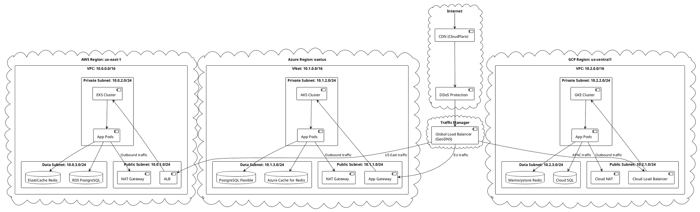

---

## 🔒 Security Architecture

### Defense-in-Depth Layers

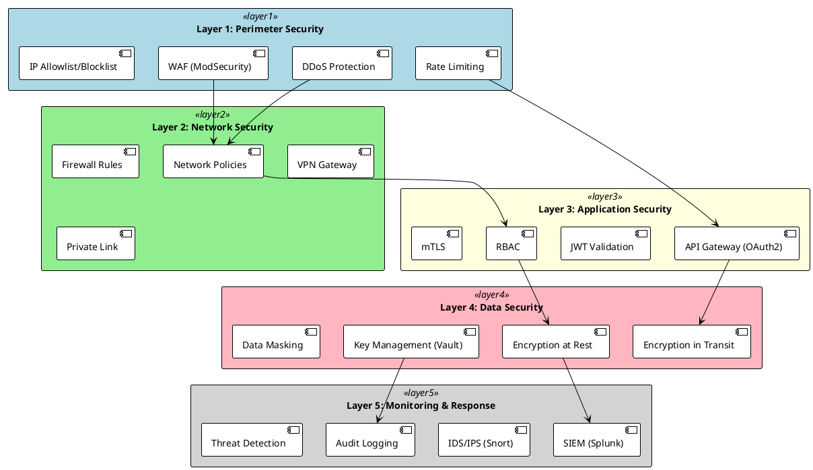

### Authentication & Authorization Flow

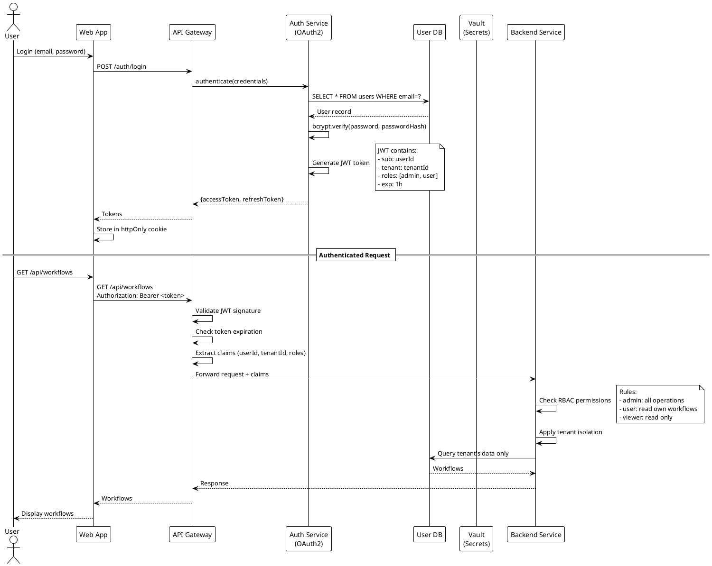

---

## 💾 Data Flow Diagrams

### Workflow Execution Data Flow

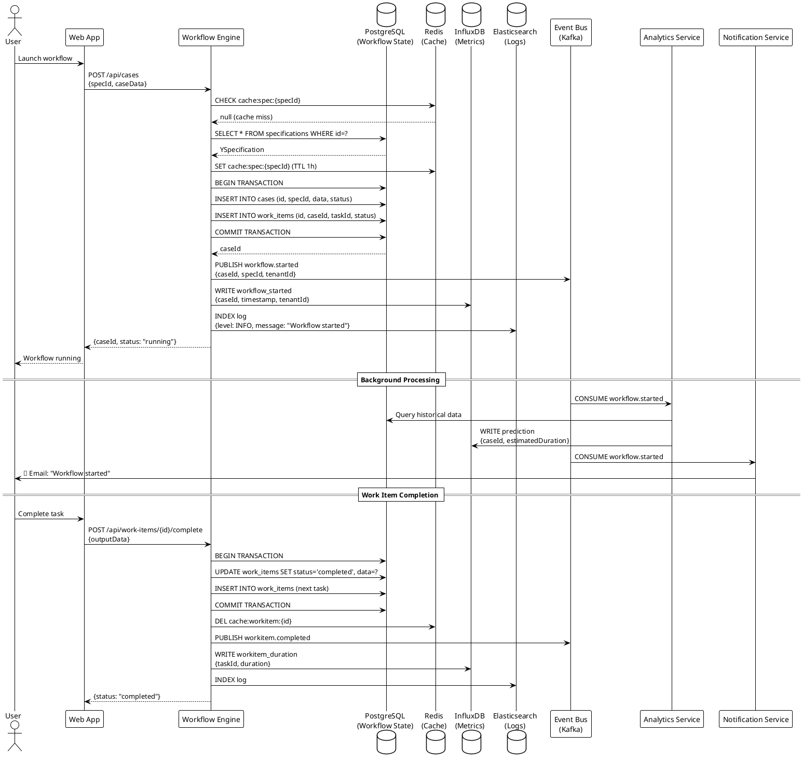

### AI Workflow Generation Data Flow

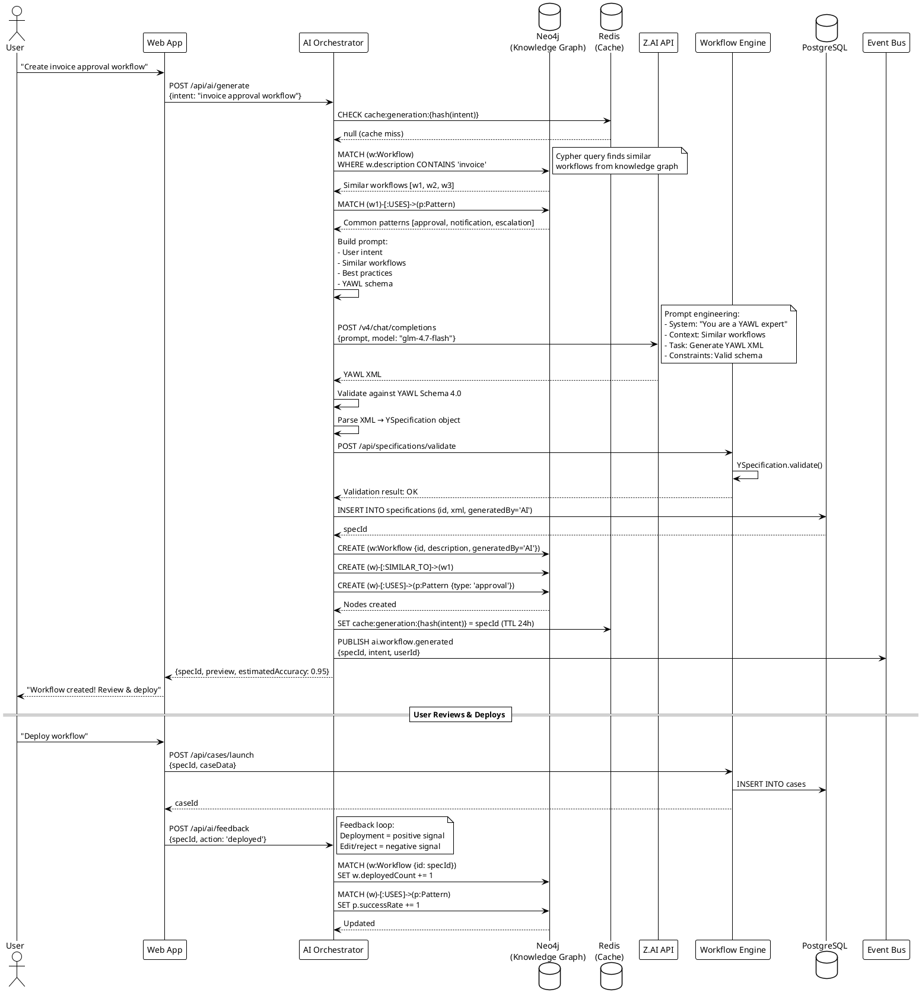

### Marketplace Transaction Data Flow

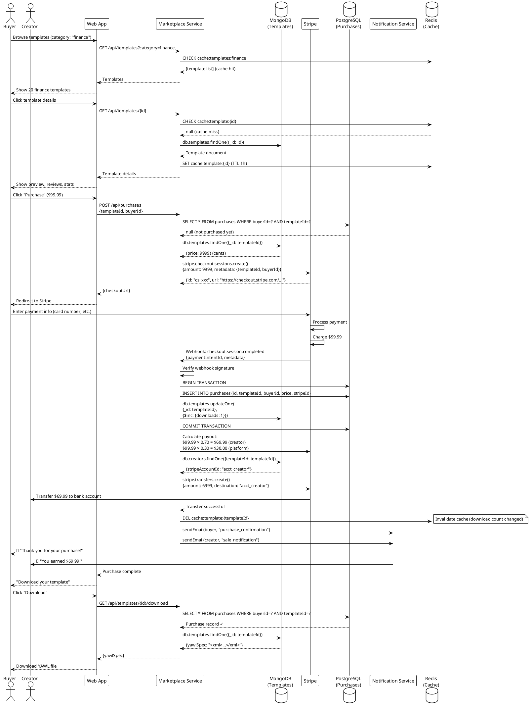

---

## 📊 Observability Architecture

### Monitoring Stack

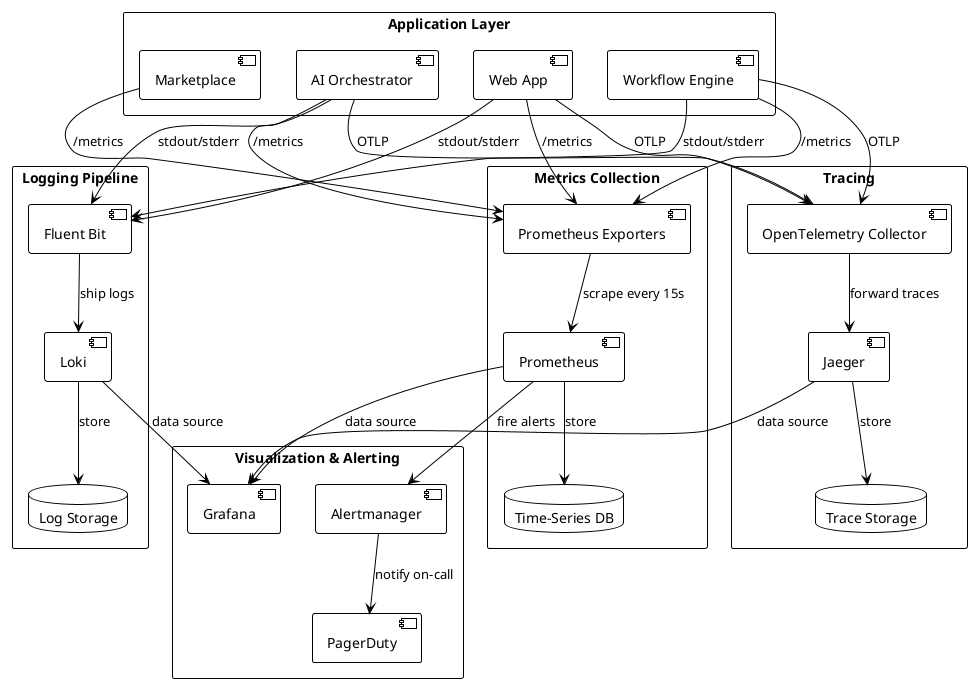

### Distributed Tracing Example

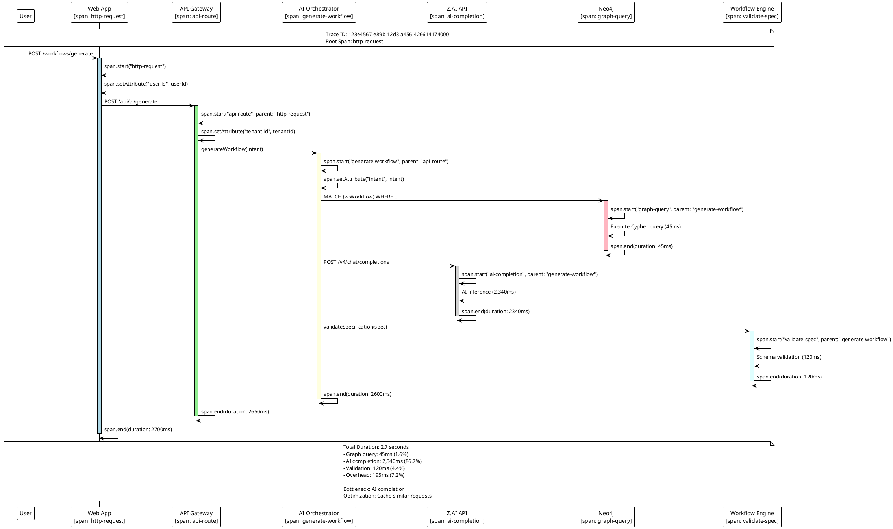

---

## 🔄 CI/CD Pipeline Architecture

```plantuml
@startuml CICD_Pipeline
!theme plain

rectangle "Developer Workflow" {
    actor Developer
    component "Git Push" as git
    component "GitHub" as github
}

rectangle "CI Pipeline (GitHub Actions)" {
    component "Checkout Code" as checkout
    component "Build (Ant)" as build
    component "Unit Tests" as tests
    component "SAST Scan (SonarQube)" as sast
    component "Build Docker Images" as docker
    component "Vulnerability Scan (Trivy)" as trivy
    component "Push to Registry" as registry
}

rectangle "CD Pipeline (ArgoCD)" {
    component "ArgoCD" as argocd
    component "Helm Chart Render" as helm
    component "Manifest Validation" as validate
    component "Apply to Kubernetes" as k8s
}

rectangle "Environments" {
    cloud "Dev Cluster" as dev
    cloud "Staging Cluster" as staging
    cloud "Production Cluster" as prod
}

rectangle "Testing & Validation" {
    component "Integration Tests" as integration
    component "E2E Tests (Playwright)" as e2e
    component "Load Tests (k6)" as load
    component "Security Tests (OWASP ZAP)" as security
}

rectangle "Approval Gates" {
    actor "QA Team" as qa
    actor "Security Team" as sec
    actor "Product Owner" as po
}

Developer -> git : "git push"
git -> github : "trigger webhook"
github -> checkout : "pull code"

checkout -> build : "ant buildAll"
build -> tests : "ant unitTest"
tests -> sast : "sonarqube scan"
sast -> docker : "docker build"
docker -> trivy : "scan images"
trivy -> registry : "push to ECR/ACR/GCR"

registry -> argocd : "new image available"
argocd -> helm : "render manifests"
helm -> validate : "kubeval, kube-score"

validate -> dev : "auto-deploy"
dev -> integration : "run tests"
integration -> e2e : "playwright tests"

e2e -> qa : "approve staging?"
qa -> staging : "approved"
staging -> load : "k6 load test"
staging -> security : "OWASP ZAP scan"

load -> sec : "approve production?"
sec -> po : "business approval?"
po -> prod : "deploy to prod"

@enduml
```

---

## 🗺️ Service Mesh Architecture

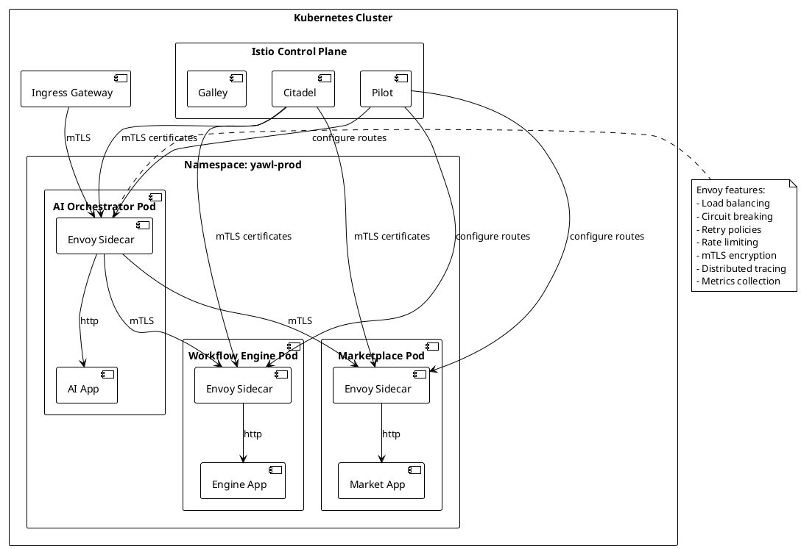

---

## 💾 Backup & Disaster Recovery Architecture

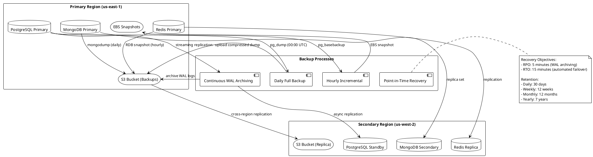

---

## 📈 Auto-Scaling Architecture

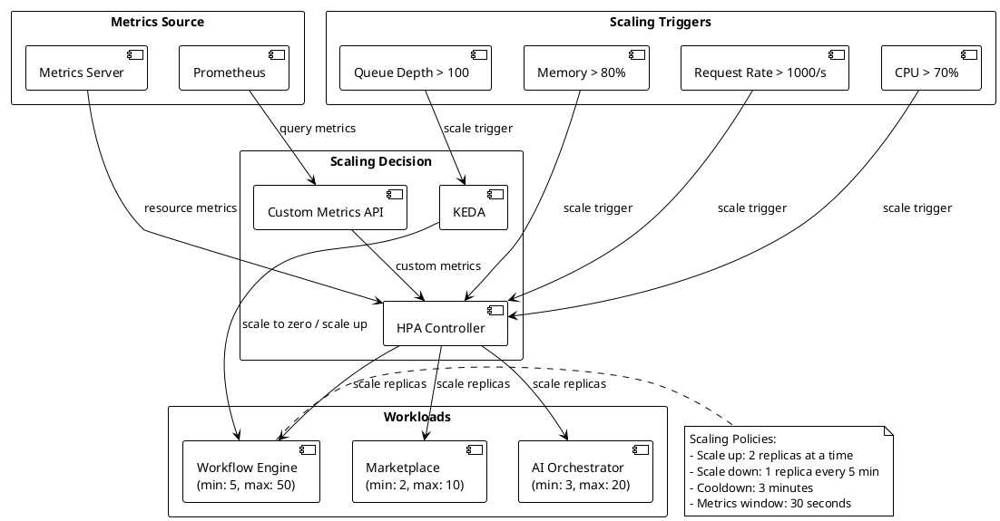

---

## 🌍 Global Distribution Architecture

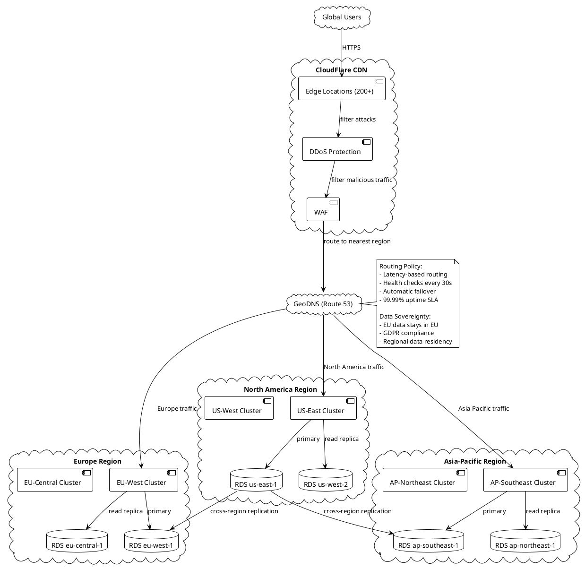

---

## 📋 Summary

### Architecture Diagrams Created

1. **Network Architecture** - Multi-cloud network topology
2. **Security Architecture** - Defense-in-depth layers
3. **Authentication Flow** - OAuth2/JWT authentication
4. **Data Flow Diagrams** - Workflow execution, AI generation, marketplace
5. **Observability Stack** - Prometheus, Loki, Jaeger integration
6. **CI/CD Pipeline** - GitHub Actions → ArgoCD → Kubernetes
7. **Service Mesh** - Istio with mTLS
8. **Backup & DR** - Multi-region backup strategy
9. **Auto-Scaling** - HPA and KEDA configuration
10. **Global Distribution** - CloudFlare CDN + GeoDNS

### Key Architectural Principles

✅ **Security First** - Defense-in-depth, zero trust
✅ **High Availability** - Multi-region, auto-failover
✅ **Scalability** - Horizontal scaling, global distribution
✅ **Observability** - Metrics, logs, traces
✅ **Resilience** - Circuit breakers, retries, backups
✅ **Performance** - CDN, caching, read replicas
✅ **Compliance** - Data residency, encryption, audit logs

---

**All diagrams use PlantUML format for easy rendering and version control.**
