# YAWL v6.0.0 — Automated CVE Scanning Setup

**Document Version:** 1.0  
**Last Updated:** 2026-02-20  
**Status:** Complete / Production-Ready

---

## Overview

This document describes the automated CVE (Common Vulnerabilities and Exposures) scanning setup for YAWL v6.0.0. The system continuously monitors all Maven dependencies for known vulnerabilities using OWASP Dependency-Check, integrated into both local development and GitHub Actions CI/CD pipelines.

### Key Components

| Component | Purpose | Location |
|-----------|---------|----------|
| **OWASP Dependency-Check Plugin** | Maven plugin that scans dependencies against NVD database | `pom.xml` (lines 1664-1704) |
| **ci-security Profile** | Maven profile for GitHub Actions CI/CD (auto-activated) | `pom.xml` (ci-security profile) |
| **security-audit Profile** | Manual/offline CVE scanning with detailed reporting | `pom.xml` (security-audit profile) |
| **Suppressions File** | Documented false positives, accepted risks, transitive deps | `/home/user/yawl/owasp-suppressions.xml` |
| **GitHub Actions Workflow** | Automated CVE scanning on every commit + daily scheduled | `.github/workflows/cve-scanning.yml` |

---

## Quick Start

### Run Local CVE Scan (Security Audit)

```bash
# Full comprehensive scan with all report formats (HTML, JSON, XML)
mvn clean verify -P security-audit

# Output: target/dependency-check/dependency-check-report.*
# View HTML report: open target/dependency-check/dependency-check-report.html
```

### Run Local CVE Scan (CI Mode)

```bash
# Same as CI/CD environment - fails on CVSS >= 7.0
mvn clean verify -P ci-security

# Exit codes:
#   0 = No HIGH/CRITICAL CVEs
#   1 = Found HIGH/CRITICAL CVEs (build fails)
```

### View GitHub Actions Results

1. Navigate to: **Actions** → **CVE Scanning - Maven Dependencies**
2. Click latest run
3. **Artifacts** tab: Download CVE reports (HTML/JSON/XML)
4. **Annotations** tab: View security findings

---

## CVE Thresholds & Policy

### Severity Levels (CVSS)

| CVSS | Severity | Action | Impact |
|------|----------|--------|--------|
| 9.0-10.0 | **CRITICAL** | **MUST FIX immediately** | Build FAILS, blocks merge |
| 7.0-8.9 | **HIGH** | **MUST FIX before release** | Build FAILS, blocks merge |
| 4.0-6.9 | **MEDIUM** | Track for next release | Build PASSES, create issue |
| 0.1-3.9 | **LOW** | Monitor & document | Build PASSES, log only |
| N/A | **Informational** | Reference only | No action required |

### Build Policy

```
✅ PASSES: No vulnerabilities OR only LOW/MEDIUM (properly suppressed)
❌ FAILS:  Any HIGH/CRITICAL NOT in suppressions.xml
⚠️  WARNS: MEDIUM severity with accepted risk documented
```

---

## Local Development

### Setup (One-Time)

```bash
# No special setup needed - plugin is configured in pom.xml
# First run downloads NVD database (internet required)

# Verify Maven is configured:
mvn -v

# Verify Java 25 is available:
java -version
```

### Workflow

```bash
# After adding new dependencies, always run:
mvn clean verify -P security-audit

# Check reports:
open target/dependency-check/dependency-check-report.html

# If new CVEs found:
# 1. Update dependency version if available
# 2. If no fix available: Add suppression to owasp-suppressions.xml
# 3. Document in suppression: WHY risk is acceptable
# 4. Commit both pom.xml and owasp-suppressions.xml
```

### Adding a New Suppression

**File:** `/home/user/yawl/owasp-suppressions.xml`

**Template:**
```xml
<suppress until="2026-12-31">
    <notes>
        COMPONENT: [Library name and version]
        REASON: [Why suppressed: false positive/accepted risk/transitive/planned upgrade]
        CONTEXT: [How YAWL uses this (e.g., test-only, optional service)]
        RISK LEVEL: [Low/Medium/High + specific CVSS if known]
        MITIGATION: [Any deployment controls or usage restrictions]
        UPGRADE PATH: [When/how this will be remediated]
        REVIEWED: YYYY-MM-DD
    </notes>
    <packageUrl regex="true">^pkg:maven/org\.example/library@.*$</packageUrl>
    <cvssBelow>7.0</cvssBelow>
</suppress>
```

**Example (Real):**
```xml
<suppress until="2026-06-30">
    <notes>
        COMPONENT: ANTLR 2.7.7
        REASON: Transitive dependency of Hibernate 6.6.42
        CONTEXT: Required for JPA query parsing at runtime
        RISK LEVEL: Low-Medium (parsing only, not network-exposed)
        MITIGATION: None required in current deployment
        UPGRADE PATH: Migrate to Hibernate 7.0 by 2026-06-30
        REVIEWED: 2026-02-20
    </notes>
    <packageUrl regex="true">^pkg:maven/antlr/antlr@2\.7\.7$</packageUrl>
    <cvssBelow>7.0</cvssBelow>
</suppress>
```

---

## GitHub Actions CI/CD Integration

### Workflow: cve-scanning.yml

**Location:** `.github/workflows/cve-scanning.yml`

**Triggers:**
- ✅ Every push to `main` or `release/**` branches (if pom.xml changed)
- ✅ Every pull request to `main`
- ✅ Daily at 02:00 UTC (scheduled scan)
- ✅ Manual trigger via GitHub Actions UI (`workflow_dispatch`)

**Jobs:**
1. **cve-scan** (30-min timeout)
   - Checks out code
   - Runs Maven with `ci-security` profile
   - Executes `mvn clean verify -P ci-security`
   - Parses results, generates HTML/JSON/XML reports
   - Uploads reports as workflow artifacts (90-day retention)
   - Comments on PRs with summary
   - Uploads SARIF for GitHub Security alerts

2. **summary** (aggregation)
   - Reports status to CI/CD pipeline
   - **FAILS** if HIGH/CRITICAL CVEs found
   - Blocks merge until resolved or suppressed

### PR Workflow Example

```
1. Developer pushes code with new dependency
   ↓
2. GitHub Actions triggers cve-scanning.yml
   ↓
3. OWASP Dependency-Check runs
   ↓
4. If HIGH/CRITICAL CVEs found:
   → PR comment with findings
   → Build marked FAILED
   → Cannot merge until fixed
   ↓
5. Developer either:
   a) Updates dependency to patched version
   b) Documents accepted risk in owasp-suppressions.xml
   c) Removes problematic dependency
   ↓
6. Commit changes, push again
   ↓
7. GitHub Actions re-runs, passes
   ↓
8. PR approved and merged
```

### Accessing Reports

**In GitHub Actions:**
1. Click "Actions" → "CVE Scanning - Maven Dependencies"
2. Click the failed/passed run
3. Scroll to "Artifacts" section
4. Download `cve-reports-NNN.zip` containing:
   - `dependency-check-report.html` (visual, viewable in browser)
   - `dependency-check-report.json` (machine-parseable)
   - `dependency-check-report.xml` (detailed, all CVEs)

**Locally from CI Run:**
```bash
# If run failed, download artifact manually or re-run locally:
mvn clean verify -P security-audit
```

---

## Maven Profiles

### 1. `security-audit` Profile

**Purpose:** Comprehensive, time-unlimited CVE scan (human review)

**Activation:** Manual only
```bash
mvn -P security-audit dependency-check:aggregate
```

**Behavior:**
- ✅ Scans ALL dependencies (runtime + transitive)
- ✅ Generates HTML, JSON, XML reports
- ❌ FAILS on CVSS >= 7.0
- ✅ Applies suppressions from `owasp-suppressions.xml`
- ⏱️ Takes 2-5 minutes (downloads NVD database)

**Output:**
```
target/dependency-check/dependency-check-report.html
target/dependency-check/dependency-check-report.json
target/dependency-check/dependency-check-report.xml
```

### 2. `ci-security` Profile

**Purpose:** Production-grade security gate (automated CI/CD)

**Activation:** Automatic in GitHub Actions (`env.GITHUB_ACTIONS` property)

**Behavior:**
- ✅ Scans runtime dependencies only (no test deps)
- ✅ Generates HTML, JSON, XML reports
- ❌ FAILS on CVSS >= 7.0 (production threshold)
- ✅ Applies suppressions from `owasp-suppressions.xml`
- ⏱️ Runs as part of `verify` phase
- 🔄 Auto-updates CVE database from NVD

**Configuration in pom.xml:**
```xml
<profile>
    <id>ci-security</id>
    <activation>
        <property>
            <name>env.GITHUB_ACTIONS</name>
        </property>
    </activation>
    <!-- ... dependency-check configuration ... -->
</profile>
```

---

## Configuration Details

### pom.xml Changes

#### 1. Plugin Management (Lines 1664-1704)

```xml
<plugin>
    <groupId>org.owasp</groupId>
    <artifactId>dependency-check-maven</artifactId>
    <version>${owasp.dependency.check.version}</version>  <!-- v12.2.0 -->
    <configuration>
        <suppressionFile>owasp-suppressions.xml</suppressionFile>
        <formats>
            <format>HTML</format>
            <format>JSON</format>
            <format>XML</format>
        </formats>
        <reportOutputDirectory>${project.build.directory}/dependency-check</reportOutputDirectory>
        <dependencyCheckAssembly>true</dependencyCheckAssembly>
        <autoUpdate>true</autoUpdate>
        <cveDataDirectory>.m2/cve-data</cveDataDirectory>
        <connectionTimeout>20000</connectionTimeout>
        <socketTimeout>20000</socketTimeout>
        <enableExperimental>false</enableExperimental>
        <enableRetired>false</enableRetired>
    </configuration>
</plugin>
```

**Key Settings:**
- `failBuildOnCVSS`: Set per-profile (7.0 for ci-security, 11 for security-audit)
- `suppressionFile`: References `owasp-suppressions.xml`
- `reportOutputDirectory`: `target/dependency-check/`
- `autoUpdate`: Auto-download latest NVD data (can be disabled offline)

#### 2. ci-security Profile

Auto-activates when `GITHUB_ACTIONS` env var is present (always set by GitHub Actions).

```xml
<profile>
    <id>ci-security</id>
    <activation>
        <property>
            <name>env.GITHUB_ACTIONS</name>
        </property>
    </activation>
    <build>
        <plugins>
            <plugin>
                <groupId>org.owasp</groupId>
                <artifactId>dependency-check-maven</artifactId>
                <configuration>
                    <failBuildOnCVSS>7.0</failBuildOnCVSS>
                    <!-- ... rest of config from pluginManagement ... -->
                </configuration>
                <executions>
                    <execution>
                        <id>ci-dependency-check</id>
                        <phase>verify</phase>
                        <goals>
                            <goal>check</goal>
                        </goals>
                    </execution>
                </executions>
            </plugin>
        </plugins>
    </build>
</profile>
```

#### 3. security-audit Profile

Manual trigger for comprehensive offline scans.

```xml
<profile>
    <id>security-audit</id>
    <!-- No activation (manual only) -->
    <build>
        <plugins>
            <plugin>
                <groupId>org.owasp</groupId>
                <artifactId>dependency-check-maven</artifactId>
                <configuration>
                    <failBuildOnCVSS>7.0</failBuildOnCVSS>
                    <formats>
                        <format>HTML</format>
                        <format>JSON</format>
                        <format>XML</format>
                    </formats>
                    <includeTestScope>false</includeTestScope>
                    <!-- ... -->
                </configuration>
                <!-- ... -->
            </plugin>
        </plugins>
    </build>
</profile>
```

---

## Suppressions Management

### File Structure

**Location:** `/home/user/yawl/owasp-suppressions.xml`

**Sections:**
1. **False Positives** - CVEs incorrectly flagged (not actually vulnerable)
2. **Accepted Risks** - Known issues acceptable due to usage/deployment context
3. **Transitive Dependencies** - Required by upstream libraries, upgrade scheduled
4. **Planned Upgrades** - Known issues with documented fix timeline

### Review Schedule

**Quarterly Review (Feb/May/Aug/Nov):**

```bash
# 1. Run current scan
mvn clean verify -P security-audit

# 2. Review suppressions file
cat owasp-suppressions.xml

# 3. Check expiration dates (until="YYYY-MM-DD")
grep "until=" owasp-suppressions.xml

# 4. Update notes with review date

# 5. Remove expired suppressions

# 6. Check for updates to suppressed libraries
mvn dependency:tree | grep -E "(twitter4j|jung|antlr)"

# 7. Commit changes
git add pom.xml owasp-suppressions.xml
git commit -m "chore: Q1 2026 CVE suppression review"
```

### Baseline Suppressions (Current)

| Library | Type | Reason | Expiration |
|---------|------|--------|------------|
| Twitter4j | False Positive | Optional service, not in core | No expiration |
| JUNG | False Positive | Graph visualization only, not network-exposed | No expiration |
| H2 Database | Accepted Risk | Test/dev only; production uses PostgreSQL/MySQL | 2026-12-31 |
| ANTLR 2.7.7 | Transitive | Required by Hibernate; upgrade to H7 by 2026-06-30 | 2026-06-30 |
| JSF/Jakarta Faces | Planned Upgrade | Legacy UI, migration to React/Vue by 2026-12-31 | 2026-12-31 |

---

## Troubleshooting

### Issue: Build fails with "Repository unavailable"

**Symptom:** Maven cannot download NVD database

```
[ERROR] Failed to retrieve...
[ERROR] The following artifacts could not be resolved...
```

**Solution:** Use offline mode or configure proxy

```bash
# Option 1: Disable auto-update for offline testing
mvn -P security-audit \
    -Ddependency-check.skip.checks=true \
    dependency-check:aggregate

# Option 2: Configure proxy in settings.xml
# See: https://maven.apache.org/settings.html

# Option 3: Run with -o flag
mvn -o -P security-audit dependency-check:check
```

### Issue: False Positive CVE (correctly suppressed but still fails)

**Symptom:** Suppression added but build still fails

**Diagnosis:**
```bash
# Check suppression is valid XML
xmllint owasp-suppressions.xml

# Verify suppression matches actual package
mvn dependency:tree | grep -i "twitter4j"
# Compare with suppression <packageUrl>

# Check report for actual CVE
unzip -p target/dependency-check.zip \
      dependency-check-report.json | jq '.reportSchema.dependencies[] | select(.packageUrl | contains("twitter4j"))'
```

**Fix:** Ensure `<packageUrl>` regex exactly matches Maven dependency format

```xml
<!-- Correct: -->
<packageUrl regex="true">^pkg:maven/org\.twitter4j/twitter4j\-core@.*$</packageUrl>

<!-- Wrong: -->
<packageUrl>org.twitter4j:twitter4j-core</packageUrl>
```

### Issue: CVE database is old (not updated)

**Symptom:** Recent CVEs not detected

**Solution:**
```bash
# Force CVE database update
rm -rf ~/.m2/cve-data/
mvn clean verify -P security-audit

# Or update just the NVD data
mvn dependency-check:update-only -P security-audit
```

### Issue: Scan takes too long (>10 minutes)

**Symptom:** GitHub Actions workflow times out

**Causes:**
1. First run (downloads 1GB+ CVE database)
2. Network timeout to NVD servers
3. Too many transitive dependencies to scan

**Solutions:**

```bash
# Option 1: Disable experimental analyzers (faster)
mvn -P ci-security \
    -Ddependency-check.analyzer.nexus.enabled=false \
    -Ddependency-check.analyzer.retirejs.enabled=false \
    dependency-check:check

# Option 2: Pre-populate CVE cache
mvn dependency-check:update-only -P security-audit

# Option 3: Cache downloads in GitHub Actions
# See: .github/workflows/cve-scanning.yml (uses maven cache)
```

### Issue: "No suppression file found"

**Symptom:** Error about missing `owasp-suppressions.xml`

```
[ERROR] OWASP Dependency-Check Plugin: Suppression file not found
```

**Solution:**
```bash
# Check file exists
ls -la /home/user/yawl/owasp-suppressions.xml

# Check pom.xml references correct path
grep "suppressionFile" /home/user/yawl/pom.xml
# Should show: ${maven.multiModuleProjectDirectory}/owasp-suppressions.xml

# Verify path is correct
echo $MAVEN_MULTMODULE_PROJECT_DIRECTORY
# or use relative path
mvn help:describe -Dplugin=org.owasp:dependency-check-maven
```

---

## Integration with CI/CD

### GitHub Actions Event Flow

```mermaid
graph TD
    A[Push to main] --> B[GitHub detects pom.xml change]
    B --> C[Trigger cve-scanning.yml]
    C --> D[Run: mvn clean verify -P ci-security]
    D --> E{Check for HIGH/CRITICAL}
    E -->|Found| F[❌ BUILD FAILS]
    E -->|Not Found| G[✅ BUILD PASSES]
    F --> H[Comment on PR]
    G --> H
    H --> I[Upload Reports to Artifacts]
```



### Required Permissions

**GitHub Actions Workflow Permissions:**
```yaml
permissions:
  contents: read          # Read repository contents
  pull-requests: write    # Comment on PRs
  security-events: write  # Upload SARIF reports
```

**Repository Settings:**
1. Go to: **Settings** → **Code security and analysis**
2. Enable: **Dependency graph** ✅
3. Enable: **Dependabot** ✅ (optional, for auto-updates)
4. Enable: **GitHub Advanced Security** (if available)

---

## Best Practices

### 1. Never Suppress Without Documentation

✅ Good:
```xml
<suppress until="2026-12-31">
    <notes>
        COMPONENT: ANTLR 2.7.7
        REASON: Transitive dep of Hibernate (no upgrade path in current version)
        CONTEXT: Parser used only at startup, not processing untrusted input
        UPGRADE PATH: Will be resolved when upgrading to Hibernate 7.0
        RISK LEVEL: Low-Medium
        REVIEWED: 2026-02-20
    </notes>
    ...
</suppress>
```

❌ Bad:
```xml
<suppress>
    <notes>False positive</notes>
    ...
</suppress>
```

### 2. Use Time-Limited Suppressions

✅ Good:
```xml
<suppress until="2026-12-31">
```

❌ Bad:
```xml
<suppress>  <!-- No expiration - will persist forever -->
```

### 3. Test Suppressions Locally Before Pushing

```bash
# Add suppression to owasp-suppressions.xml
# Then verify it works:
mvn clean verify -P security-audit

# Check the report:
cat target/dependency-check/dependency-check-report.json | jq '.reportSchema.dependencies[]'
```

### 4. Review Suppressions Monthly

- Set calendar reminder for 1st of each month
- Run `mvn clean verify -P security-audit`
- Review output against suppressions
- Remove any expired suppressions
- Update reviewed dates

### 5. Escalate Critical Findings

If a CRITICAL CVE (CVSS 9.0+) is found:

1. **Immediately** open a security issue (private if necessary)
2. **Within 24 hours:** Upgrade dependency or apply vendor patch
3. **Within 7 days:** Release security update
4. Only suppress temporarily during patch development

---

## Related Documentation

- **OWASP Dependency-Check:** https://jeremylong.github.io/DependencyCheck/
- **NIST CVE Database:** https://nvd.nist.gov/
- **CVSS Scoring:** https://nvd.nist.gov/vuln/detail/
- **Maven Central:** https://mvnrepository.com/
- **YAWL GitHub:** https://github.com/yawlfoundation/yawl

---

## Checklist: Pre-Release Security Review

- [ ] Run `mvn clean verify -P security-audit`
- [ ] Review all CVEs in report
- [ ] Verify all suppressions have expiration dates
- [ ] Remove any expired suppressions
- [ ] Update CHANGELOG.md with security notes
- [ ] Check for newer versions of suppressed libraries
- [ ] Run GitHub Actions cve-scanning.yml manually
- [ ] Review PR comments and artifact reports
- [ ] Update this documentation with new findings
- [ ] Sign off on security assessment before release

---

## Questions?

For security issues or questions about CVE scanning:

1. Check this documentation first
2. Review existing GitHub Issues tagged `security`
3. Contact: [security contact or team]
4. For CVE disclosures: Follow YAWL security policy

---

**YAWL v6.0.0 – Secure by Design**

