# YAWL Build Sequences — Complete Reference

**19 modules | 7 dependency layers | FM7 poka-yoke**

This document is the canonical reference for building any subset or all of the YAWL Maven
modules in the correct order. It covers the full dependency DAG, parallel build layers,
per-module sequence diagrams, minimal build paths, and the corrected `dx.sh` ordering.

---

## §1 — Full Dependency Flowchart

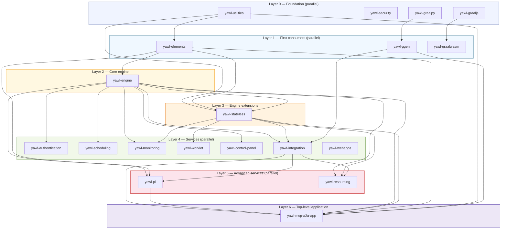

---

## §2 — Parallel Build Layers

Modules within the same layer have no dependency on each other and can compile concurrently.
Maven's `-T 1.5C` flag exploits this automatically.

| Layer | Modules | Parallel? | Bottleneck |
|-------|---------|-----------|-----------|
| **0** | yawl-utilities, yawl-security, yawl-graalpy, yawl-graaljs | ✓ All 4 | None |
| **1** | yawl-elements, yawl-ggen, yawl-graalwasm | ✓ All 3 | Waits for layer 0 |
| **2** | yawl-engine | — (single) | Waits for yawl-elements |
| **3** | yawl-stateless | — (single) | Waits for layer 2 |
| **4** | yawl-authentication, yawl-scheduling, yawl-monitoring, yawl-worklet, yawl-control-panel, yawl-integration, yawl-webapps | ✓ All 7 | Waits for layer 3 (and yawl-ggen for integration) |
| **5** | yawl-pi, yawl-resourcing | ✓ Both | Waits for yawl-integration |
| **6** | yawl-mcp-a2a-app | — (single) | Waits for layer 5 |

**Key insight**: The critical path is:
`utilities → elements → engine → stateless → integration → pi → mcp-a2a-app` (7 hops)

---

## §3 — Sequence Diagrams (19 modules)

Each diagram shows the exact build chain required before a module can compile.

### yawl-utilities (Layer 0)

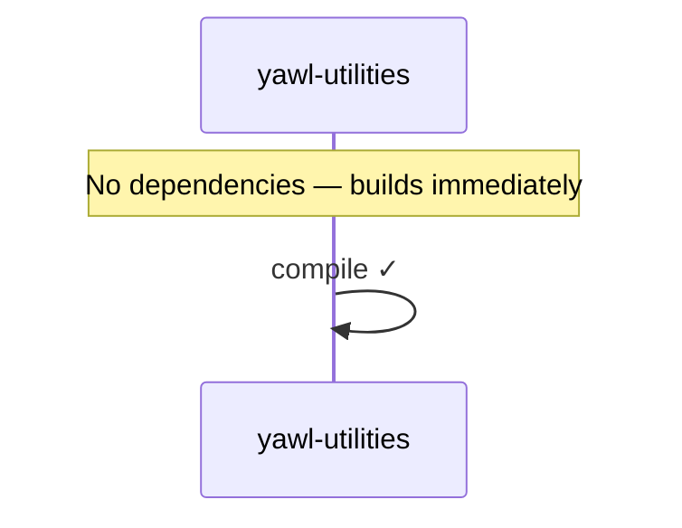

### yawl-security (Layer 0)

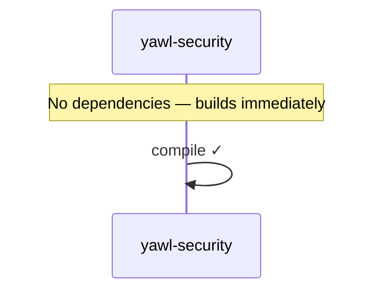

### yawl-graalpy (Layer 0)


### yawl-graaljs (Layer 0) ← NEW

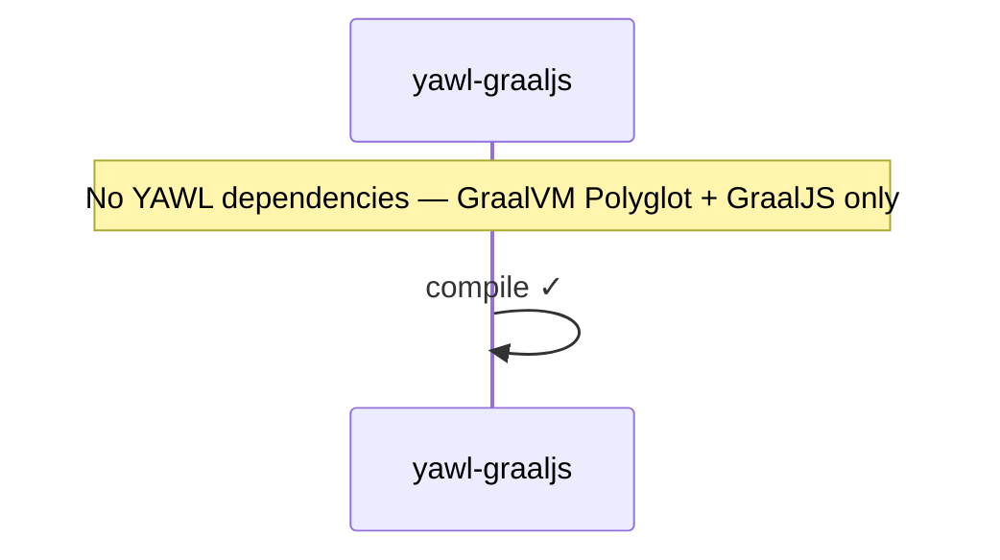

### yawl-elements (Layer 1)

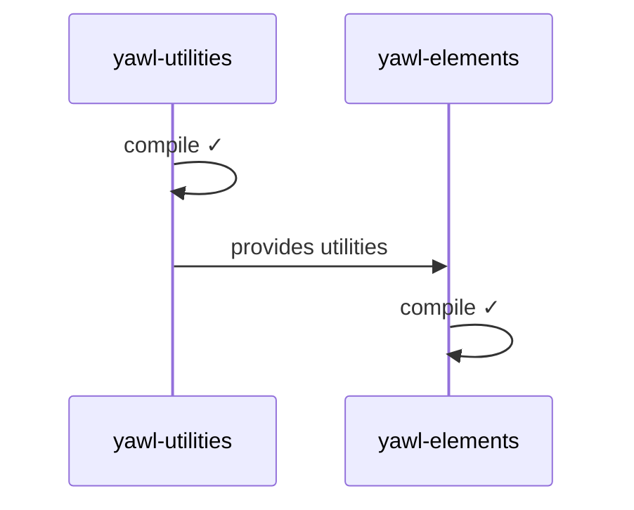

### yawl-ggen (Layer 1)

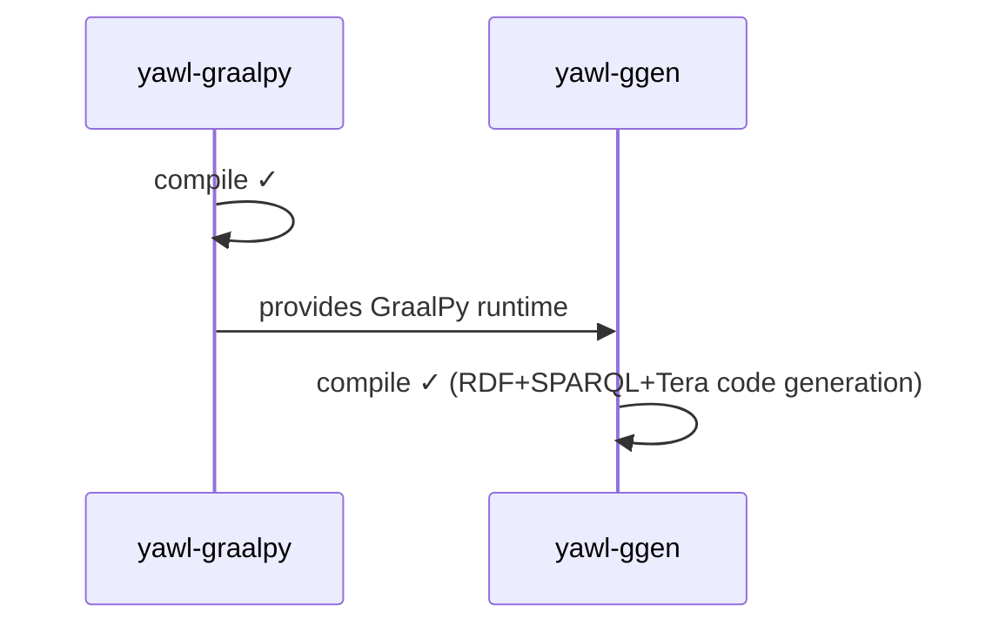

### yawl-graalwasm (Layer 1) ← NEW

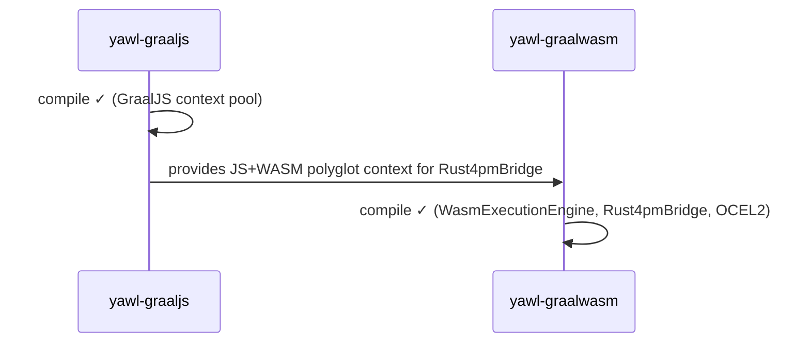

### yawl-engine (Layer 2)

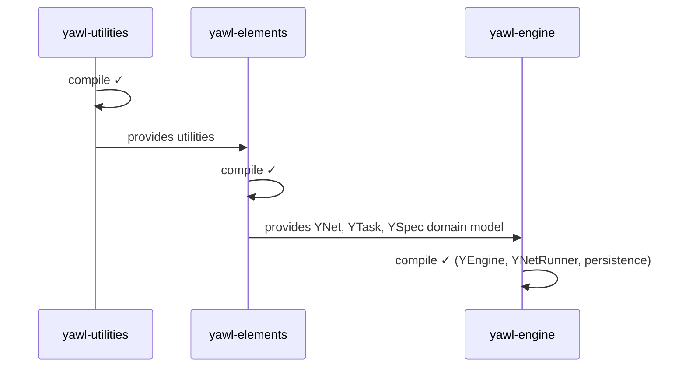

### yawl-stateless (Layer 3)

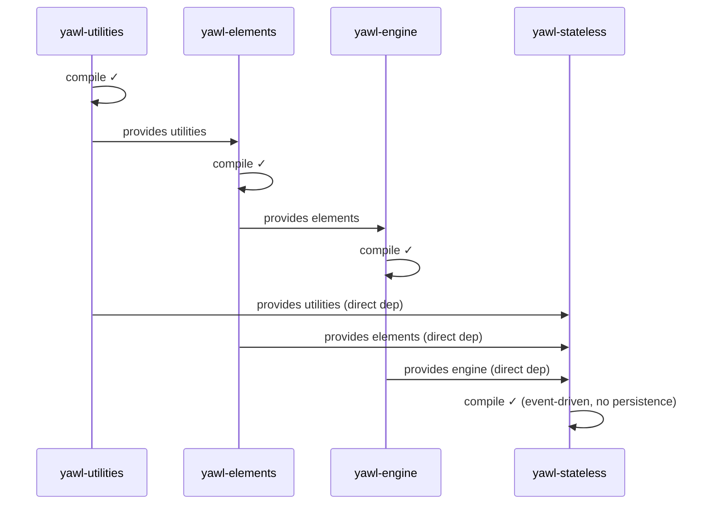

### yawl-authentication (Layer 4)

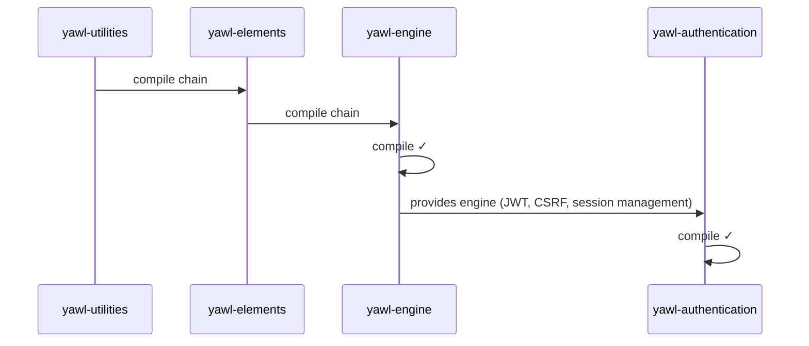

### yawl-scheduling (Layer 4)

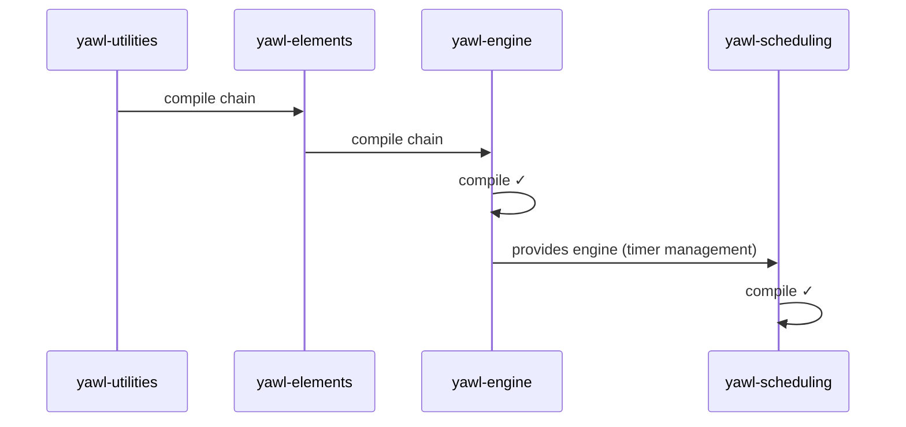

### yawl-monitoring (Layer 4)

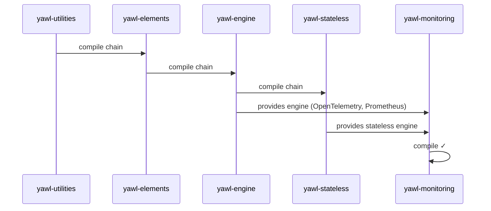

### yawl-worklet (Layer 4)

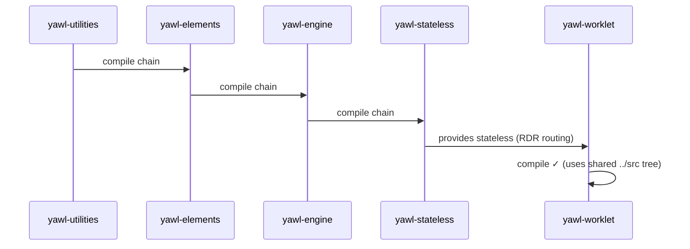

### yawl-control-panel (Layer 4)

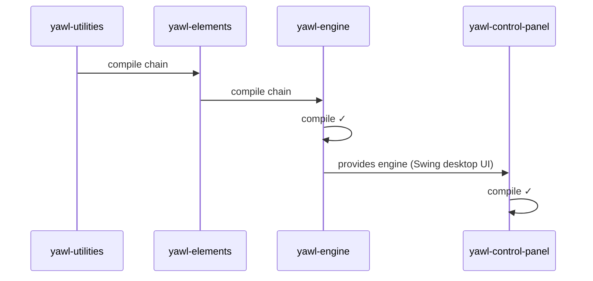

### yawl-integration (Layer 4)

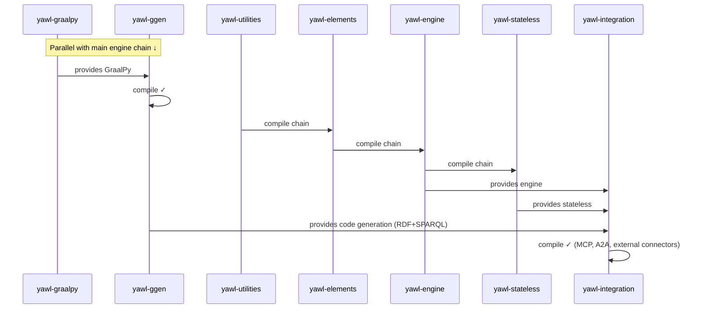

### yawl-webapps (Layer 4 — aggregator)

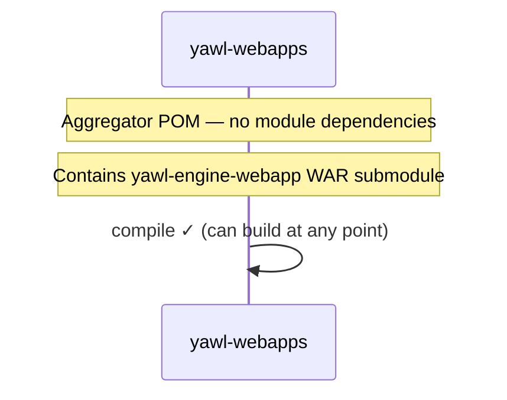

### yawl-pi (Layer 5)

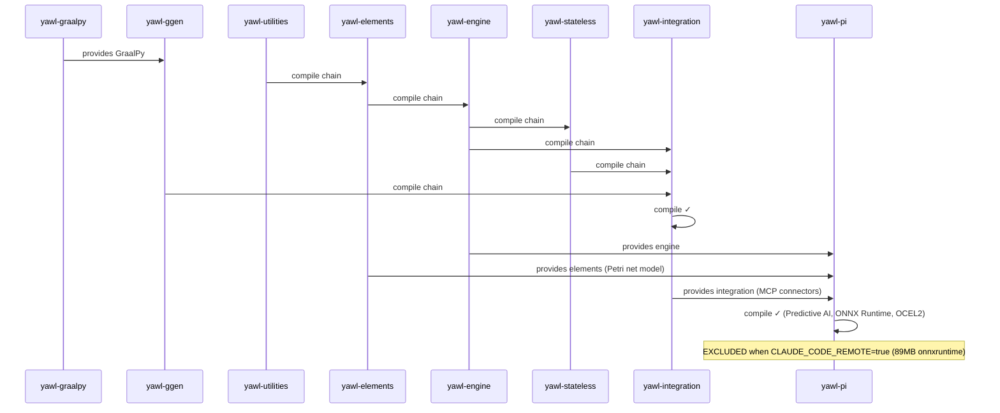

### yawl-resourcing (Layer 5)

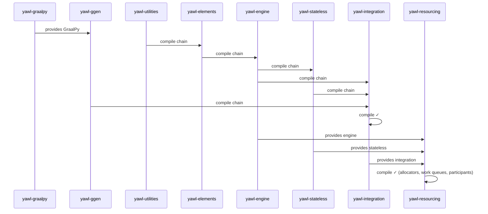

### yawl-mcp-a2a-app (Layer 6)

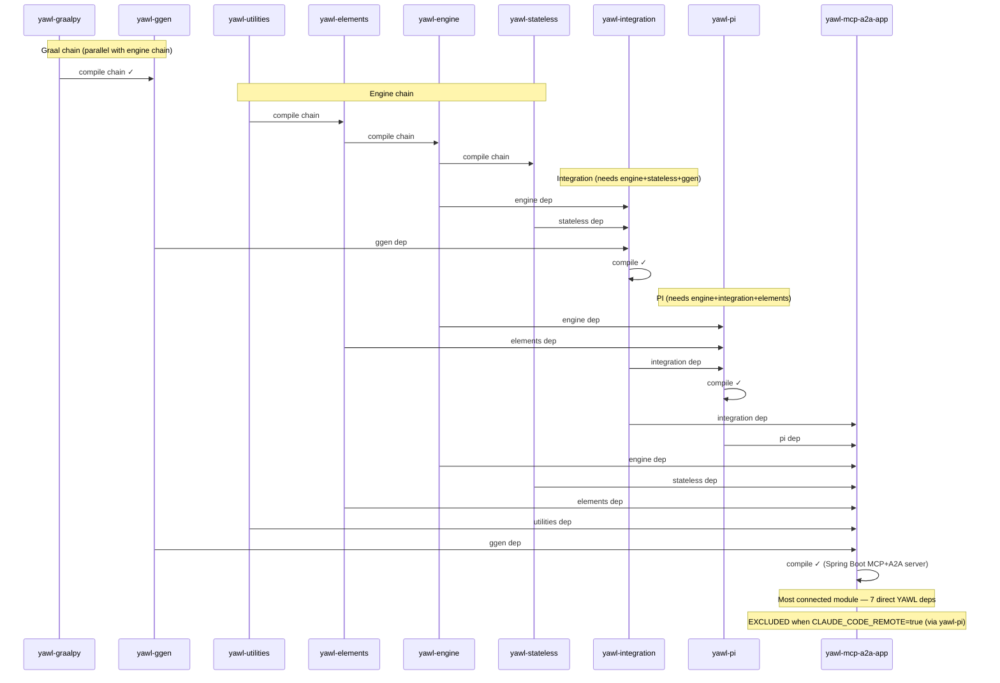

---

## §4 — Canonical Topological Sort

The definitive 19-module build order where every dependency is satisfied before its consumer.

| # | Module | Layer | Depends On (YAWL modules only) |
|---|--------|-------|--------------------------------|
| 1 | **yawl-utilities** | 0 | — |
| 2 | **yawl-security** | 0 | — |
| 3 | **yawl-graalpy** | 0 | — |
| 4 | **yawl-graaljs** | 0 | — ← NEW |
| 5 | **yawl-elements** | 1 | yawl-utilities |
| 6 | **yawl-ggen** | 1 | yawl-graalpy |
| 7 | **yawl-graalwasm** | 1 | yawl-graaljs ← NEW |
| 8 | **yawl-engine** | 2 | yawl-elements |
| 9 | **yawl-stateless** | 3 | yawl-utilities, yawl-elements, yawl-engine |
| 10 | **yawl-authentication** | 4 | yawl-engine |
| 11 | **yawl-scheduling** | 4 | yawl-engine |
| 12 | **yawl-monitoring** | 4 | yawl-engine, yawl-stateless |
| 13 | **yawl-worklet** | 4 | yawl-stateless |
| 14 | **yawl-control-panel** | 4 | yawl-engine |
| 15 | **yawl-integration** | 4 | yawl-engine, yawl-stateless, yawl-ggen |
| 16 | **yawl-webapps** | 4* | — (aggregator, independent) |
| 17 | **yawl-pi** | 5 | yawl-engine, yawl-integration, yawl-elements |
| 18 | **yawl-resourcing** | 5 | yawl-engine, yawl-stateless, yawl-integration |
| 19 | **yawl-mcp-a2a-app** | 6 | yawl-integration, yawl-pi, yawl-engine, yawl-stateless, yawl-elements, yawl-utilities, yawl-ggen |

> `yawl-webapps` is an aggregator POM (no module deps) and can compile at any layer ≥ 0.

---

## §5 — Minimal Build Paths (for `-pl` targeting)

Use these when running `mvn -pl <modules> -am compile` or `bash scripts/dx.sh -pl <modules>`.
The `-am` (also-make) flag tells Maven to also build upstream dependencies automatically,
so the minimal path shown is the **transitive closure** for that module.

| Target Module | Minimal `-pl` module list | Count |
|---------------|--------------------------|-------|
| yawl-utilities | `yawl-utilities` | 1 |
| yawl-security | `yawl-security` | 1 |
| yawl-graalpy | `yawl-graalpy` | 1 |
| yawl-graaljs | `yawl-graaljs` | 1 |
| yawl-elements | `yawl-utilities,yawl-elements` | 2 |
| yawl-ggen | `yawl-graalpy,yawl-ggen` | 2 |
| yawl-graalwasm | `yawl-graaljs,yawl-graalwasm` | 2 |
| yawl-engine | `yawl-utilities,yawl-elements,yawl-engine` | 3 |
| yawl-stateless | `yawl-utilities,yawl-elements,yawl-engine,yawl-stateless` | 4 |
| yawl-authentication | `yawl-utilities,yawl-elements,yawl-engine,yawl-authentication` | 4 |
| yawl-scheduling | `yawl-utilities,yawl-elements,yawl-engine,yawl-scheduling` | 4 |
| yawl-control-panel | `yawl-utilities,yawl-elements,yawl-engine,yawl-control-panel` | 4 |
| yawl-worklet | `yawl-utilities,yawl-elements,yawl-engine,yawl-stateless,yawl-worklet` | 5 |
| yawl-monitoring | `yawl-utilities,yawl-elements,yawl-engine,yawl-stateless,yawl-monitoring` | 5 |
| yawl-integration | `yawl-graalpy,yawl-ggen,yawl-utilities,yawl-elements,yawl-engine,yawl-stateless,yawl-integration` | 7 |
| yawl-pi | `yawl-graalpy,yawl-ggen,yawl-utilities,yawl-elements,yawl-engine,yawl-stateless,yawl-integration,yawl-pi` | 8 |
| yawl-resourcing | `yawl-graalpy,yawl-ggen,yawl-utilities,yawl-elements,yawl-engine,yawl-stateless,yawl-integration,yawl-resourcing` | 8 |
| yawl-webapps | `yawl-webapps` | 1 (aggregator) |
| yawl-mcp-a2a-app | All 19 modules (transitively) | 19 |

**Example commands:**
```bash
# Build just the engine and its deps
bash scripts/dx.sh -pl yawl-utilities,yawl-elements,yawl-engine

# Build integration and everything it needs
mvn -pl yawl-graalpy,yawl-ggen,yawl-utilities,yawl-elements,yawl-engine,yawl-stateless,yawl-integration -T 1.5C clean compile

# Use Maven's -am flag to auto-resolve deps (simpler)
mvn -pl yawl-integration -am -T 1.5C clean compile
```

---

## §6 — dx.sh Ordering (corrected)

The `scripts/dx.sh` `ALL_MODULES` array was **incorrect** — it placed `yawl-authentication`
before `yawl-engine`, but authentication depends on engine. The new modules `yawl-graaljs`
and `yawl-graalwasm` were also missing.

```bash
# BEFORE (wrong — authentication before engine, missing graaljs/graalwasm):
ALL_MODULES=(
    yawl-utilities yawl-elements yawl-authentication yawl-engine
    yawl-stateless yawl-resourcing yawl-scheduling
    yawl-security yawl-integration yawl-monitoring yawl-ggen yawl-pi yawl-webapps
    yawl-control-panel yawl-mcp-a2a-app
)

# AFTER (correct — topological order, all 19 modules):
ALL_MODULES=(
    yawl-utilities yawl-security yawl-graalpy yawl-graaljs
    yawl-elements yawl-ggen yawl-graalwasm
    yawl-engine
    yawl-stateless
    yawl-authentication yawl-scheduling yawl-monitoring
    yawl-worklet yawl-control-panel yawl-integration yawl-webapps
    yawl-pi yawl-resourcing
    yawl-mcp-a2a-app
)
```

---

## §7 — Build Profiles by Scenario

| Scenario | Command | Approx. Time |
|----------|---------|-------------|
| Fast check (changed modules only) | `bash scripts/dx.sh` | 5–15s |
| Compile only (changed) | `bash scripts/dx.sh compile` | 3–5s |
| Test only (changed) | `bash scripts/dx.sh test` | 10–15s |
| Full build + test (all) | `bash scripts/dx.sh all` | 45–60s |
| Single module compile | `bash scripts/dx.sh -pl yawl-engine` | 5–10s |
| Unit tests only | `mvn -P quick-test clean test -T 1.5C` | ~10s |
| CI build (with coverage) | `mvn -P ci clean verify -T 1.5C` | 2–3m |
| Full static analysis | `mvn -P analysis clean verify -T 1.5C` | 5m+ |
| Security scan (SBOM) | `mvn -P security verify` | 3m+ |
| Production validation | `mvn -P prod verify` | 3m+ |
| Pre-commit gate | `bash scripts/dx.sh all` | 45–60s |

**Environment variables:**

| Variable | Values | Effect |
|----------|--------|--------|
| `CLAUDE_CODE_REMOTE=true` | true/false | Excludes yawl-pi + yawl-mcp-a2a-app (89MB onnxruntime) |
| `DX_VERBOSE=1` | 0/1 | Full Maven output |
| `DX_OFFLINE=1` | 1/0/auto | Force offline build |
| `DX_FAIL_AT=end` | fast/end | Continue or stop on first failure |
| `DX_CLEAN=1` | 0/1 | Run `clean` phase before build |

---

## §8 — Release Gate Sequence

From `scripts/validation/validate-release.sh` (PY-1, PY-2, PY-3, FM13):

```
G_compile ──→ G_test ──→ G_guard ──→ G_analysis ──→ G_security ──→ G_documentation
   │              │          │              │                │
  <90s       100% pass   0 H-patterns   0 SpotBugs      SBOM+Grype
  reactor                (14 patterns)  0 PMD          no critical CVEs
  order                  hyper-         0 Checkstyle
  correct                validate.sh    ≥75% JaCoCo
                                              │
                              ───────────────────────────────────
                              │ PY-1: gate receipts (≤24h old) │
                              │   gate-G_guard-receipt.json     │
                              │   gate-G_test-receipt.json      │
                              │   gate-G_security-receipt.json  │
                              │ PY-2: JaCoCo ≥55% instruction  │
                              │ PY-3: grype --fail-on critical  │
                              │ PY-4: 48h stability receipt     │
                              └───────────────────────────────┘
                                              │
                                         G_release ✓
```

**Run release gate validation:**
```bash
bash scripts/validation/validate-release.sh           # all gates
bash scripts/validation/validate-release.sh receipts  # PY-1 only
bash scripts/validation/validate-release.sh coverage  # PY-2 only
bash scripts/validation/validate-release.sh sbom      # PY-3 only
bash scripts/validation/validate-release.sh stability # FM13 stability receipt
```

---

## §9 — Source Strategy Reference

YAWL modules use two source strategies. This matters for `-pl` targeting — some modules
share a common `../src` tree and scope to their package subtree via `<includes>`.

| Strategy | Modules | Source Root |
|----------|---------|-------------|
| **package_scoped** (shared `../src`) | yawl-graaljs, yawl-graalwasm, yawl-graalpy, yawl-worklet, yawl-authentication, yawl-scheduling, yawl-security, yawl-monitoring, yawl-control-panel | `../src` (scoped by package filter) |
| **standard** | yawl-utilities, yawl-elements, yawl-engine, yawl-stateless, yawl-resourcing, yawl-integration, yawl-ggen, yawl-pi, yawl-mcp-a2a-app | `src/main/java` |
| **aggregator** | yawl-webapps | pom only, no Java source |

> When modifying shared source files under `src/org/yawlfoundation/yawl/`, check
> `docs/v6/diagrams/facts/modules.txt` to identify which modules include that package.

---

*Generated 2026-02-27 | YAWL v6.0.0-GA | FM7 mitigation (RPN=105)*
