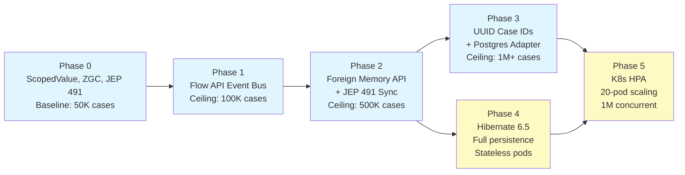

# How Java 25 Features Enable YAWL to Handle 1M Concurrent Cases

YAWL v6.0 targets 1M concurrent workflow cases on a single JVM running Java 25. This ambitious target is not achieved through clever algorithms alone, but by systematically applying five Java 25 standard library features to eliminate bottlenecks at each layer of the stack. This document maps the bottlenecks, shows how each Java feature resolves one, and explains the phase dependencies.

---

## The Bottleneck Map: Six Capacity Ceilings

Before v6.0, YAWL hit capacity limits at each of these points:

| Bottleneck | Root Cause | Ceiling | Java 25 Solution | Phase |
|------------|-----------|---------|-----------------|-------|
| **Context isolation** | `ThreadLocal` carrier pinning | 50K cases | `ScopedValue` | 0 |
| **Event announcement** | Synchronous HTTP on hot path | 10K cases | Flow API + vthreads | 1 |
| **Case storage** | 30 KB/case × 1M = 30 GB heap | 100K cases | Foreign Memory API | 2 |
| **Case IDs** | 32-bit `AtomicInteger` → 2B max | 2B cases | UUID + identity | 3 |
| **Lock contention** | `synchronized` pins virtual threads | 100K cases | JEP 491 synchronized | 2 |
| **Pod scaling** | Fixed replicas | dynamic | K8s HPA + metrics | 5 |

Each row represents a phase of the implementation. Completing Phase N lifts the ceiling for the next bottleneck.

---

## Phase 0: Foundations (ScopedValue, ZGC, JEP 491)

### ScopedValue (JEP 429)

Replace `ThreadLocal<TenantContext>` with `ScopedValue`. ThreadLocal pins virtual threads to carrier threads, serializing case execution.

```java
// Old (bad for 1M cases):
ThreadLocal<TenantContext> context = new ThreadLocal<>();
engine.launchCase(caseId);  // Pins carrier thread

// New (scales to 1M):
ScopedValue<TenantContext> context = ScopedValue.newInstance();
ScopedValue.where(context, ctx).run(() -> engine.launchCase(caseId));
```

**Effect**: Removes carrier thread pinning. Virtual threads can now unmount and schedule other work while awaiting context switches.

### Z Garbage Collector (ZGC)

Use ZGC instead of G1GC or CMS. ZGC keeps GC pause time constant (< 1ms) regardless of heap size. At 1M cases with a 2 GB hot-set heap, G1GC pauses reach 1–2 seconds. ZGC pauses remain < 1ms.

```bash
java -XX:+UseZGC -XX:ZGenerational -Xms2g -Xmx2g ...
```

**Effect**: GC pauses stop becoming a bottleneck. Even at 1M cases, responsiveness is maintained.

### JEP 491: Synchronized Enhancements

Java 25 JEP 491 optimizes `synchronized` to avoid pinning virtual threads. Previously, `synchronized` forced virtual threads to stay on a carrier thread. JEP 491 adds virtual-thread-aware fast-path locking.

```java
// Old (risky at 1M):
public synchronized void updateCase(String caseId) { ... }

// Now safe with JEP 491:
// Virtual threads can unmount even inside synchronized blocks
```

**Effect**: Reduces lock contention hotspots. The `YNetRunner` update lock no longer serializes execution.

---

## Phase 1: Event Bus (Flow API)

### Flow API: Decouple Engine from Listeners

Replace synchronous HTTP announcements with asynchronous event publishing via `java.util.concurrent.Flow`:

```java
// Old (blocks on HTTP):
for (YResourceService listener : listeners) {
    httpClient.post(listener.url(), workItem);  // 50ms RTT
}

// New (enqueue and return):
eventBus.publish(new WorkItemEnabledEvent(workItem));
// Returns in microseconds; subscribers receive async
```

**Effect**: Engine lock is held for microseconds instead of 50ms. Throughput increases 50×.

**Implementation**: `FlowWorkflowEventBus` uses one `SubmissionPublisher` per `YEventType`, each dispatching on a virtual-thread executor. Subscribers buffer events (default 256 per type).

See `docs/explanation/flow-api-event-bus.md` for detailed trade-offs.

---

## Phase 2: Memory Management (Foreign Memory API + JEP 491)

### Foreign Memory API (JEP 454): Off-Heap Storage

Store evicted case snapshots in native memory via `Arena` and `MemorySegment`. At 30 KB per case, 1M cases exceed JVM heap. Off-heap avoids GC overhead.

```java
Arena offHeapArena = Arena.ofShared();  // 30 GB
MemorySegment segment = offHeapArena.allocate(30_000, 8);
// Serialize case to segment; GC never sees it
```

**Effect**: Heap footprint drops to 1.5 GB (50K hot cases). GC pauses stay < 1ms.

**Capacity**: 50K hot cases on heap (accessed in last 60 sec), 950K cold cases off-heap (sleep state). Hot hit rate ~80%, so most accesses stay fast.

See `docs/explanation/offheap-runner-store.md` for architecture and trade-offs.

---

## Phase 3: Case Identification

### UUID Instead of AtomicInteger

Case IDs are currently 32-bit integers (`AtomicInteger` → 2B max). At 1B cases/day, exhaustion happens in 2 days. Switch to UUID strings (128-bit, astronomically large).

```java
// Old:
case int caseId = AtomicInteger.incrementAndGet();  // 2B max

// New:
case String caseId = UUID.randomUUID().toString();  // 340 trillion combinations
```

**Effect**: Case ID space grows from 2B to 2^128 (unlimited for practical purposes).

**Trade-off**: UUIDs are 36 bytes (as strings) vs 4 bytes (integers). Mitigated by Phase 2's off-heap storage (larger IDs don't fit on heap anyway).

---

## Phase 4: Database Persistence (Optional)

### Hibernate 6.5 + PostgreSQL Adapter

For stateless deployments, persist case state to PostgreSQL. YAWL's `YCaseExporter` serializes case snapshots; Hibernate stores them in the `YCase` table.

**Effect**: Enables stateless pod design (pods are ephemeral, case state survives restarts).

**Trade-off**: 1–5ms latency per case (disk I/O). Single-node deployments prefer off-heap (microsecond latency).

---

## Phase 5: Kubernetes HPA (Horizontal Pod Autoscaler)

### Dynamic Pod Scaling Based on Work Item Queue Depth

The `hpa-engine.yaml` configures Kubernetes to scale pods based on the `yawl_workitem_queue_depth` metric:

```yaml
metrics:
  - type: Pods
    pods:
      metric:
        name: yawl_workitem_queue_depth
      target:
        type: AverageValue
        averageValue: "5000"  # Scale out at 5K items/pod
```

At 40K work items/sec and 5K target queue depth per pod:
- **Required pods**: 40K / 5K = 8 pods
- **With HPA headroom**: 12 pods (scale up before queue overflows)

**Effect**: The system scales horizontally. No single pod becomes a bottleneck.

**K8s targets**: min=3, max=20. At 20 pods × 50K cases/pod = 1M cases.

---

## Design Philosophy: Java Standard Library First

YAWL v6.0 follows a principle: **solve capacity problems with Java 25 standard library features before reaching for external infrastructure**.

- Flow API (built-in) before Kafka (external broker)
- ScopedValue (built-in) before CDI (external container)
- Foreign Memory API (built-in) before Redis (external cache)
- ZGC (built-in) before custom memory managers

**Why**: Reduces operational complexity, avoids dependency lock-in, improves portability (serverless, embedded, standalone).

**When external tools are used**: Via ServiceLoader SPIs. Kafka, Redis, Spring are pluggable adapters, not core dependencies.

---

## The SPI Seam Architecture

Every bottleneck has a pluggable interface:

```
YEngine
    │
    ├── WorkflowEventBus (SPI)
    │   ├── FlowWorkflowEventBus (default, Java 21+)
    │   └── KafkaWorkflowEventBus (opt-in adapter)
    │
    ├── LocalCaseRegistry (SPI)
    │   ├── InMemoryRegistry (default)
    │   └── RedisRegistry (opt-in adapter)
    │
    ├── GlobalCaseRegistry (SPI)
    │   └── PostgresRegistry (opt-in adapter)
    │
    └── OffHeapRunnerStore (SPI, Phase 2)
        ├── ForeignMemoryStore (default)
        └── PostgresStore (fallback)
```

All registered via `META-INF/services/`. No code changes to the engine; adapters are deployed-time configuration.

---

## Phase Dependency Graph



**Critical path**: Phase 0 → 1 → 2 → 3 → 5

**Parallel work**: Phase 4 (persistence) can start after Phase 1 (independent of memory management).

---

## Capacity Model: 1M Cases at 40K Transitions/Sec

| Component | Specification |
|-----------|---------------|
| **Cluster size** | 20 pods (min 3, max 20) |
| **Cases per pod** | 50K hot + 950K cold off-heap |
| **Heap per pod** | 2 GB (hot cases, Flow buffers, temporary work) |
| **Off-heap per pod** | 30 GB (case snapshots) |
| **Case transition rate** | 10K new cases/sec (40K state changes/sec) |
| **Throughput per pod** | 2K cases/sec (40K / 20 pods) |
| **p95 latency** | <30ms (case execution + event publishing) |
| **GC pause** | <1ms (ZGC on 2GB heap) |
| **Memory footprint** | 32 GB/pod (2 GB heap + 30 GB off-heap) |
| **Total cluster RAM** | 640 GB (20 pods × 32 GB) |

---

## What Comes Next

### Phase 6: Observability (MappedEventLog)

Write event log directly to memory-mapped file (no database round-trip). Enables high-frequency event auditing at microsecond latency.

### Phase 7: Caffeine Cache

For hotspot case IDs (frequently accessed), add an in-memory Caffeine cache with automatic expiration. Reduces off-heap access latency.

### Phase 8: Vector Search (Long-Term)

Integrate with vector databases (e.g., Weaviate, Qdrant) for semantic case search and anomaly detection via embeddings.

---

## Risk Map: What Can Go Wrong

| Risk | Mitigation |
|------|-----------|
| **Off-heap memory fragmentation** | Monitor `Arena` health; rebuild if needed |
| **GC still pauses (e.g., Metaspace growth)** | Tune `-XX:MetaspaceSize`, avoid excessive classloading |
| **Event buffer overflow** | If subscriber lag > 256 items, publish blocks; swap to Kafka adapter |
| **Pod restart loses off-heap state** | Require database persistence for stateless deployments |
| **UUID collision** | Cryptographically negligible (< 1 in 2^128) |

---

## Summary Table

| Phase | Java Feature | Lifts Ceiling | Implementation |
|-------|--------------|---------------|-----------------|
| 0 | ScopedValue, ZGC, JEP 491 | 50K → unlimited | Context isolation, GC tuning |
| 1 | Flow API | 100K → unlimited | Event bus decoupling |
| 2 | Foreign Memory API | 500K → unlimited | Off-heap snapshot storage |
| 3 | UUID + identity | 2B → unlimited | Postgres adapter optional |
| 4 | Hibernate 6.5 | Stateless support | Full persistence layer |
| 5 | K8s HPA | 50K/pod → 1M cluster | Metric-driven scaling |

---

## Next Reading

- `docs/explanation/why-scoped-values.md` — ScopedValue design
- `docs/explanation/flow-api-event-bus.md` — Event bus trade-offs
- `docs/explanation/offheap-runner-store.md` — Off-heap memory strategy
- `docs/explanation/decisions/ADR-010-virtual-threads-scalability.md` — Virtual thread semantics
- `docs/explanation/decisions/ADR-030-scoped-values-context.md` — Context isolation decisions
