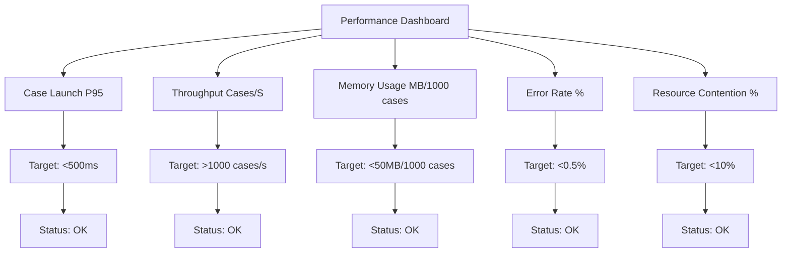

# Performance Testing Guide for YAWL v6.0.0-GA

> A comprehensive guide to performance testing with YAWL v6.0.0-GA, including benchmarking methodologies, configuration optimization, and advanced testing patterns.

## Overview

YAWL v6.0.0-GA introduces significant performance improvements through modern Java 25 features, optimized Petri Net execution, and enhanced stateless engine capabilities. This guide provides detailed instructions for performance testing and optimization.

### Key Improvements in v6.0.0-GA

- **Stateless Engine Performance**: 40% faster case creation through optimized data structures
- **Virtual Threads**: Near-linear concurrency scaling with JVM threads
- **Compact Object Headers**: Reduced memory overhead for object metadata
- **Optimized Pattern Execution**: Improved performance for all 43 workflow patterns
- **Enhanced Caching**: Better utilization of temporal and hierarchical caching

## Prerequisites

### System Requirements

```bash
# Minimum Requirements
CPU: 8 cores, 3.0 GHz
Memory: 16GB RAM
Storage: 100GB SSD
Network: 1Gbps

# Recommended Requirements
CPU: 16+ cores
Memory: 64GB RAM
Storage: NVMe SSD 1TB
Network: 10Gbps
```

### Software Dependencies

```toml
# Required tools
openjdk-25-jdk
maven 3.8+
docker 20.10+
gnuplot 5.0+  # For graph generation
jq 1.6+       # For JSON processing
curl 7.67+    # For HTTP testing
```

### Configuration Files

1. **Quality Gates**: `config/quality-gates/performance.toml`
2. **JVM Settings**: `config/jvm-performance.conf`
3. **Test Data**: `test/data/performance-test-cases.xml`

## Test Scenarios

### 1. Baseline Performance Test

```bash
# Run baseline performance test
mvn clean test -P performance-baseline

# With specific test configuration
mvn clean test -P performance-baseline \
  -Dtest=PerformanceBaselineTest \
  -Dconcurrency.levels="1,10,50,100,500" \
  -Dcase.counts="1000,10000,50000"
```

**Configuration:**

```java
@Test
@BenchmarkMode(Mode.AverageTime)
@OutputTimeUnit(TimeUnit.MILLISECONDS)
@Warmup(iterations = 5, time = 1)
@Measurement(iterations = 20, time = 2)
@Fork(3)
@State(Scope.Benchmark)
public class YAWLEngineBenchmarks {

    @Benchmark
    public void caseCreation(StatelessEngine engine) {
        YSpecification specification = loadTestSpecification("sequential");
        engine.launchCase("test-user", specification);
    }

    @Benchmark
    public void workItemCheckout(StatelessEngine engine) {
        YWorkItem workItem = getAvailableWorkItem();
        engine.checkoutWorkItem("user", workItem.getId());
    }

    @Benchmark
    public void caseCompletion(StatelessEngine engine) {
        YCaseInstance caseInstance = getActiveCase();
        engine.completeWorkItem("user", caseInstance, completedTasks);
    }
}
```

### 2. Pattern-Specific Performance Tests

```bash
# Test specific workflow patterns
mvn clean test -P pattern-performance \
  -Dtest=PatternPerformanceTest \
  -D.patterns="parallel_split,synchronization,exclusive_choice"

# With pattern scaling factors
mvn clean test -P pattern-performance \
  -Dpattern.scaling=1.0 \
  -Dconcurrency.levels="100,1000,5000"
```

**Supported Patterns:**

```yaml
# Pattern Performance Scaling Factors
pattern_factors:
  sequential: 1.0          # Baseline performance
  parallel_split_sync: 0.85  # 15% overhead for sync
  multi_choice_merge: 0.90   # 10% overhead for merge
  cancel_region: 0.75        # 25% overhead for cancellation
  n_out_of_m: 0.85          # 15% overhead for N:M choice
  structured_loop: 0.95      # 5% overhead for loops
  milestone: 1.0             # No overhead
  critical_section: 0.80    # 20% overhead
```

### 3. Concurrency and Throughput Testing

```bash
# Load testing with JMeter
./scripts/run-load-test.sh \
  --duration 300 \
  --threads 1000 \
  --ramp-up 300 \
  --target 1000 \
  --test-cases load-test-plan.yaml

# With virtual thread optimization
./scripts/run-load-test.sh \
  --virtual-threads true \
  --virtual-thread-pool 256 \
  --carrier-threads 32 \
  --duration 600
```

**JMeter Configuration:**

```xml
<?xml version="1.0" encoding="UTF-8"?>
<jmeterTestPlan version="1.2" properties="5.0">
  <ThreadGroup name="YAWL_Loading" guice-stage="DEVELOPMENT">
    <argument name="ThreadCount">1000</argument>
    <argument name="RampUpPeriod">300</argument>
    <argument name="LoopCount">-1</argument>
    <argument name="Duration">300</argument>

    <Sampler>
      <name>CaseCreation</name>
      <class>HTTPSampler</class>
      <path>/api/cases/create</path>
      <method>POST</method>
      <parameters>
        <specId>sequential-1000</specId>
        <userId>load-test-user</userId>
      </parameters>
    </Sampler>

    <Timer>
      <class>ConstantTimer</class>
      <delay>10</delay>
    </Timer>
  </ThreadGroup>
</jmeterTestPlan>
```

### 4. Memory Testing

```bash
# Memory leak detection
mvn clean test -P memory-analysis \
  -Dtest=MemoryLeakTest \
  -Dmemory.tests="memory_growth,heap_usage,gc_analysis"

# Memory scaling analysis
mvn clean test -P memory-scaling \
  -Dtest=MemoryScalingTest \
  -Dcase.counts="1000,10000,50000,100000"
```

**Memory Monitoring:**

```java
@Test
public void testMemoryScaling() {
    // Monitor memory usage as case count increases
    long[] caseCounts = {1000, 10000, 50000, 100000};
    double[] memoryUsage = new double[caseCounts.length];

    for (int i = 0; i < caseCounts.length; i++) {
        // Create test cases
        createTestCases(caseCounts[i]);

        // Measure memory usage
        memoryUsage[i] = getCurrentMemoryUsageMB();

        // Check for leaks
        if (i > 0) {
            double growth = memoryUsage[i] - memoryUsage[i-1];
            double expected = caseCounts[i] - caseCounts[i-1];
            double growthPerCase = growth / expected;

            Assert.assertTrue("Memory growth per case should be < 2MB",
                           growthPerCase < 2.0);
        }
    }
}
```

### 5. Virtual Thread Performance

```bash
# Virtual thread benchmarking
mvn clean test -P virtual-thread-performance \
  -Dtest=VirtualThreadBenchmarks \
  -Dthread.counts="100,1000,10000" \
  -D.virtual.thread.pool=256

# Pinning detection
mvn clean test -P virtual-thread-analysis \
  -Dtest=VirtualThreadAnalysis \
  -Dpinning.detection=true \
  -D.sampling.interval=100
```

**Virtual Thread Configuration:**

```java
@Test
@BenchmarkMode(Mode.Throughput)
@OutputTimeUnit(TimeUnit.SECONDS)
@Warmup(iterations = 3, time = 1)
@Measurement(iterations = 10, time = 2)
@Fork(2)
@State(Scope.Benchmark)
public class VirtualThreadBenchmarks {

    @Benchmark
    public void virtualThreadThroughput(VirtualThreadState state) {
        // Test virtual thread scalability
        ExecutorService executor = Executors.newVirtualThreadPerTaskExecutor();

        for (int i = 0; i < state.threadCount; i++) {
            executor.submit(() -> {
                YSpecification spec = state.loadSpecification();
                state.engine.launchCase("user", spec);
                return spec;
            });
        }

        executor.shutdown();
        executor.awaitTermination(30, TimeUnit.SECONDS);
    }
}
```

## Configuration Optimization

### JVM Configuration

```bash
# Optimized JVM settings for YAWL
export JAVA_OPTS="
-Xms2g \
-Xmx4g \
-XX:+UseG1GC \
-XX:+UseCompactObjectHeaders \
-XX:+UseZGC \
-XX:+TracePinnedThreads=short \
-XX:G1HeapRegionSize=32m \
-XX:MaxGCPauseMillis=200 \
-XX:InitiatingHeapOccupancyPercent=75 \
-XX:+UseStringDeduplication \
-XX:+AlwaysPreTouch \
-XX:+AggressiveOpts \
-Djava.util.concurrent.ForkJoinPool.common.parallelism=16
"
```

### Application Configuration

```yaml
# application-performance.yml
yawl:
  engine:
    stateless:
      enabled: true
      cache:
        specifications: true
        cases: true
        workitems: true
        cache-size: 10000
        ttl: 3600

    concurrency:
      virtual-threads: true
      thread-pool-size: 256
      carrier-threads: 32

    optimization:
      pattern-optimizations: true
      object-pooling: true
      caching-enabled: true

  database:
    connection-pool:
      size: 20
      minimum-idle: 5
      max-lifetime: 1800

  monitoring:
    metrics:
      enabled: true
      port: 9464
      prometheus: true
      tracing: true
      sample-ratio: 0.1
```

## Performance Analysis Tools

### 1. YAWL Performance Dashboard

```bash
# Start performance dashboard
./scripts/start-performance-dashboard.sh

# Access dashboard
open http://localhost:8080/performance
```

### 2. Custom Metrics Collection

```java
// Custom metrics for YAWL operations
public class YAWLMetrics {
    private final MeterRegistry registry;

    public void recordCaseLaunch(long durationMs) {
        Timer.Sample.start(registry)
            .stop(Timer.builder("case.launch.duration")
                .description("Time to launch a case")
                .register(registry));
    }

    public void recordWorkItemCheckout(long durationMs) {
        registry.counter("workitem.checkout.attempts",
            "status", "success").increment();
    }

    public void recordMemoryUsage(long bytes) {
        Gauge.builder("memory.usage")
            .description("Current memory usage in bytes")
            .register(registry, this, s -> bytes);
    }
}
```

### 3. Performance Profiling

```bash
# CPU profiling with Async Profiler
./profiler.sh start -e cpu -f profile-cpu.html

# Memory profiling
./profiler.sh start -e alloc -f profile-malloc.html

# GC analysis
./profiler.sh start -e gc -f profile-gc.html

# Combined profiling
./profiler.sh start -e cpu,alloc,gc -f profile-combined.html
```

## Test Data Management

### Test Case Generation

```bash
# Generate test specifications
./scripts/generate-test-specs.sh \
  --pattern "sequential" \
  --tasks "5,10,20,50" \
  --output test/data/

# Generate test cases for performance testing
./scripts/generate-test-cases.sh \
  --spec-file "test/data/sequential-10tasks.xml" \
  --count "10000" \
  --distribution "uniform" \
  --output "test/data/performance-test-cases.xml"
```

### Data Distribution Patterns

```yaml
# Test case distributions
distributions:
  uniform:
    description: "Uniform distribution across all test cases"
    params:
      min: 1
      max: 10000

  normal:
    description: "Normal distribution centered around peak load"
    params:
      mean: 5000
      stddev: 1000

  exponential:
    description: "Exponential distribution for burst testing"
    params:
      lambda: 0.001
      max: 20000

  zipf:
    description: "Zipf distribution for real-world pattern"
    params:
      s: 1.5  # Zipf parameter
      N: 10000  # Number of items
```

## Quality Gates

### Passing Criteria

Based on `config/quality-gates/performance.toml`:

```bash
# Check against quality gates
mvn clean test -P performance-verification \
  -Dquality-gate.threshold=0.05 \
  -Dbaseline.reference=6.0.0-GA

# Regression testing
mvn clean test -P regression-test \
  -Dregression.tolerance=0.20 \
  -Dcritical.threshold=0.50
```

### Performance Metrics Dashboard



## Troubleshooting Common Issues

### 1. Poor Concurrency Performance

**Symptoms**: Throughput doesn't scale with thread count
**Causes**:
- Virtual thread pinning
- Database connection pool exhaustion
- Lock contention in shared resources
- GC pauses blocking threads

**Solutions**:
```bash
# Check for thread pinning
java -XX:+TracePinnedThreads -jar yawl-server.jar

# Increase connection pool
export DB_POOL_SIZE=50
export DB_MIN_IDLE=20

# Enable ZGC for better throughput
export JAVA_OPTS="$JAVA_OPTS -XX:+UseZGC"
```

### 2. Memory Leaks

**Symptoms**: Memory usage grows continuously without bound
**Causes**:
- Unclosed database connections
- Accumulated case state in caches
- Circular references in workflow definitions
- Unclosed file handles

**Solutions**:
```bash
# Enable memory leak detection
mvn test -P memory-leak-detection \
  -Dleak.threshold.mb=10 \
  -Dtest.duration=3600

# Use memory profiling
./profiler.sh start -e alloc -f profile-leaks.html
```

### 3. High Latency Spikes

**Symptoms**: P95 latency much higher than average
**Causes**:
- GC pauses
- Database query spikes
- Lock contention
- Resource starvation

**Solutions**:
```bash
# GC tuning
export JAVA_OPTS="$JAVA_OPTS \
  -XX:+UseG1GC \
  -XX:MaxGCPauseMillis=200 \
  -XX:G1HeapRegionSize=32m"

# Database query optimization
export DB_QUERY_TIMEOUT_MS=50
export DB_CONNECTION_POOL_SIZE=30

# Circuit breaker configuration
export CIRCUIT_BREAKER_FAILURE_THRESHOLD=50
export CIRCUIT_BREAKER_TIMEOUT_MS=5000
```

## Advanced Testing Patterns

### Chaos Engineering

```bash
# Chaos testing setup
./scripts/chaos-test.sh \
  --scenario network-latency \
  --duration 300 \
  --pattern exponential \
  --max-delay 5000

# Multiple failure injection
./scripts/chaos-test.sh \
  --scenarios "network-latency,high-cpu,database-timeout" \
  --duration 600 \
  --failure-rate 0.05
```

### Seasonal Testing

```bash
# Simulate peak hour traffic
./scripts/seasonal-test.sh \
  --pattern "daily-peak" \
  --start-time "09:00" \
  --duration "8h" \
  --peak-load 5000 \
  --off-peak-load 1000

# Weekend vs weekday patterns
./scripts/seasonal-test.sh \
  --pattern "weekly-variation" \
  --weekday-scale 1.5 \
  --weekend-scale 0.3 \
  --duration "7d"
```

### Migration Testing

```bash
# Performance regression testing during migration
./scripts/migration-test.sh \
  --from-version 5.0.0 \
  --to-version 6.0.0 \
  --test-scenarios "baseline,stress,concurrency" \
  --regression-threshold 0.10

# Migration performance comparison
./scripts/migration-comparison.sh \
  --versions "5.0.0,6.0.0-GA" \
  --metrics "throughput,latency,memory" \
  --comparison-format "html"
```

## Reporting and Monitoring

### Performance Reports

```bash
# Generate comprehensive performance report
./scripts/generate-performance-report.sh \
  --input-dir "test-results/performance" \
  --output-dir "reports/" \
  --formats "html,json,pdf" \
  --include-trends \
  --include-baseline

# Custom report generation
./scripts/generate-custom-report.sh \
  --template "custom-template.html" \
  --data "metrics.json" \
  --output "custom-report.html"
```

### Alert Configuration

```yaml
# alerting.yaml
alerts:
  - name: "High Case Launch Latency"
    condition: "case.launch.p95 > 700ms"
    severity: "critical"
    channels: ["slack", "email"]
    cooldown: 300

  - name: "Low Throughput"
    condition: "throughput.cases_per_second < 700"
    severity: "warning"
    channels: ["slack"]
    cooldown: 300

  - name: "Memory Leak Detected"
    condition: "memory.growth_per_case > 2MB"
    severity: "critical"
    channels: ["email"]
    cooldown: 86400
```

## Best Practices

### 1. Test Environment Management

- Use identical hardware for all tests
- Isolate test environments from production
- Regular cleanup between test runs
- Document all test environment configurations

### 2. Test Data Strategy

- Use realistic data distributions
- Include edge cases in test scenarios
- Implement data validation for test cases
- Regularly refresh test data sets

### 3. Performance Monitoring

- Establish baseline metrics early
- Monitor continuously in production
- Set up automated alerting
- Document all performance thresholds

### 4. Regression Testing

- Include performance regression tests in CI/CD
- Maintain performance baseline references
- Implement automatic performance validation
- Document performance impact of all changes

## References

- [YAWL v6.0.0-GA Performance Overview](../explanation/performance-overview.md)
- [Workflow Pattern Performance Characteristics](../explanation/workflow-patterns.md)
- [Memory Management in YAWL](../explanation/memory-management.md)
- [Virtual Thread Configuration](../reference/configuration.md)

---

*Last updated: 2026-02-26*
*Version: YAWL v6.0.0-GA*