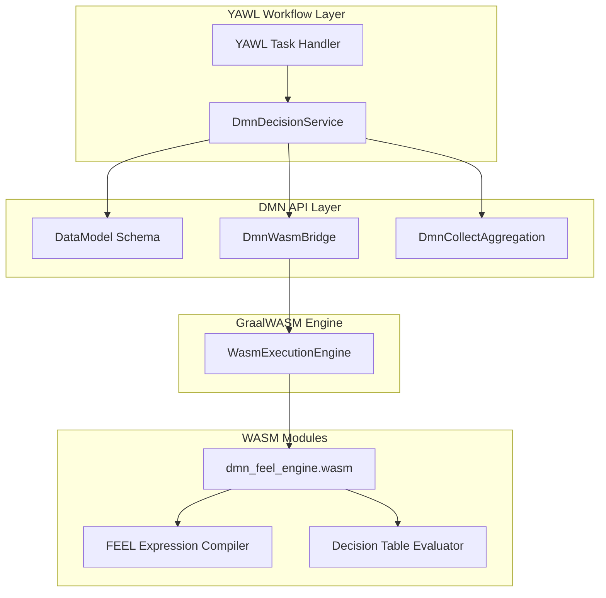

# DMN Integration Guide — Business Rules and Decision Engine

## Overview

The DMN (Decision Model and Notation) integration brings complete DMN 1.3 execution capabilities to YAWL workflows, combining schema validation with WASM-accelerated FEEL (Friendly Enough Expression Language) evaluation. This guide covers architecture, patterns, and best practices for integrating business rules into your workflow logic.

### Architecture Layers



## Core Components

### 1. DmnDecisionService

The high-level facade that combines schema validation with decision evaluation.

**Key Responsibilities:**
- Schema validation before evaluation
- Input/output type checking
- Lifecycle management (AutoCloseable)
- Result aggregation with COLLECT operations

```java
// With schema validation
try (DmnDecisionService svc = new DmnDecisionService(schema)) {
    // Parse and evaluate
    DmnDecisionResult result = svc.evaluate(model, "DecisionName", context);

    // Aggregate results
    OptionalDouble sum = svc.collectAggregate(result, "score", SUM);
}
```

### 2. DataModel

Schema definition with tables, columns, and relationships.

```java
DataModel schema = DataModel.builder("LoanSchema")
    .table(DmnTable.builder("Applicant")
        .column(DmnColumn.of("age", "integer").minValue(18))
        .column(DmnColumn.of("income", "double").required(true))
        .build())
    .relationship(DmnRelationship.builder()
        .from("Customer").to("Order").cardinality("1..*", "0..*")
        .build())
    .build();
```

### 3. DmnWasmBridge

The WASM-based DMN execution engine.

**Features:**
- FEEL expression evaluation
- Decision table processing
- Hit policy enforcement (FIRST, ALL, etc.)
- DMN XML parsing and validation

### 4. DmnCollectAggregation

Operations for aggregating multiple decision results.

```java
// Available aggregations
SUM, MIN, MAX, COUNT

// Usage
OptionalDouble total = svc.collectAggregate(result, "amount", SUM);
```

## DMN Model Patterns

### 1. Simple Decision Table

```xml
<decision name="EligibilityDecision">
    <decisionTable hitPolicy="FIRST">
        <input label="Age" typeRef="integer"/>
        <input label="Income" typeRef="double"/>
        <output label="Eligible" name="eligible" typeRef="boolean"/>

        <rule>
            <inputEntry>Age &lt; 18</inputEntry>
            <inputEntry>Income &lt; 30000</inputEntry>
            <outputEntry>false</outputEntry>
        </rule>
        <rule>
            <inputEntry>Age &gt;= 18</inputEntry>
            <inputEntry>Income &gt;= 30000</inputEntry>
            <outputEntry>true</outputEntry>
        </rule>
    </decisionTable>
</decision>
```

### 2. Hit Policy Patterns

| Hit Policy | Behavior | Use Case |
|------------|----------|----------|
| `FIRST` | First matching rule | Default, simple yes/no decisions |
| `PRIORITY` | Highest priority rule wins | Risk assessment, scoring |
| `COLLECT` | All matching rules | Auditing, logging multiple outcomes |
| `UNIQUE` | Single rule allowed | Data integrity constraints |
| `RULE ORDER` | Rule order matters | Sequential processing |

### 3. FEEL Expression Patterns

#### Simple Conditions
```xml
<!-- Numeric comparisons -->
<inputEntry>Age &gt; 25</inputEntry>
<inputEntry>Income between 30000 and 100000</inputEntry>

<!-- String conditions -->
<inputEntry>Customer.name contains "Premium"</inputEntry>
<inputEntry>Order.status = "shipped"</inputEntry>

<!-- Logical operations -->
<inputEntry>Age &gt; 18 and Income &gt; 30000</inputEntry>
<inputEntry>CreditScore &gt; 750 or Income &gt; 100000</inputEntry>
```

#### Complex Expressions
```xml
<!-- Date functions -->
<inputEntry>date(Customer.since) &gt; date("2020-01-01")</inputEntry>

<!-- List operations -->
<inputEntry>Order.items[Product.category = "electronics"]</inputEntry>

<!-- Context evaluation -->
<inputEntry>Customer.profile.tier = "gold"</inputEntry>
```

## Workflow Integration Patterns

### 1. Pre-Validation Pattern

Validate data before decision evaluation.

```java
public class OrderValidationHandler {
    private final DmnDecisionService dmnService;

    public void validateOrder(YWorkItem item) {
        // Get order data
        Map<String, Object> orderData = item.getDataMap();

        // Validate against schema first
        try {
            DmnEvaluationContext context = DmnEvaluationContext.builder()
                .putAll(orderData)
                .build();

            // Schema validation happens on construction
            DmnDecisionResult result = dmnService.evaluate(
                orderModel, "OrderValidation", context);

        } catch (SchemaValidationException e) {
            // Handle validation failures
            item.setOutputData(Map.of("valid", false, "errors", e.getViolations()));
        }
    }
}
```

### 2. Decision Chain Pattern

Evaluate multiple decisions in sequence with passing data.

```java
public class RiskAssessmentHandler {
    private final DmnDecisionService dmnService;

    public void assessRisk(YWorkItem item) {
        Map<String, Object> data = new HashMap<>(item.getDataMap());

        // Step 1: Initial risk assessment
        DmnDecisionResult initialResult = dmnService.evaluate(
            riskModel, "InitialAssessment",
            DmnEvaluationContext.builder().putAll(data).build());

        initialResult.getSingleResult().ifPresent(row -> {
            data.put("riskLevel", row.get("riskLevel"));
            data.put("riskScore", row.get("riskScore"));
        });

        // Step 2: Additional risk factors
        DmnDecisionResult additionalResult = dmnService.evaluate(
            riskModel, "AdditionalFactors",
            DmnEvaluationContext.builder().putAll(data).build());

        // Step 3: Final risk aggregation
        DmnDecisionResult finalResult = dmnService.evaluate(
            riskModel, "FinalRisk",
            DmnEvaluationContext.builder().putAll(data).build());

        // Set final result
        finalResult.getSingleResult().ifPresent(row -> {
            data.put("finalRisk", row.get("riskLevel"));
        });

        item.setDataMap(data);
    }
}
```

### 3. Result Aggregation Pattern

COLLECT multiple decision results for batch processing.

```java
public class BatchApprovalHandler {
    private final DmnDecisionService dmnService;

    public void batchApprove(YWorkItem item) {
        List<Map<String, Object>> orders = (List<Map<String, Object>>)
            item.getDataMap().get("orders");

        DmnDecisionResult allResults = new DmnDecisionResult();

        // Evaluate each order
        for (Map<String, Object> order : orders) {
            DmnDecisionResult result = dmnService.evaluate(
                eligibilityModel, "OrderEligibility",
                DmnEvaluationContext.builder().putAll(order).build());

            allResults.addAllResults(result);
        }

        // Aggregate results
        OptionalDouble totalAmount = dmnService.collectAggregate(
            allResults, "amount", SUM);

        OptionalDouble maxRisk = dmnService.collectAggregate(
            allResults, "riskScore", MAX);

        // Process aggregated results
        Map<String, Object> batchResult = Map.of(
            "totalAmount", totalAmount.orElse(0.0),
            "maxRisk", maxRisk.orElse(0.0),
            "processedCount", allResults.getResultCount()
        );

        item.setOutputData(batchResult);
    }
}
```

### 4. Decision Caching Pattern

Cache parsed DMN models for performance.

```java
public class CachedDecisionHandler {
    private final DmnDecisionService dmnService;
    private final Map<String, DmnWasmBridge.DmnModel> modelCache = new ConcurrentHashMap<>();

    public void processDecision(YWorkItem item) {
        String modelName = item.getDataMap().get("modelType").toString();
        String dmnXml = getDmnXml(modelName);

        // Cache parsed models
        DmnWasmBridge.DmnModel model = modelCache.computeIfAbsent(
            modelName,
            key -> dmnService.parseDmnModel(dmnXml)
        );

        DmnDecisionResult result = dmnService.evaluate(
            model,
            item.getDataMap().get("decisionName").toString(),
            createContext(item)
        );

        processResult(item, result);
    }
}
```

## Performance Optimization

### 1. Schema Pre-compilation

Parse DMN models once per workflow definition.

```java
// Workflow definition class
public class LoanWorkflowDefinition {
    private final DmnDecisionService dmnService;
    private final DmnWasmBridge.DmnModel loanModel;

    public LoanWorkflowDefinition() {
        DataModel schema = LoanSchemas.createLoanSchema();
        this.dmnService = new DmnDecisionService(schema);
        this.loanModel = dmnService.parseDmnModel(loadLoanDmnXml());
    }

    public DmnDecisionService getService() {
        return dmnService;
    }

    public DmnWasmBridge.DmnModel getModel() {
        return loanModel;
    }
}
```

### 2. Context Pooling

Reuse evaluation contexts for multiple decisions.

```java
public class DecisionContextPool {
    private final DmnDecisionService dmnService;
    private final Queue<DmnEvaluationContext> pool = new ConcurrentLinkedQueue<>();

    public DmnEvaluationContext acquireContext() {
        DmnEvaluationContext context = pool.poll();
        return context != null ?
            context.clear() :
            DmnEvaluationContext.builder().build();
    }

    public void releaseContext(DmnEvaluationContext context) {
        pool.offer(context.clear());
    }

    public DmnDecisionResult evaluateWithPool(
        DmnWasmBridge.DmnModel model,
        String decisionName,
        Map<String, Object> data
    ) {
        DmnEvaluationContext context = acquireContext();
        try {
            context.putAll(data);
            return dmnService.evaluate(model, decisionName, context);
        } finally {
            releaseContext(context);
        }
    }
}
```

### 3. Result Streaming

Process large result sets without loading all into memory.

```java
public class StreamingResultHandler {
    private final DmnDecisionService dmnService;

    public void processLargeResults(YWorkItem item) {
        DmnDecisionResult result = dmnService.evaluate(
            largeModel, "BatchDecision", createContext(item));

        // Process results in batches
        result.streamResults().batch(1000).forEach(batch -> {
            processBatch(batch);
            updateProgress(item, batch.size());
        });
    }
}
```

## Error Handling Strategies

### 1. Validation-First Pattern

```java
public class SafeDecisionHandler {
    public void executeDecision(YWorkItem item) {
        try {
            // Validate inputs
            validateInputData(item);

            // Execute decision
            DmnDecisionResult result = dmnService.evaluate(
                model, "Decision", createContext(item));

            // Handle results
            processResult(item, result);

        } catch (SchemaValidationException e) {
            handleValidationError(item, e);
        } catch (DmnException e) {
            handleDecisionError(item, e);
        } catch (Exception e) {
            handleUnexpectedError(item, e);
        }
    }

    private void validateInputData(YWorkItem item) {
        // Validate required fields
        // Check data types
        // Apply business rules
    }
}
```

### 2. Fallback Pattern

```java
public class FallbackDecisionHandler {
    private final DmnDecisionService primaryService;
    private final DmnDecisionService fallbackService;

    public void executeWithFallback(YWorkItem item) {
        try {
            DmnDecisionResult result = primaryService.evaluate(
                model, "Decision", createContext(item));
            processResult(item, result);

        } catch (DmnException e) {
            log.warn("Primary decision failed, using fallback", e);

            DmnDecisionResult fallbackResult = fallbackService.evaluate(
                fallbackModel, "DefaultDecision", createContext(item));
            processResult(item, fallbackResult);
        }
    }
}
```

### 3. Circuit Breaker Pattern

```java
public class CircuitBreakerHandler {
    private final DmnDecisionService dmnService;
    private final CircuitBreaker circuitBreaker;

    public void executeWithCircuitBreaker(YWorkItem item) {
        try {
            CircuitBreaker.Response response = circuitBreaker.execute(() -> {
                DmnDecisionResult result = dmnService.evaluate(
                    model, "Decision", createContext(item));
                processResult(item, result);
                return CircuitBreaker.Response.success();
            });

            if (response.isFailure()) {
                handleCircuitBreakerFailure(item);
            }

        } catch (CircuitBreaker.OpenException e) {
            handleCircuitOpen(item);
        }
    }
}
```

## Monitoring and Observability

### 1. Decision Metrics

```java
public class DecisionMetrics {
    private final MeterRegistry meterRegistry;

    public void recordDecisionEvaluation(String decisionName, long duration, boolean success) {
        Timer.Sample sample = Timer.start(meterRegistry);
        sample.stop(Timer.builder("dmn.decision.evaluation")
            .tag("decision", decisionName)
            .tag("success", String.valueOf(success))
            .register(meterRegistry));
    }

    public void recordSchemaValidation(String schemaName, long duration, int violationCount) {
        Counter.builder("dmn.schema.validation")
            .tag("schema", schemaName)
            .register(meterRegistry)
            .increment(violationCount);
    }
}
```

### 2. Decision Logging

```java
public class DecisionLogger {
    private static final Logger log = LoggerFactory.getLogger(DecisionLogger.class);

    public void logDecisionStart(String decisionName, DmnEvaluationContext context) {
        log.info("Evaluating decision '{}' with inputs: {}", decisionName, context);
    }

    public void logDecisionResult(String decisionName, DmnDecisionResult result) {
        log.info("Decision '{}' completed with {} results",
            decisionName, result.getResultCount());
    }

    public void logDecisionError(String decisionName, Exception e) {
        log.error("Decision '{}' failed: {}", decisionName, e.getMessage(), e);
    }
}
```

## Best Practices

### 1. Model Organization

- **Modularity**: Group related decisions in separate models
- **Naming**: Use descriptive names for decisions and tables
- **Documentation**: Comment complex expressions
- **Testing**: Validate models with test data

### 2. Schema Design

- **Validation**: Define clear constraints
- **Types**: Use appropriate data types
- **Relationships**: Document cardinality
- **Performance**: Keep tables focused and small

### 3. Error Handling

- **Validation**: Check inputs before execution
- **Graceful Failure**: Provide fallback values
- **Logging**: Track decision outcomes
- **Recovery**: Implement retry logic for transient errors

### 4. Performance

- **Caching**: Reuse parsed models
- **Contexts**: Pool evaluation contexts
- **Batching**: Process multiple items efficiently
- **Monitoring**: Track performance metrics

## Troubleshooting

### Common Issues

1. **Slow Decision Evaluation**
   - Check FEEL expression complexity
   - Consider indexing large input sets
   - Monitor WASM engine memory usage

2. **Memory Leaks**
   - Always use try-with-resources for AutoCloseable objects
   - Monitor context pool usage
   - Clear caches regularly

3. **Type Mismatches**
   - Validate input types before evaluation
   - Use schema validation
   - Check DMN model type definitions

### Debug Mode

```java
// Enable debug logging
DmnDecisionService svc = new DmnDecisionService(schema, DmnConfig.builder()
    .debugMode(true)
    .logExecutionDetails(true)
    .build());

// Enable trace-level monitoring
DmnEvaluationContext context = DmnEvaluationContext.builder()
    .enableTracing(true)
    .build();
```

This completes the DMN integration guide, covering architecture, patterns, and best practices for business rules in YAWL workflows.