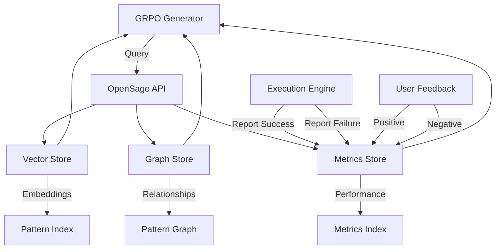

# Using OpenSage Memory System

## What is OpenSage?

OpenSage is the integrated memory system in YAWL v6.0.0-GA that enables machine learning workflows to learn from past generations and improve over time. It stores:
- **Workflow Patterns**: Successful control-flow and data-flow patterns
- **Performance Metrics**: Execution time, resource usage, success rates
- **Domain Knowledge**: Industry-specific best practices
- **User Preferences**: Personalized generation preferences

OpenSage uses a hybrid approach combining vector embeddings for semantic similarity with graph databases for pattern relationships.

## How Memory Improves Workflow Generation

### Learning Loop

```
Generation → Execution → Metrics → Storage → Retrieval → Improved Generation
   ↑                                                        ↓
────────────────────────────────────────────────────────────────
```

1. **Capture**: Store successful workflow executions
2. **Index**: Embed patterns using Nomic text embeddings
3. **Query**: Retrieve similar patterns during generation
4. **Adapt**: Modify based on context and constraints
5. **Learn**: Update models with new successful patterns

### Memory Architecture



## Configuring Memory Storage

### Storage Types

OpenSage supports multiple storage backends:

#### SQLite (Default)
```properties
# For development and small-scale deployments
memory.storage.type=sqlite
memory.storage.path=./opensage.db
memory.embeddings.dimension=768
```

#### PostgreSQL (Production)
```properties
# For large-scale deployments
memory.storage.type=postgresql
memory.storage.host=localhost
memory.storage.port=5432
memory.storage.database=opensage
memory.storage.username=opensage
memory.storage.password=securepassword

# Connection pool configuration
memory.pool.max.size=20
memory.pool.min.idle=5
memory.pool.max.idle=10
memory.pool.timeout=30000
```

#### MongoDB (Hybrid)
```properties
# For unstructured pattern storage
memory.storage.type=mongodb
memory.storage.uri=mongodb://localhost:27017/opensage
memory.storage.database=opensage
memory.storage.collection.patterns

# Embedded document configuration
memory.embedded.patterns=true
memory.embedded.metrics=true
```

### Configuration Example

Create `opensage-config.toml`:
```toml
[storage]
type = "postgresql"
host = "localhost"
port = 5432
database = "opensage"
username = "opensage_user"
password = "your-secure-password"
connection_pool_max = 20
connection_timeout = 30000

[indexing]
embeddings_model = "nomic-embed-text"
embeddings_dimension = 768
similarity_threshold = 0.85
max_patterns_per_query = 100

[retention]
pattern_retention_days = 180
metric_retention_days = 90
feedback_retention_days = 365

[performance]
batch_size = 50
query_timeout_ms = 5000
index_update_interval = 60000

[monitoring]
enable_metrics = true
log_queries = false
enable_analytics = true
```

### Database Setup

PostgreSQL setup script:
```sql
-- Create database
CREATE DATABASE opensage;

-- Create extensions
CREATE EXTENSION vector;
CREATE EXTENSION pg_stat_statements;

-- Create tables
CREATE TABLE patterns (
    id UUID PRIMARY KEY DEFAULT gen_random_uuid(),
    name VARCHAR(255) NOT NULL,
    domain VARCHAR(100) NOT NULL,
    category VARCHAR(50) NOT NULL,
    yawl_xml TEXT NOT NULL,
    vector VECTOR(768) NOT NULL,
    created_at TIMESTAMP DEFAULT CURRENT_TIMESTAMP,
    updated_at TIMESTAMP DEFAULT CURRENT_TIMESTAMP,
    usage_count INTEGER DEFAULT 1,
    success_rate FLOAT DEFAULT 1.0,
    avg_execution_time FLOAT DEFAULT 0.0
);

CREATE TABLE pattern_relationships (
    id UUID PRIMARY KEY DEFAULT gen_random_uuid(),
    source_pattern UUID REFERENCES patterns(id),
    target_pattern UUID REFERENCES patterns(id),
    relationship_type VARCHAR(50) NOT NULL,
    strength FLOAT DEFAULT 1.0,
    created_at TIMESTAMP DEFAULT CURRENT_TIMESTAMP
);

CREATE TABLE performance_metrics (
    id UUID PRIMARY KEY DEFAULT gen_random_uuid(),
    pattern_id UUID REFERENCES patterns(id),
    execution_time FLOAT NOT NULL,
    memory_usage_mb FLOAT,
    cpu_usage_percent FLOAT,
    success BOOLEAN NOT NULL,
    error_message TEXT,
    execution_timestamp TIMESTAMP DEFAULT CURRENT_TIMESTAMP
);

-- Create indexes
CREATE INDEX idx_patterns_domain ON patterns(domain);
CREATE INDEX idx_patterns_category ON patterns(category);
CREATE INDEX idx_patterns_vector ON patterns_vector USING hnsw (vector vector_cosine_ops);
CREATE INDEX idx_metrics_pattern_id ON performance_metrics(pattern_id);
CREATE INDEX idx_metrics_timestamp ON performance_metrics(execution_timestamp);

-- Create triggers for auto-update
CREATE OR REPLACE FUNCTION update_pattern_timestamp()
RETURNS TRIGGER AS $$
BEGIN
    NEW.updated_at = CURRENT_TIMESTAMP;
    RETURN NEW;
END;
$$ LANGUAGE plpgsql;

CREATE TRIGGER update_pattern_timestamp
BEFORE UPDATE ON patterns
FOR EACH ROW
EXECUTE FUNCTION update_pattern_timestamp();
```

## Querying Learned Patterns

### Pattern Queries

#### Find Similar Patterns
```bash
curl -X POST http://localhost:8080/api/v1/memory/query \
  -H "Content-Type: application/json" \
  -d '{
    "query": "purchase approval workflow",
    "domain": "procurement",
    "category": "control-flow",
    "limit": 10,
    "similarity_threshold": 0.8
  }'
```

**Response Example**:
```json
{
  "patterns": [
    {
      "id": "550e8400-e29b-41d4-a716-446655440000",
      "name": "Purchase Approval v2",
      "domain": "procurement",
      "category": "control-flow",
      "similarity": 0.92,
      "usage_count": 45,
      "success_rate": 0.98,
      "avg_execution_time": 2.3,
      "metadata": {
        "avg_approvals": 1.8,
        "rejection_rate": 0.02
      }
    }
  ],
  "total_found": 5
}
```

#### Query by Performance Metrics
```bash
curl -X POST http://localhost:8080/api/v1/memory/query-performance \
  -H "Content-Type: application/json" \
  -d '{
    "pattern_type": "ExclusiveChoice",
    "min_success_rate": 0.95,
    "max_execution_time": 5.0,
    "min_usage_count": 10,
    "order_by": "success_rate",
    "direction": "desc"
  }'
```

#### Get Pattern Relationships
```bash
curl -X GET "http://localhost:8080/api/v1/memory/pattern/{patternId}/relationships"
```

### Java API Usage

```java
import org.yawl.engine.memory.OpenSageClient;
import org.yawl.engine.memory.PatternQuery;
import org.yawl.engine.memory.PatternResult;
import java.util.List;
import java.util.UUID;

public class OpenSageExample {
    private OpenSageClient client;

    public void init() {
        client = new OpenSageClient("config/opensage-config.toml");
    }

    public void queryPatterns() {
        // Build query
        PatternQuery query = PatternQuery.builder()
            .query("employee onboarding process")
            .domain("hr")
            .category("data-flow")
            .limit(5)
            .similarityThreshold(0.8)
            .build();

        // Execute query
        List<PatternResult> results = client.queryPatterns(query);

        // Process results
        for (PatternResult result : results) {
            System.out.println("Pattern: " + result.getName());
            System.out.println("Similarity: " + result.getSimilarity());
            System.out.println("Success rate: " + result.getSuccessRate());
            System.out.println("Avg execution time: " + result.getAvgExecutionTime());
        }
    }

    public void addPattern(WorkflowSpecification workflow) {
        PatternMetadata metadata = PatternMetadata.builder()
            .name(workflow.getName())
            .domain("hr")
            .category("control-flow")
            .successRate(1.0)
            .avgExecutionTime(3.5)
            .usageCount(1)
            .build();

        client.addPattern(workflow.getXml(), metadata);
    }

    public void recordExecution(UUID patternId, boolean success,
                              double executionTime) {
        ExecutionMetrics metrics = ExecutionMetrics.builder()
            .success(success)
            .executionTime(executionTime)
            .memoryUsageMB(128.5)
            .cpuUsagePercent(45.2)
            .build();

        client.recordPerformance(patternId, metrics);
    }
}
```

## Memory Management Best Practices

### Pattern Organization

1. **Domain-Specific Organization**
```java
// Organize patterns by business domain
PatternOrganizer organizer = new PatternOrganizer(client);

// Create domain hierarchy
organizer.createDomain("hr", "Human Resources");
organizer.createDomain("procurement", "Procurement");
organizer.createDomain("finance", "Finance");

// Link related domains
organizer.linkDomains("hr", "finance", "shared_data");
```

2. **Pattern Versioning**
```java
// Version control for patterns
PatternVersioning versioning = new PatternVersioning(client);

// Create new version
versioning.createVersion(
    UUID.fromString("original-pattern-id"),
    "Updated with approval thresholds",
    "v1.1"
);

// Compare versions
PatternComparison comparison = versioning.compareVersions(
    "v1.0", "v1.1"
);
```

### Performance Optimization

1. **Batch Operations**
```java
// Batch pattern insertion
List<WorkflowSpecification> workflows = loadWorkflows();
client.batchInsertPatterns(workflows, 100); // batch size 100

// Batch performance updates
List<PerformanceRecord> records = loadPerformanceRecords();
client.batchUpdatePerformance(records, 100);
```

2. **Index Maintenance**
```java
// Periodic index optimization
client.optimizeIndexes();

// Clean up unused patterns
client.cleanupUnusedPatterns(90); // older than 90 days

// Compact database
client.compactDatabase();
```

### Data Retention Strategy

```java
// Configure retention policies
RetentionPolicy policy = RetentionPolicy.builder()
    .patternRetentionDays(180)
    .metricRetentionDays(90)
    .feedbackRetentionDays(365)
    .build();

client.setRetentionPolicy(policy);

// Archive old data
client.archivePatternsBefore("2024-01-01");

// Prune redundant patterns
client.pruneRedundantPatterns(0.95); // similarity threshold
```

### Monitoring and Analytics

```java
// Get memory statistics
MemoryStats stats = client.getMemoryStats();
System.out.println("Total patterns: " + stats.getTotalPatterns());
System.out.println("Total metrics: " + stats.getTotalMetrics());
System.out.println("Storage usage: " + stats.getStorageUsageMB() + "MB");

// Query analytics
AnalyticsReport report = client.getAnalyticsReport(
    "procurement",
    "last_30_days"
);

System.out.println("Most successful patterns: "
    + report.getMostSuccessfulPatterns());
System.out.println("Common failure points: "
    + report.getCommonFailurePoints());

// Monitor query performance
QueryPerformance perf = client.getQueryPerformance(
    "purchase approval",
    "last_week"
);
```

### Error Handling and Recovery

```java
// Handle memory service unavailability
try {
    List<PatternResult> results = client.queryPatterns(query);
} catch (MemoryServiceUnavailableException e) {
    // Fallback to local patterns
    List<PatternResult> fallback = getLocalPatterns(query);
    return fallback;
}

// Handle connection issues
client.withRetryConfiguration(3, 1000) // 3 retries, 1s delay
    .execute(operation);

// Recover from corruption
if (client.isCorrupted()) {
    client.recoverFromBackup();
}
```

## Integration with GRPO

### Memory-Enhanced Generation

```java
public class MemoryEnhancedGRPO {
    private GRPOWorkflowGenerator generator;
    private OpenSageClient memory;

    public WorkflowSpecification generateWithMemory(
        String specification,
        String domain
    ) {
        // Query memory for similar patterns
        List<PatternResult> similar = memory.queryPatterns(
            PatternQuery.builder()
                .query(specification)
                .domain(domain)
                .limit(5)
                .build()
        );

        // Prepare context for generation
        GenerationContext context = GenerationContext.builder()
            .specification(specification)
            .domain(domain)
            .similarPatterns(similar)
            .build();

        // Generate with memory context
        return generator.generateWithMemory(context);
    }
}
```

### Feedback Loop

```java
// After workflow execution, record results
public void recordGenerationFeedback(
    WorkflowSpecification workflow,
    boolean success,
    double executionTime,
    double confidence
) {
    // Update pattern in memory
    PatternMetadata metadata = PatternMetadata.builder()
        .name(workflow.getName())
        .domain(workflow.getDomain())
        .successRate(success ? 1.0 : 0.0)
        .avgExecutionTime(executionTime)
        .usageCount(1)
        .build();

    memory.addPattern(workflow.getXml(), metadata);

    // Record performance
    memory.recordPerformance(
        workflow.getId(),
        ExecutionMetrics.builder()
            .success(success)
            .executionTime(executionTime)
            .confidence(confidence)
            .build()
    );
}
```

## Migration and Backup

### Backup Strategy

```bash
# Full backup
curl -X POST http://localhost:8080/api/v1/memory/backup \
  -H "Content-Type: application/json" \
  -d '{
    "backup_path": "./backups/opensage-$(date +%Y%m%d).json",
    "include_metrics": true,
    "include_relationships": true
  }'

# Incremental backup
curl -X POST http://localhost:8080/api/v1/memory/backup-incremental \
  -H "Content-Type: application/json"
```

### Migration Between Storage Types

```java
public class MemoryMigration {
    public void migrateFromSQLiteToPostgreSQL() {
        OpenSageClient source = new OpenSageClient("sqlite-config.toml");
        OpenSageClient target = new OpenSageClient("postgresql-config.toml");

        // Migrate patterns
        List<Pattern> patterns = source.getAllPatterns();
        target.batchInsertPatterns(patterns, 100);

        // Migrate metrics
        List<PerformanceRecord> metrics = source.getAllMetrics();
        target.batchInsertMetrics(metrics, 100);

        // Migrate relationships
        List<Relationship> relationships = source.getAllRelationships();
        target.insertRelationships(relationships);
    }
}
```

## Next Steps

- Learn about GRPO workflow generation in [11-grpo-workflow-generation.md](./11-grpo-workflow-generation.md)
- Optimize performance with virtual threads in [13-virtual-threads-performance.md](./13-virtual-threads-performance.md)
- Explore workflow patterns in [workflow-patterns.md](../reference/workflow-patterns.md)
- Learn about reinforcement learning theory in [rl-theory.md](../reference/rl-theory.md)