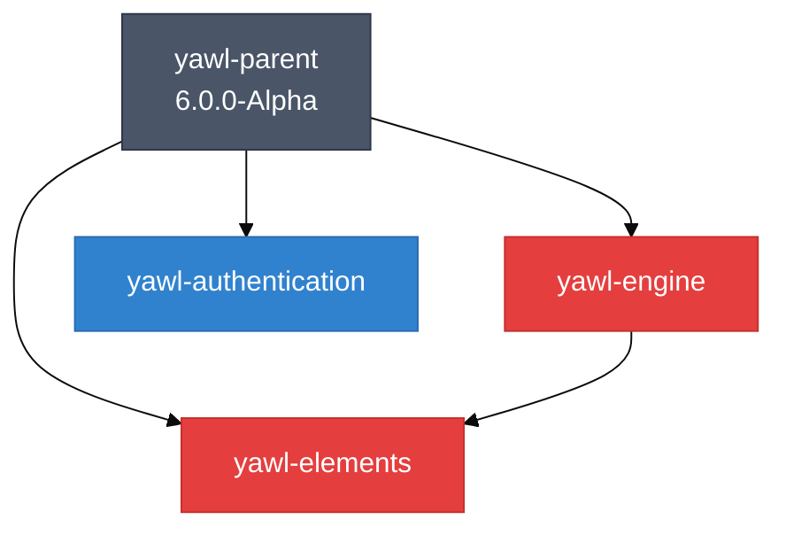

# YAWL V6 Observatory Guide

**Version:** 1.0.0
**Updated:** 2026-02-17
**Audience:** Developers, DevOps Engineers, CI/CD Integrators

---

## Table of Contents

1. [Overview](#1-overview)
2. [Architecture](#2-architecture)
3. [Running the Observatory](#3-running-the-observatory)
4. [Output Format Documentation](#4-output-format-documentation)
5. [Configuration Options](#5-configuration-options)
6. [CI/CD Integration](#6-cicd-integration)
7. [Troubleshooting Guide](#7-troubleshooting-guide)
8. [API Reference](#8-api-reference)
9. [Appendix: FMEA Risk Analysis](#9-appendix-fmea-risk-analysis)

---

## 1. Overview

### 1.1 What is the Observatory?

The YAWL V6 Observatory is a static code analysis and build system introspection tool that generates comprehensive documentation of the YAWL codebase topology. It produces:

- **9 Fact Files** (JSON) - Machine-readable truth about modules, dependencies, tests, and gates
- **7+ Diagram Files** (Mermaid) - Visual topology maps for human understanding
- **1 YAWL XML** - Build lifecycle as an executable Petri net workflow
- **1 Receipt** - Cryptographic verification of outputs (SHA-256 checksums)

### 1.2 Purpose

The Observatory solves critical problems in the YAWL V6 multi-module Maven project:

| Problem | Observatory Solution |
|---------|---------------------|
| **Path Confusion** - 5+ modules share `../src` root | `shared-src.json` + `15-shared-src-map.mmd` |
| **Dual Family Classes** - 48+ stateful/stateless mirrors | `dual-family.json` + `16-dual-family-map.mmd` |
| **Dependency Skew** - Transitive version conflicts | `deps-conflicts.json` + `17-deps-conflicts.mmd` |
| **Test Selection Ambiguity** - Shared `../test` root | `tests.json` + `30-test-topology.mmd` |
| **Gate Bypass Risk** - Skip flags disable safety | `gates.json` + `40-ci-gates.mmd` |
| **Reactor Order Violations** - Wrong module build order | `reactor.json` + `10-maven-reactor.mmd` |

### 1.3 Quick Start

```bash
# From the YAWL repository root
./scripts/observatory/observatory.sh

# Output appears in:
#   docs/v6/latest/INDEX.md          # Human-readable entry point
#   docs/v6/latest/facts/*.json      # Machine-readable facts
#   docs/v6/latest/diagrams/*.mmd    # Mermaid diagrams
#   docs/v6/latest/diagrams/yawl/    # YAWL XML workflow
#   docs/v6/latest/receipts/         # Cryptographic receipt
```

---

## 2. Architecture

### 2.1 Directory Structure

```
scripts/observatory/
    observatory.sh              # Main entry point
    lib/
        util.sh                 # Shared utilities (timing, logging, JSON helpers)
        emit-facts.sh           # Fact generators (9 JSON files)
        emit-diagrams.sh        # Mermaid diagram generators (7 MMD files)
        emit-yawl-xml.sh        # YAWL XML workflow generator
        emit-receipt.sh         # Receipt and INDEX.md generator
        emit-integration-diagrams.sh  # MCP/A2A integration diagrams
        emit-receipts.sh        # Receipt chain and lineage tracking

docs/v6/
    latest/                     # Current run output (overwritten each run)
        INDEX.md               # Human-readable entry point
        facts/                  # 9 JSON fact files
        diagrams/               # Mermaid diagrams + YAWL XML
        receipts/               # Observatory receipt
    receipt-history/            # Archived receipts (last 50 runs)
    performance-history/        # Performance trend data
```

### 2.2 Execution Flow

```
                ┌─────────────────────────────────────────────────────────┐
                │                  observatory.sh                         │
                │              (Single Entry Point)                       │
                └────────────────────────┬────────────────────────────────┘
                                         │
         ┌───────────────────────────────┼───────────────────────────────┐
         │                               │                               │
         ▼                               ▼                               ▼
┌─────────────────┐           ┌─────────────────┐           ┌─────────────────┐
│   Phase 1       │           │   Phase 2       │           │   Phase 3       │
│   FACTS         │           │   DIAGRAMS      │           │   YAWL XML      │
│                 │           │                 │           │                 │
│  emit-facts.sh  │           │emit-diagrams.sh │           │emit-yawl-xml.sh │
│                 │           │                 │           │                 │
│  - modules.json │           │  - 10-*.mmd     │           │  - build-and-   │
│  - reactor.json │           │  - 15-*.mmd     │           │    test.yawl.xml│
│  - shared-src   │           │  - 16-*.mmd     │           │                 │
│  - dual-family  │           │  - 17-*.mmd     │           │                 │
│  - duplicates   │           │  - 30-*.mmd     │           │                 │
│  - deps-conflict│           │  - 40-*.mmd     │           │                 │
│  - tests.json   │           │  - 50-*.mmd     │           │                 │
│  - gates.json   │           │                 │           │                 │
│  - maven-hazards│           │                 │           │                 │
└────────┬────────┘           └────────┬────────┘           └────────┬────────┘
         │                               │                               │
         └───────────────────────────────┼───────────────────────────────┘
                                         │
                                         ▼
                                ┌─────────────────┐
                                │   Phase 4       │
                                │   RECEIPT       │
                                │                 │
                                │ emit-receipt.sh │
                                │                 │
                                │  - observatory  │
                                │    .json        │
                                │  - INDEX.md     │
                                └─────────────────┘
```

### 2.3 Library Dependencies

Each library file (`lib/*.sh`) is sourced by `observatory.sh` and provides specific functionality:

| Library | Purpose | Key Functions |
|---------|---------|---------------|
| `util.sh` | Shared utilities | `log_info()`, `epoch_ms()`, `sha256_of_file()`, `json_escape()` |
| `emit-facts.sh` | Fact generation | `emit_modules()`, `emit_reactor()`, `emit_tests()`, etc. |
| `emit-diagrams.sh` | Diagram generation | `emit_reactor_diagram()`, `emit_risk_surfaces_diagram()`, etc. |
| `emit-yawl-xml.sh` | YAWL workflow | `emit_yawl_xml()` |
| `emit-receipt.sh` | Receipt + INDEX | `emit_receipt()`, `emit_index()` |
| `emit-integration-diagrams.sh` | MCP/A2A diagrams | `emit_mcp_architecture_diagram()`, etc. |
| `emit-receipts.sh` | Receipt chain | `emit_receipt_chain()`, `emit_receipt_lineage_mermaid()` |

---

## 3. Running the Observatory

### 3.1 Basic Usage

```bash
# Full run (all phases)
./scripts/observatory/observatory.sh

# Facts only
./scripts/observatory/observatory.sh --facts

# Diagrams only
./scripts/observatory/observatory.sh --diagrams

# YAWL XML only
./scripts/observatory/observatory.sh --yawl

# Help
./scripts/observatory/observatory.sh --help
```

### 3.2 Output Location

All output is written to `docs/v6/latest/` with deterministic file names:

```
docs/v6/latest/
    INDEX.md                        # Human-readable entry point
    facts/
        modules.json                # Module inventory
        reactor.json                # Maven reactor order
        shared-src.json             # Shared source analysis
        dual-family.json            # Stateful/stateless mirrors
        duplicates.json             # Duplicate FQCN detection
        deps-conflicts.json         # Dependency conflicts
        tests.json                  # Test topology
        gates.json                  # Quality gates configuration
        maven-hazards.json          # Maven cache hazards
        integration-facts.json      # MCP/A2A integration facts
    diagrams/
        10-maven-reactor.mmd        # Reactor dependency graph
        15-shared-src-map.mmd       # Shared source ownership
        16-dual-family-map.mmd      # Dual-family class map
        17-deps-conflicts.mmd       # Dependency conflict hotspots
        30-test-topology.mmd        # Test distribution
        40-ci-gates.mmd             # CI quality gate lifecycle
        50-risk-surfaces.mmd        # FMEA risk surface map
        60-mcp-architecture.mmd     # MCP server architecture
        65-a2a-topology.mmd         # A2A agent topology
        70-agent-capabilities.mmd   # Agent capability map
        75-protocol-sequences.mmd   # Protocol sequence diagrams
        60-receipt-lineage.mmd      # Receipt chain lineage
        yawl/
            build-and-test.yawl.xml # Build workflow as YAWL net
    receipts/
        observatory.json            # Cryptographic receipt
        receipt-chain.json          # Receipt chain relationships
        lineage.json                # Receipt lineage with ancestry
        family-tree.json            # Hierarchical receipt tree
    performance/
        performance-report.json     # Performance metrics
        summary.json                # Performance summary
        diagram-speed-analysis.json # Diagram generation trends
```

### 3.3 Exit Status and Status Line

The observatory outputs a final status line for CI/CD integration:

```
STATUS=GREEN RUN_ID=20260218T002425Z RECEIPT=docs/v6/latest/receipts/observatory.json
```

**Status Values:**

| Status | Meaning |
|--------|---------|
| `GREEN` | No refusals, no warnings |
| `YELLOW` | Warnings present, no refusals |
| `RED` | Refusals present (critical issues) |

### 3.4 Environment Variables

| Variable | Description | Default |
|----------|-------------|---------|
| `RUN_ID` | Unique run identifier | Auto-generated (ISO timestamp) |
| `TOTAL_ELAPSED` | Total execution time (ms) | Auto-set |
| `REPO_ROOT` | Repository root path | Auto-detected |

---

## 4. Output Format Documentation

### 4.1 Fact Files (JSON)

#### 4.1.1 `modules.json`

Module inventory with source strategy classification.

```json
{
  "modules": [
    {
      "name": "yawl-engine",
      "path": "yawl-engine",
      "has_pom": true,
      "src_files": 125,
      "test_files": 89,
      "source_dir": "../src",
      "strategy": "full_shared"
    },
    {
      "name": "yawl-authentication",
      "path": "yawl-authentication",
      "has_pom": true,
      "src_files": 15,
      "test_files": 8,
      "source_dir": "../src",
      "strategy": "package_scoped"
    }
  ]
}
```

**Strategy Values:**

| Strategy | Description |
|----------|-------------|
| `standard` | Module has its own `src/main/java` directory |
| `full_shared` | Module uses `../src` without include filters |
| `package_scoped` | Module uses `../src` with include filters |

#### 4.1.2 `reactor.json`

Maven reactor order and inter-module dependencies.

```json
{
  "reactor_order": [
    "yawl-parent",
    "yawl-utilities",
    "yawl-elements",
    "yawl-engine",
    "yawl-stateless"
  ],
  "module_deps": [
    {"from": "yawl-engine", "to": "yawl-elements"},
    {"from": "yawl-engine", "to": "yawl-utilities"},
    {"from": "yawl-stateless", "to": "yawl-elements"}
  ]
}
```

#### 4.1.3 `shared-src.json`

Shared source root analysis with ownership ambiguity detection.

```json
{
  "shared_roots": [
    {
      "root": "../src",
      "modules": [
        {"name": "yawl-engine", "includes": "**/engine/**", "excludes": ""},
        {"name": "yawl-elements", "includes": "**/elements/**", "excludes": ""}
      ]
    }
  ],
  "ownership_ambiguities": [
    {
      "path": "../src",
      "claimed_by": ["yawl-module-without-filters"],
      "severity": "HIGH",
      "reason": "Full shared root without include filters"
    }
  ]
}
```

#### 4.1.4 `dual-family.json`

Stateful/stateless mirror class families.

```json
{
  "mirror_namespaces": [
    {
      "stateful_prefix": "org.yawlfoundation.yawl.",
      "stateless_prefix": "org.yawlfoundation.yawl.stateless."
    }
  ],
  "family_count": 48,
  "families": [
    {
      "name": "YEngine",
      "category": "engine",
      "stateful_fqcn": "org.yawlfoundation.yawl.engine.YEngine",
      "stateless_fqcn": "org.yawlfoundation.yawl.stateless.engine.YEngine",
      "policy": "MIRROR_REQUIRED"
    }
  ]
}
```

#### 4.1.5 `gates.json`

Quality gates configuration and activation status.

```json
{
  "gates": [
    {
      "name": "spotbugs",
      "phase": "verify",
      "default_active": false,
      "activation": "PROFILE_ONLY",
      "profiles": ["ci", "quality"],
      "plugin": "spotbugs-maven-plugin"
    }
  ],
  "skip_flags": [
    {"flag": "-DskipTests=true", "risk": "RED", "disables": "surefire+failsafe"},
    {"flag": "-Dspotbugs.skip=true", "risk": "YELLOW", "disables": "spotbugs"}
  ],
  "profiles": ["ci", "quality", "release", "docker"]
}
```

#### 4.1.6 `tests.json`

Test topology with surefire/failsafe configuration.

```json
{
  "surefire": {
    "modules": ["yawl-engine", "yawl-elements"],
    "includes": ["**/*Test.java"],
    "excludes": ["**/*IT.java"]
  },
  "failsafe": {
    "modules": ["yawl-integration"],
    "includes": ["**/*IT.java"],
    "excludes": []
  },
  "module_detail": [
    {
      "module": "yawl-engine",
      "scoped_tests": 89,
      "visible_tests": 150,
      "integration_tests": 12,
      "test_source": "../test"
    }
  ]
}
```

### 4.2 Mermaid Diagrams

#### 4.2.1 Diagram Numbering Convention

| Number Range | Category |
|--------------|----------|
| 10-19 | Maven Build System |
| 20-29 | Source Code Structure |
| 30-39 | Testing Infrastructure |
| 40-49 | CI/CD and Quality Gates |
| 50-59 | Risk Analysis (FMEA) |
| 60-69 | MCP Integration |
| 70-79 | A2A Integration |

#### 4.2.2 Rendering Mermaid Diagrams

**Option 1: GitHub/GitLab** - Mermaid diagrams render natively in markdown.

**Option 2: VS Code** - Install the "Mermaid Preview" extension.

**Option 3: Mermaid CLI** - Convert to PNG/SVG:

```bash
npm install -g @mermaid-js/mermaid-cli
mmdc -i diagrams/10-maven-reactor.mmd -o diagrams/10-maven-reactor.png
```

**Option 4: Online** - Paste content into https://mermaid.live/

#### 4.2.3 Example: 10-maven-reactor.mmd



### 4.3 YAWL XML Workflow

The `build-and-test.yawl.xml` file models the Maven build lifecycle as a Petri net:

```xml
<specificationSet xmlns="http://www.yawlfoundation.org/yawlschema">
  <specification uri="BuildAndTest">
    <decomposition id="main" isRootNet="true" xsi:type="NetFactsType">
      <processControlElements>
        <inputCondition id="InputCondition">
          <flowsInto><nextElementRef id="Validate"/></flowsInto>
        </inputCondition>

        <task id="Validate">
          <name>Validate POM and Dependencies</name>
          <flowsInto><nextElementRef id="Compile"/></flowsInto>
          <join code="xor"/>
          <split code="and"/>
        </task>

        <!-- ... additional tasks ... -->

        <outputCondition id="OutputCondition">
          <name>Build Complete</name>
        </outputCondition>
      </processControlElements>
    </decomposition>
  </specification>
</specificationSet>
```

### 4.4 Receipt Format

The `observatory.json` receipt provides cryptographic verification:

```json
{
  "run_id": "20260218T002425Z",
  "status": "GREEN",
  "repo": {
    "path": "/Users/sac/cre/vendors/yawl",
    "git": {
      "branch": "claude/v6-quality-improvements",
      "commit": "845cf96",
      "dirty": false
    }
  },
  "toolchain": {
    "java": "25",
    "maven": "3.9.9"
  },
  "inputs": {
    "root_pom_sha256": "sha256:abc123..."
  },
  "facts_emitted": ["modules", "reactor", "shared-src", ...],
  "diagrams_emitted": ["10-maven-reactor.mmd", ...],
  "refusals": [],
  "warnings": [],
  "outputs": {
    "index_sha256": "sha256:def456...",
    "facts_sha256": {
      "modules.json": "sha256:abc123...",
      "reactor.json": "sha256:def456..."
    },
    "diagrams_sha256": {
      "10-maven-reactor.mmd": "sha256:ghi789..."
    }
  },
  "timing_ms": {
    "total": 2345,
    "facts": 1200,
    "diagrams": 800,
    "yawl_xml": 45
  }
}
```

---

## 5. Configuration Options

### 5.1 POM Configuration for Source Scoping

Modules using shared source must declare include filters:

```xml
<build>
  <sourceDirectory>../src</sourceDirectory>
  <plugins>
    <plugin>
      <groupId>org.apache.maven.plugins</groupId>
      <artifactId>maven-compiler-plugin</artifactId>
      <configuration>
        <includes>
          <include>**/org/yawlfoundation/yawl/engine/**</include>
          <include>**/org/yawlfoundation/yawl/elements/**</include>
        </includes>
      </configuration>
    </plugin>
  </plugins>
</build>
```

### 5.2 Test Source Directory Configuration

```xml
<build>
  <testSourceDirectory>../test</testSourceDirectory>
  <plugins>
    <plugin>
      <groupId>org.apache.maven.plugins</groupId>
      <artifactId>maven-compiler-plugin</artifactId>
      <configuration>
        <testIncludes>
          <testInclude>**/org/yawlfoundation/yawl/engine/**Test.java</testInclude>
        </testIncludes>
      </configuration>
    </plugin>
  </plugins>
</build>
```

### 5.3 Quality Gate Activation

Activate gates via Maven profiles:

```xml
<profiles>
  <profile>
    <id>ci</id>
    <build>
      <plugins>
        <plugin>
          <groupId>com.github.spotbugs</groupId>
          <artifactId>spotbugs-maven-plugin</artifactId>
          <executions>
            <execution>
              <phase>verify</phase>
              <goals><goal>check</goal></goals>
            </execution>
          </executions>
        </plugin>
      </plugins>
    </build>
  </profile>
</profiles>
```

---

## 6. CI/CD Integration

### 6.1 GitHub Actions

```yaml
name: Observatory Analysis

on:
  push:
    branches: [main, master]
  pull_request:
    branches: [main, master]

jobs:
  observatory:
    runs-on: ubuntu-latest
    steps:
      - uses: actions/checkout@v4

      - name: Set up Java 25
        uses: actions/setup-java@v4
        with:
          java-version: '25'
          distribution: 'temurin'

      - name: Run Observatory
        id: observatory
        run: |
          chmod +x scripts/observatory/observatory.sh
          ./scripts/observatory/observatory.sh 2>&1 | tee observatory-output.txt
          # Extract status from final line
          tail -1 observatory-output.txt | grep -oP 'STATUS=\K\w+' > status.txt

      - name: Upload Observatory Artifacts
        uses: actions/upload-artifact@v4
        with:
          name: observatory-output
          path: |
            docs/v6/latest/
            status.txt

      - name: Check Observatory Status
        run: |
          STATUS=$(cat status.txt)
          if [ "$STATUS" == "RED" ]; then
            echo "Observatory detected critical issues (refusals)"
            exit 1
          elif [ "$STATUS" == "YELLOW" ]; then
            echo "Observatory completed with warnings"
          else
            echo "Observatory completed successfully"
          fi

      - name: Comment PR with Results
        if: github.event_name == 'pull_request'
        uses: actions/github-script@v7
        with:
          script: |
            const fs = require('fs');
            const receipt = JSON.parse(fs.readFileSync('docs/v6/latest/receipts/observatory.json', 'utf8'));
            const body = `## Observatory Results

            **Status:** ${receipt.status}
            **Run ID:** ${receipt.run_id}
            **Refusals:** ${receipt.refusals.length}
            **Warnings:** ${receipt.warnings.length}
            **Duration:** ${receipt.timing_ms.total}ms

            ### Artifacts
            - [INDEX.md](docs/v6/latest/INDEX.md)
            - [Receipt](docs/v6/latest/receipts/observatory.json)
            `;
            github.rest.issues.createComment({
              owner: context.repo.owner,
              repo: context.repo.repo,
              issue_number: context.issue.number,
              body: body
            });
```

### 6.2 Jenkins Pipeline

```groovy
pipeline {
    agent any

    tools {
        maven 'Maven 3.9'
        jdk 'JDK 25'
    }

    stages {
        stage('Checkout') {
            steps {
                checkout scm
            }
        }

        stage('Observatory Analysis') {
            steps {
                sh '''
                    chmod +x scripts/observatory/observatory.sh
                    ./scripts/observatory/observatory.sh 2>&1 | tee observatory-output.txt
                '''
            }
        }

        stage('Publish Results') {
            steps {
                archiveArtifacts artifacts: 'docs/v6/latest/**/*', allowEmptyArchive: true
                publishHTML target: [
                    allowMissing: true,
                    alwaysLinkToLastBuild: true,
                    keepAll: true,
                    reportDir: 'docs/v6/latest',
                    reportFiles: 'INDEX.md',
                    reportName: 'Observatory Report'
                ]
            }
        }

        stage('Check Status') {
            steps {
                script {
                    def status = sh(
                        script: "tail -1 observatory-output.txt | grep -oP 'STATUS=\\K\\w+'",
                        returnStdout: true
                    ).trim()

                    if (status == 'RED') {
                        error("Observatory detected critical issues")
                    } else if (status == 'YELLOW') {
                        unstable("Observatory completed with warnings")
                    }
                }
            }
        }
    }

    post {
        always {
            cleanWs()
        }
    }
}
```

### 6.3 GitLab CI

```yaml
observatory:
  stage: analyze
  image: eclipse-temurin:25-jdk
  script:
    - apt-get update && apt-get install -y maven
    - chmod +x scripts/observatory/observatory.sh
    - ./scripts/observatory/observatory.sh 2>&1 | tee observatory-output.txt
    - tail -1 observatory-output.txt | grep -oP 'STATUS=\K\w+' > status.txt
  artifacts:
    paths:
      - docs/v6/latest/
      - status.txt
    expire_in: 1 week
  after_script:
    - |
      STATUS=$(cat status.txt 2>/dev/null || echo "UNKNOWN")
      if [ "$STATUS" == "RED" ]; then
        echo "::error::Observatory detected critical issues"
        exit 1
      elif [ "$STATUS" == "YELLOW" ]; then
        echo "::warning::Observatory completed with warnings"
      fi
```

### 6.4 Pre-commit Hook

```bash
#!/bin/bash
# .git/hooks/pre-commit

echo "Running Observatory analysis..."

./scripts/observatory/observatory.sh --facts 2>&1 | tail -5

# Check status
STATUS=$(tail -1 observatory-output.txt 2>/dev/null | grep -oP 'STATUS=\K\w+' || echo "UNKNOWN")

if [ "$STATUS" == "RED" ]; then
    echo "ERROR: Observatory detected critical issues. Commit blocked."
    echo "Review docs/v6/latest/INDEX.md for details."
    exit 1
fi

echo "Observatory passed with status: $STATUS"
```

---

## 7. Troubleshooting Guide

### 7.1 Common Issues

#### Issue: `observatory.sh: command not found`

**Cause:** Script not executable or wrong working directory.

**Solution:**
```bash
chmod +x scripts/observatory/observatory.sh
cd /path/to/yawl && ./scripts/observatory/observatory.sh
```

#### Issue: `status: RED` with `H_SHARED_SRC_AMBIGUOUS_OWNER`

**Cause:** Module uses `../src` without include filters.

**Solution:** Add include filters to the module's `pom.xml`:
```xml
<build>
  <plugins>
    <plugin>
      <groupId>org.apache.maven.plugins</groupId>
      <artifactId>maven-compiler-plugin</artifactId>
      <configuration>
        <includes>
          <include>**/org/yawlfoundation/yawl/yourpackage/**</include>
        </includes>
      </configuration>
    </plugin>
  </plugins>
</build>
```

#### Issue: `status: RED` with `H_MAVEN_CACHED_MISSING_ARTIFACT`

**Cause:** Failed download cached in `~/.m2/repository`.

**Solution:**
```bash
# Clear specific cached failure
rm -rf ~/.m2/repository/org/yawlfoundation/yawl/<artifact-path>

# Or clear all YAWL artifacts
rm -rf ~/.m2/repository/org/yawlfoundation/yawl

# Rebuild
mvn clean install -U
```

#### Issue: `status: RED` with `H_DUPLICATE_FQCN_WITHIN_ARTIFACT`

**Cause:** Same class exists in multiple locations within shared source.

**Solution:**
1. Identify the duplicate classes in `facts/duplicates.json`
2. Rename or consolidate the duplicate classes
3. Re-run observatory to verify fix

#### Issue: Diagrams not rendering in GitHub

**Cause:** Mermaid syntax issue or GitHub caching.

**Solution:**
1. Verify Mermaid syntax at https://mermaid.live/
2. Add `%%{ init: { 'theme': 'base' } }%%` header
3. Force GitHub cache refresh by making a trivial edit

#### Issue: `epoch_ms: command not found`

**Cause:** Missing `util.sh` source or missing Python for fallback.

**Solution:**
```bash
# Ensure util.sh is sourced
source scripts/observatory/lib/util.sh

# Or install Python for fallback timing
# macOS: brew install python3
# Ubuntu: apt-get install python3
```

### 7.2 Debug Mode

Enable verbose logging:

```bash
# Run with bash debug
bash -x ./scripts/observatory/observatory.sh

# Or add at the top of observatory.sh
set -x  # Enable debug
```

### 7.3 Performance Issues

If observatory runs slowly:

1. **Check disk I/O** - Observatory scans many files
2. **Exclude directories** - Add exclusions for large generated directories
3. **Use SSD** - Significantly improves file scanning speed

Expected performance on modern hardware:
- Facts phase: 500-2000ms
- Diagrams phase: 100-500ms
- Total run: 1000-3000ms

---

## 8. API Reference

### 8.1 Utility Functions (util.sh)

#### Timing Functions

```bash
# Get current epoch in milliseconds
epoch_ms
# Returns: 1739823456789

# Start timer
timer_start

# Get elapsed milliseconds since timer_start
timer_elapsed_ms
# Returns: 1234
```

#### JSON Helpers

```bash
# Escape string for JSON
json_escape "Hello \"World\""
# Returns: Hello \"World\"

# Wrap string in quotes
json_str "value"
# Returns: "value"

# Create JSON array
json_arr "a" "b" "c"
# Returns: ["a","b","c"]
```

#### Git Functions

```bash
# Get current branch
git_branch
# Returns: claude/v6-quality-improvements

# Get short commit hash
git_commit
# Returns: 845cf96

# Check if working directory is dirty
git_dirty
# Returns: true or false
```

#### Logging Functions

```bash
# Info message (cyan)
log_info "Processing modules..."

# Warning message (yellow, adds to WARNINGS array)
log_warn "Missing include filter"

# Error message (red)
log_error "Failed to parse POM"

# Success message (green)
log_ok "All facts emitted"
```

#### Refusal Registration

```bash
# Register a refusal (causes RED status)
add_refusal "H_CODE" "Human readable message" '{"witness":"data"}'
```

### 8.2 Fact Emission Functions (emit-facts.sh)

```bash
# Emit all 9 fact files
emit_all_facts

# Individual emitters
emit_modules          # facts/modules.json
emit_reactor          # facts/reactor.json
emit_shared_src       # facts/shared-src.json
emit_dual_family      # facts/dual-family.json
emit_duplicates       # facts/duplicates.json
emit_deps_conflicts   # facts/deps-conflicts.json
emit_tests            # facts/tests.json
emit_gates            # facts/gates.json
emit_maven_hazards    # facts/maven-hazards.json
```

### 8.3 Diagram Emission Functions (emit-diagrams.sh)

```bash
# Emit all diagrams
emit_all_diagrams

# Individual emitters
emit_reactor_diagram         # 10-maven-reactor.mmd
emit_shared_src_diagram      # 15-shared-src-map.mmd
emit_dual_family_diagram     # 16-dual-family-map.mmd
emit_deps_conflicts_diagram  # 17-deps-conflicts.mmd
emit_test_topology_diagram   # 30-test-topology.mmd
emit_ci_gates_diagram        # 40-ci-gates.mmd
emit_risk_surfaces_diagram   # 50-risk-surfaces.mmd
```

### 8.4 Receipt Functions (emit-receipt.sh)

```bash
# Emit receipt and INDEX.md
emit_receipt_and_index

# Individual emitters
emit_receipt    # receipts/observatory.json
emit_index      # INDEX.md
```

### 8.5 Integration Diagram Functions (emit-integration-diagrams.sh)

```bash
# Emit all integration diagrams and facts
emit_all_integration_diagrams

# Individual emitters
emit_mcp_architecture_diagram    # 60-mcp-architecture.mmd
emit_a2a_topology_diagram        # 65-a2a-topology.mmd
emit_agent_capabilities_diagram  # 70-agent-capabilities.mmd
emit_protocol_sequences_diagram  # 75-protocol-sequences.mmd
emit_integration_facts           # facts/integration-facts.json
```

### 8.6 Receipt Chain Functions (emit-receipts.sh)

```bash
# Emit all receipt chain outputs
emit_receipt_chain

# Individual emitters
emit_receipt_chain_json         # receipts/receipt-chain.json
emit_receipt_lineage_mermaid    # diagrams/60-receipt-lineage.mmd
emit_receipt_lineage_json       # receipts/lineage.json
emit_receipt_family_tree        # receipts/family-tree.json

# Discovery and relationship building
discover_receipt_history
build_receipt_relationships

# Receipt management
archive_receipt_to_history
update_receipt_with_chain_info
```

---

## 9. Appendix: FMEA Risk Analysis

The observatory implements Failure Mode and Effects Analysis (FMEA) to quantify and mitigate risks in the YAWL V6 codebase.

### 9.1 Risk Priority Number (RPN) Formula

```
RPN = Severity x Occurrence x Detection
```

Where each factor is rated 1-10 (10 = worst).

### 9.2 Failure Modes

| ID | Failure Mode | S | O | D | RPN | Mitigation |
|----|-------------|---|---|---|-----|------------|
| FM1 | Shared Source Path Confusion | 9 | 8 | 3 | 216 | shared-src.json + 15-shared-src-map.mmd |
| FM2 | Dual-Family Class Confusion | 8 | 7 | 4 | 224 | dual-family.json + 16-dual-family-map.mmd |
| FM3 | Dependency Version Skew | 7 | 6 | 5 | 210 | deps-conflicts.json + 17-deps-conflicts.mmd |
| FM4 | Maven Cached Missing Artifacts | 6 | 5 | 2 | 60 | maven-hazards.json |
| FM5 | Test Selection Ambiguity | 7 | 4 | 3 | 84 | tests.json + 30-test-topology.mmd |
| FM6 | Gate Bypass via Skip Flags | 8 | 3 | 6 | 144 | gates.json + 40-ci-gates.mmd |
| FM7 | Reactor Order Violation | 5 | 3 | 7 | 105 | reactor.json + 10-maven-reactor.mmd |

### 9.3 Severity Scale

| Score | Impact |
|-------|--------|
| 9-10 | Production outage, data loss, security breach |
| 7-8 | Major feature broken, deployment blocked |
| 5-6 | Minor feature issue, workaround available |
| 3-4 | Cosmetic issue, documentation gap |
| 1-2 | Negligible impact |

### 9.4 Occurrence Scale

| Score | Frequency |
|-------|-----------|
| 9-10 | Occurs on every change |
| 7-8 | Occurs daily |
| 5-6 | Occurs weekly |
| 3-4 | Occurs monthly |
| 1-2 | Occurs rarely |

### 9.5 Detection Scale

| Score | Detection Method |
|-------|-----------------|
| 9-10 | No detection possible |
| 7-8 | Manual review only |
| 5-6 | Automated scan with gaps |
| 3-4 | Automated scan, good coverage |
| 1-2 | Impossible to miss |

### 9.6 Mitigation Effectiveness

The observatory reduces Detection scores (improves detectability) for each failure mode:

| Failure Mode | Before Detection Score | After Detection Score | Improvement |
|-------------|----------------------|----------------------|-------------|
| FM1 | 8 | 3 | 5x better |
| FM2 | 9 | 4 | 2.25x better |
| FM3 | 8 | 5 | 1.6x better |
| FM4 | 7 | 2 | 3.5x better |
| FM5 | 7 | 3 | 2.3x better |
| FM6 | 9 | 6 | 1.5x better |
| FM7 | 9 | 7 | 1.3x better |

---

## Changelog

### Version 1.0.0 (2026-02-17)
- Initial documentation
- Complete API reference
- CI/CD integration examples
- FMEA risk analysis documentation

---

**Maintained by:** YAWL V6 Development Team
**License:** Apache 2.0
