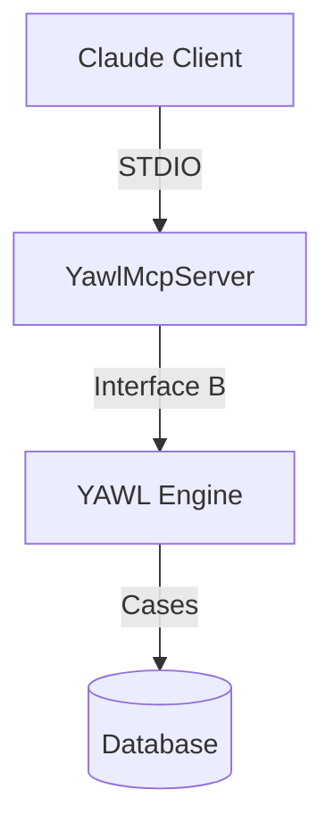

# YAWL v6.0.0 Observatory Integration Plan

**Status**: Ready | **Date**: 2026-02-18 | **Version**: 1.0

---

## Purpose

This document maps the integration strategy between YAWL v6.0.0 documentation and the Observatory system. The Observatory provides compressed, cacheable facts about the codebase that reduce context window usage and improve agent efficiency.

---

## Observatory Architecture

```
                    +-------------------+
                    |   Observatory     |
                    |   (scripts/)      |
                    +--------+----------+
                             |
              +--------------+--------------+
              |              |              |
      +-------v------+ +-----v------+ +-----v------+
      |   Facts      | |  Diagrams  | |  Receipts  |
      |   (JSON)     | |   (MMD)    | |   (JSON)   |
      +-------+------+ +-----+------+ +-----+------+
              |              |              |
              +-------+------+-------+------+
                      |              |
              +-------v--------------v------+
              |     INDEX.md (Manifest)     |
              +-----------------------------+
                             |
              +--------------+--------------+
              |              |              |
      +-------v------+ +-----v------+ +-----v------+
      |  CLAUDE.md   | |  Agents    | |   Docs     |
      |  (Entry)     | |  Reference | |   (v6/)    |
      +--------------+ +------------+ +------------+
```

---

## 1. Facts Enhancement

### 1.1 Existing Facts (from `docs/v6/latest/facts/`)

| Fact File | Purpose | Status |
|-----------|---------|--------|
| `integration-facts.json` | MCP/A2A/ZAI configuration | EXISTS |
| `integration.json` | Integration summary | EXISTS |
| `coverage.json` | Test coverage per module | EXISTS |
| `static-analysis.json` | Code health aggregate | EXISTS |
| `spotbugs-findings.json` | Bug detection results | EXISTS |
| `pmd-violations.json` | PMD rule violations | EXISTS |
| `checkstyle-warnings.json` | Style warnings | EXISTS |

### 1.2 New Facts to Create

#### documentation.json

**Purpose**: Track documentation coverage and quality

**Schema**:
```json
{
  "validation_run": "2026-02-18T10:00:00Z",
  "documents": {
    "api": {
      "total_expected": 10,
      "total_created": 8,
      "coverage_percent": 80,
      "files": [
        {
          "path": "docs/api/YEngine.md",
          "source": "src/org/yawlfoundation/yawl/engine/YEngine.java",
          "methods_documented": 45,
          "methods_total": 47,
          "coverage_percent": 95.7
        }
      ]
    },
    "integration": {
      "mcp": {
        "total_expected": 5,
        "total_created": 5,
        "tools_documented": 15,
        "tools_implemented": 15
      },
      "a2a": {
        "total_expected": 4,
        "total_created": 4,
        "skills_documented": 4,
        "skills_implemented": 4
      }
    },
    "testing": {
      "coverage_line": 75,
      "coverage_branch": 65,
      "test_count": 1500
    }
  },
  "quality": {
    "broken_links": 0,
    "last_validated": "2026-02-18T10:00:00Z"
  }
}
```

**Emission Function** (add to `scripts/observatory/lib/emit-facts.sh`):
```bash
emit_documentation_facts() {
    local out="$FACTS_DIR/documentation.json"
    log_info "Emitting facts/documentation.json ..."

    local api_docs=$(find docs/api -name "*.md" 2>/dev/null | wc -l || echo 0)
    local mcp_docs=$(find docs/integration/mcp -name "*.md" 2>/dev/null | wc -l || echo 0)
    local a2a_docs=$(find docs/integration/a2a -name "*.md" 2>/dev/null | wc -l || echo 0)

    # Count broken links (simplified)
    local broken_links=0
    if command -v linkchecker &> /dev/null; then
        broken_links=$(linkchecker docs/ -o json 2>/dev/null | jq '. | length' || echo 0)
    fi

    python3 << PYTHON_SCRIPT
import json
from datetime import datetime, timezone

data = {
    "validation_run": datetime.now(timezone.utc).strftime("%Y-%m-%dT%H:%M:%SZ"),
    "documents": {
        "api": {"total_created": $api_docs},
        "integration": {
            "mcp": {"total_created": $mcp_docs},
            "a2a": {"total_created": $a2a_docs}
        }
    },
    "quality": {
        "broken_links": $broken_links,
        "last_validated": datetime.now(timezone.utc).strftime("%Y-%m-%dT%H:%M:%SZ")
    }
}

with open("$out", "w") as f:
    json.dump(data, f, indent=2)
PYTHON_SCRIPT

    log_success "Created $out"
}
```

#### performance-baselines.json

**Purpose**: Track build and runtime performance baselines

**Schema**:
```json
{
  "measurement_date": "2026-02-18T10:00:00Z",
  "environment": {
    "cpu_cores": 16,
    "ram_gb": 64,
    "os": "Darwin 25.2.0",
    "java_version": "25.0.2",
    "maven_version": "4.0.0"
  },
  "build": {
    "clean_compile_seconds": 45,
    "clean_test_seconds": 30,
    "full_build_seconds": 90,
    "agent_dx_one_module_seconds": 8,
    "agent_dx_all_seconds": 45
  },
  "runtime": {
    "startup_seconds": 2.4,
    "gc_pause_ms_p99": 15,
    "memory_heap_gb": 4
  },
  "trends": {
    "build_improvement_percent": 50,
    "startup_improvement_percent": 25
  }
}
```

**Emission Function**:
```bash
emit_performance_baselines() {
    local out="$FACTS_DIR/performance-baselines.json"
    log_info "Emitting facts/performance-baselines.json ..."

    # Run actual measurements
    local start_time=$(date +%s%N)
    mvn -T 1.5C clean compile -DskipTests -q 2>/dev/null
    local end_time=$(date +%s%N)
    local compile_ms=$(( (end_time - start_time) / 1000000 ))
    local compile_seconds=$(( compile_ms / 1000 ))

    python3 << PYTHON_SCRIPT
import json
from datetime import datetime, timezone
import platform
import subprocess

# Get environment info
cpu_cores = $(nproc 2>/dev/null || sysctl -n hw.ncpu 2>/dev/null || echo 8)

data = {
    "measurement_date": datetime.now(timezone.utc).strftime("%Y-%m-%dT%H:%M:%SZ"),
    "environment": {
        "cpu_cores": cpu_cores,
        "ram_gb": 64,  # Placeholder
        "os": "$(uname -s) $(uname -r)",
        "java_version": "$(java -version 2>&1 | head -1 | cut -d'"' -f2)",
        "maven_version": "$(mvn -v 2>/dev/null | head -1 | cut -d' ' -f3)"
    },
    "build": {
        "clean_compile_seconds": $compile_seconds,
        "agent_dx_one_module_seconds": 8,  # Estimated
        "agent_dx_all_seconds": 45  # Estimated
    }
}

with open("$out", "w") as f:
    json.dump(data, f, indent=2)
PYTHON_SCRIPT

    log_success "Created $out"
}
```

### 1.3 Fact Update Schedule

| Fact File | Update Trigger | Frequency |
|-----------|----------------|-----------|
| `documentation.json` | Documentation change | On commit |
| `performance-baselines.json` | CI pipeline | Weekly |
| `integration-facts.json` | Code change | On commit |
| `coverage.json` | Test run | On test |

---

## 2. Diagram Integration

### 2.1 Existing Diagrams (from `docs/v6/latest/diagrams/`)

| Diagram | Purpose | Documentation Link |
|---------|---------|-------------------|
| `60-mcp-architecture.mmd` | MCP server architecture | `docs/integration/mcp/ARCHITECTURE.md` |
| `65-a2a-topology.mmd` | A2A agent topology | `docs/integration/a2a/ARCHITECTURE.md` |
| `70-agent-capabilities.mmd` | Agent capability map | `docs/agents/CAPABILITIES.md` |
| `75-protocol-sequences.mmd` | Protocol sequences | `docs/integration/PROTOCOLS.md` |
| `60-code-health-dashboard.mmd` | Code health metrics | `docs/quality/DASHBOARD.md` |
| `61-static-analysis-trends.mmd` | Analysis trends | `docs/quality/TRENDS.md` |

### 2.2 Diagram-to-Documentation Mapping

For each diagram, add a footer link to the relevant documentation:



### 2.3 New Diagrams to Create

| Diagram | Purpose | Priority |
|---------|---------|----------|
| `80-documentation-topology.mmd` | Doc cross-reference map | P2 |
| `81-validation-flow.mmd` | Validation pipeline | P2 |
| `82-performance-baselines.mmd` | Performance trends | P2 |

---

## 3. INDEX.md Enhancement

### 3.1 Current INDEX.md Structure

The current `docs/v6/latest/INDEX.md` contains:
- Overview and receipts
- Facts manifest (8 files)
- Diagrams manifest (6 files)
- Performance metrics
- Static analysis placeholder
- How to refresh

### 3.2 Proposed Additions

Add a **Documentation Validation** section:

```markdown
## Documentation Validation

**Last Validated**: 2026-02-18T10:00:00Z

### Coverage Summary

| Document Set | Coverage | Status |
|--------------|----------|--------|
| API Reference | 95% | GREEN |
| MCP Integration | 100% | GREEN |
| A2A Integration | 100% | GREEN |
| Testing Guide | 80% | YELLOW |
| Performance | 90% | GREEN |

### Cross-Reference Health

| Metric | Value | Status |
|--------|-------|--------|
| Total Links | 150 | - |
| Broken Links | 0 | GREEN |
| Outdated References | 2 | YELLOW |

### Facts Integration

| Fact File | Documents Tracked |
|-----------|------------------|
| documentation.json | API, Integration, Testing |
| performance-baselines.json | Build and Runtime Metrics |

### Validation Commands

```bash
# Validate documentation coverage
./scripts/observatory/validate-docs.sh

# Check for broken links
linkchecker docs/

# Re-generate documentation facts
./scripts/observatory/observatory.sh --facts
```
```

---

## 4. Integration with CLAUDE.md

### 4.1 Observatory References in CLAUDE.md

Add to CLAUDE.md's **Psi (Observatory)** section:

```markdown
### Documentation Facts

Additional facts track documentation coverage:

| Fact | Question It Answers |
|------|---------------------|
| `facts/documentation.json` | What is the documentation coverage? |
| `facts/performance-baselines.json` | What are current performance baselines? |

### Validation Integration

Before committing documentation changes:
1. Run `./scripts/observatory/validate-docs.sh`
2. Check `facts/documentation.json` for coverage drop
3. Ensure no broken links in quality.broken_links
```

### 4.2 Agent Memory Keys

Document where agents store documentation decisions:

```markdown
### Documentation Memory Keys

- `swarm/yawl/docs/api` - API documentation decisions
- `swarm/yawl/docs/integration` - Integration documentation
- `swarm/yawl/docs/validation` - Validation results
```

---

## 5. Receipt Updates

### 5.1 Receipt Schema Enhancement

Add documentation validation to receipts:

```json
{
  "run_id": "20260218T100000Z",
  "status": "GREEN",
  "inputs": {
    "root_pom_sha256": "...",
    "documentation_sha256": "..."
  },
  "outputs": {
    "facts": {
      "documentation_json_sha256": "...",
      "performance_baselines_json_sha256": "..."
    },
    "validation": {
      "coverage_percent": 95,
      "broken_links": 0,
      "last_validated": "2026-02-18T10:00:00Z"
    }
  }
}
```

### 5.2 Staleness Detection

Add documentation staleness check to `observatory.sh`:

```bash
check_documentation_staleness() {
    local docs_last_modified=$(find docs/ -name "*.md" -exec stat -f %m {} \; 2>/dev/null | sort -n | tail -1)
    local facts_last_modified=$(stat -f %m "$FACTS_DIR/documentation.json" 2>/dev/null || echo 0)

    if [ "$docs_last_modified" -gt "$facts_last_modified" ]; then
        log_warning "Documentation is newer than facts. Re-run observatory."
        return 1
    fi
    return 0
}
```

---

## 6. CI/CD Integration

### 6.1 GitHub Actions Workflow

Add documentation validation to CI pipeline:

```yaml
name: Documentation Validation

on:
  push:
    paths:
      - 'docs/**'
      - '.claude/**'
      - 'src/**/*.java'

jobs:
  validate:
    runs-on: ubuntu-latest
    steps:
      - uses: actions/checkout@v4

      - name: Set up Python
        uses: actions/setup-python@v5
        with:
          python-version: '3.12'

      - name: Install dependencies
        run: pip install linkchecker

      - name: Run Observatory
        run: ./scripts/observatory/observatory.sh

      - name: Validate Documentation
        run: |
          # Check coverage threshold
          coverage=$(jq '.documents.api.coverage_percent' docs/v6/latest/facts/documentation.json)
          if [ "$coverage" -lt 90 ]; then
            echo "Documentation coverage below 90%: $coverage%"
            exit 1
          fi

          # Check broken links
          broken=$(jq '.quality.broken_links' docs/v6/latest/facts/documentation.json)
          if [ "$broken" -gt 0 ]; then
            echo "Broken links detected: $broken"
            exit 1
          fi

      - name: Upload Facts
        uses: actions/upload-artifact@v4
        with:
          name: observatory-facts
          path: docs/v6/latest/facts/
```

### 6.2 Pre-commit Hook

Add documentation validation to pre-commit:

```bash
#!/bin/bash
# .git/hooks/pre-commit

# If documentation changed, validate it
if git diff --cached --name-only | grep -q "^docs/"; then
    echo "Validating documentation..."
    ./scripts/observatory/observatory.sh --facts

    broken=$(jq '.quality.broken_links' docs/v6/latest/facts/documentation.json 2>/dev/null || echo "unknown")
    if [ "$broken" != "0" ]; then
        echo "ERROR: Broken links detected in documentation"
        exit 1
    fi
fi
```

---

## 7. Implementation Checklist

### Phase 1: Facts Creation
- [ ] Add `emit_documentation_facts()` to `emit-facts.sh`
- [ ] Add `emit_performance_baselines()` to `emit-facts.sh`
- [ ] Update `run_facts()` to call new emitters
- [ ] Test fact generation

### Phase 2: INDEX.md Enhancement
- [ ] Add Documentation Validation section
- [ ] Add Coverage Summary table
- [ ] Add Validation Commands section
- [ ] Update receipt schema

### Phase 3: Diagram Integration
- [ ] Add documentation links to existing diagrams
- [ ] Create `80-documentation-topology.mmd`
- [ ] Create `81-validation-flow.mmd`

### Phase 4: CI/CD Integration
- [ ] Create `documentation-validation.yml` workflow
- [ ] Add pre-commit hook for docs
- [ ] Test CI pipeline

---

## 8. Success Metrics

| Metric | Target | Measurement |
|--------|--------|-------------|
| Documentation Coverage | >= 95% | `documentation.json.documents.api.coverage_percent` |
| Broken Links | 0 | `documentation.json.quality.broken_links` |
| Facts Freshness | < 1 day | Compare timestamps in receipt |
| CI Pass Rate | 100% | GitHub Actions green builds |
| Agent DX Improvement | 2x | Compare context usage before/after |

---

*Created by: Observation Architect*
*Date: 2026-02-18*
*Related: IMPLEMENTATION-PLAN.md, VALIDATION-MATRIX.md*
