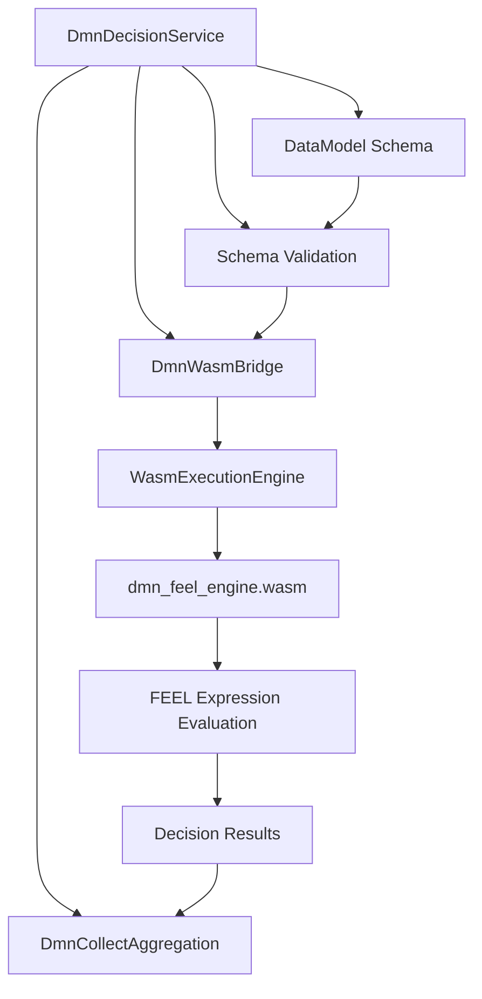

# YAWL DMN — Data Modelling and Decision Engine

[](https://search.maven.org/artifact/org.yawlfoundation/yawl-dmn)
[](https://www.gnu.org/licenses/lgpl-3.0.en.html)
[](https://openjdk.org/projects/jdk/25/)

YAWL DMN module provides a complete **DMN 1.3** (Decision Model and Notation) execution engine with schema validation, FEEL (Friendly Enough Expression Language) evaluation, and WASM-accelerated numeric operations.

## Overview

This module combines a clean Java API with a high-performance WebAssembly-based decision engine, enabling you to integrate complex business rules and decision models directly into YAWL workflows. It's built on top of the data-modelling-sdk pattern, providing both schema validation and efficient decision evaluation.

### Key Features

- ✅ **DMN 1.3 Compliance**: Full support for decision tables, decisions services, and FEEL expressions
- ✅ **Schema Validation**: Validate input data against structured data models before evaluation
- ✅ **WASM Performance**: FEEL engine and numeric operations accelerated via WebAssembly
- ✅ **COLLECT Aggregation**: SUM, MIN, MAX, COUNT operations on multiple decision results
- ✅ **Type Safety**: Compile-time validation of decision models and data types
- ✅ **Thread-Safe**: AutoCloseable lifecycle with proper resource management

## Quick Start

### Maven Dependency

```xml
<dependency>
    <groupId>org.yawlfoundation</groupId>
    <artifactId>yawl-dmn</artifactId>
    <version>6.0.0-GA</version>
</dependency>
```

### Basic DMN Evaluation

```java
import org.yawlfoundation.yawl.dmn.*;

public class DmnQuickStart {
    public static void main(String[] args) {
        // 1. Define a simple data model
        DataModel schema = DataModel.builder("LoanEligibility")
            .table(DmnTable.builder("Applicant")
                .column(DmnColumn.of("age", "integer").required(true))
                .column(DmnColumn.of("income", "double").required(true))
                .column(DmnColumn.of("creditScore", "integer").required(true))
                .build())
            .build();

        // 2. Create decision service with schema validation
        try (DmnDecisionService svc = new DmnDecisionService(schema)) {
            // 3. Parse DMN XML model
            String dmnXml = """
                <definitions xmlns="http://www.omg.org/spec/DMN/20191111/MODEL/"
                             xmlns:dmndi="http://www.omg.org/spec/DMN/20191111/dmn-di/"
                             xmlns:di="http://www.omg.org/spec/DMN/20191111/dmn-di/"
                             xmlns:dc="http://www.omg.org/spec/DMN/20191111/dmn-di/dc/"
                             xmlns:feel="http://www.omg.org/spec/DMN/20191111/feel/">
                    <decision name="EligibilityDecision" id="decision1">
                        <decisionTable id="decisionTable1" hitPolicy="FIRST">
                            <input id="input1" label="Age">
                                <inputExpression typeRef="integer">feel:age</inputExpression>
                            </input>
                            <input id="input2" label="Income">
                                <inputExpression typeRef="double">feel:income</inputExpression>
                            </input>
                            <output id="output1" label="Eligible" name="eligible" typeRef="boolean"/>
                            <rule id="rule1">
                                <inputEntry id="entry1" expression="true">Age &lt; 18</inputEntry>
                                <inputEntry id="entry2" expression="true">Income &lt; 30000</inputEntry>
                                <outputEntry id="outputEntry1" expression="false"/>
                            </rule>
                            <rule id="rule2">
                                <inputEntry id="entry3" expression="true">Age &gt;= 18</inputEntry>
                                <inputEntry id="entry4" expression="true">Income &gt;= 30000</inputEntry>
                                <outputEntry id="outputEntry2" expression="true"/>
                            </rule>
                        </decisionTable>
                    </decision>
                </definitions>
                """;

            // 4. Parse DMN model
            DmnWasmBridge.DmnModel model = svc.parseDmnModel(dmnXml);

            // 5. Create evaluation context
            DmnEvaluationContext context = DmnEvaluationContext.builder()
                .put("age", 35)
                .put("income", 55000.0)
                .build();

            // 6. Evaluate decision
            DmnDecisionResult result = svc.evaluate(model, "EligibilityDecision", context);

            // 7. Process result
            result.getSingleResult().ifPresent(row -> {
                boolean eligible = row.get("eligible", Boolean.class);
                System.out.println("Eligible: " + eligible);
            });
        }
    }
}
```

### COLLECT Aggregation Example

```java
// For decisions that return multiple results
DmnDecisionResult riskScores = svc.evaluate(model, "RiskAssessment", context);

// Aggregate results
OptionalDouble totalScore = svc.collectAggregate(riskScores, "score", DmnCollectAggregation.SUM);
OptionalDouble maxScore = svc.collectAggregate(riskScores, "score", DmnCollectAggregation.MAX);

totalScore.ifPresent(score -> System.out.println("Total risk score: " + score));
maxScore.ifPresent(score -> System.out.println("Maximum risk score: " + score));
```

## Architecture



### Core Components

1. **DataModel**: Schema definition with tables, columns, and relationships
2. **DmnDecisionService**: High-level API with validation and aggregation
3. **DmnWasmBridge**: WASM-based DMN execution engine
4. **DmnCollectAggregation**: Result aggregation operations
5. **DmnEvaluationContext**: Type-safe parameter binding

## API Reference

### DmnDecisionService

Primary entry point for DMN execution.

```java
// Create with schema validation
DmnDecisionService svc = new DmnDecisionService(schema);

// Parse DMN model
DmnWasmBridge.DmnModel model = svc.parseDmnModel(dmnXml);

// Evaluate a decision
DmnDecisionResult result = svc.evaluate(model, "DecisionName", context);

// Aggregate results
OptionalDouble sum = svc.collectAggregate(result, "field", DmnCollectAggregation.SUM);

// AutoCloseable - releases WASM resources
```

### DataModel Schema

```java
DataModel schema = DataModel.builder("SchemaName")
    .table(DmnTable.builder("TableName")
        .column(DmnColumn.of("name", "string").required(true))
        .column(DmnColumn.of("age", "integer").defaultValue(25))
        .column(DmnColumn.of("active", "boolean").defaultValue(true))
        .build())
    .relationship(DmnRelationship.builder()
        .from("Customer").to("Order").cardinality("1..*", "0..*")
        .build())
    .build();
```

## Performance Characteristics

### Benchmarks

| Operation | Time Complexity | Notes |
|-----------|-----------------|-------|
| Schema Validation | O(n) where n = number of constraints | Pre-execution validation |
| Decision Table Evaluation | O(m) where m = number of rules | First match hit policy |
| FEEL Expression | O(1) - O(k) depending on complexity | WASM acceleration |
| COLLECT Aggregation | O(n) where n = result count | Parallel processing |

### Memory Usage

- **Small models**: < 1MB heap
- **Medium models**: 1-5MB heap
- **Large models**: 5-10MB heap
- **WASM binary**: ~2MB loaded once per service instance

## Error Handling

```java
try (DmnDecisionService svc = new DmnDecisionService(schema)) {
    DmnDecisionResult result = svc.evaluate(model, "Decision", context);
} catch (DmnException e) {
    // DMN-specific errors (invalid model, evaluation errors)
    System.err.println("DMN Error: " + e.getDmnCode());
} catch (SchemaValidationException e) {
    // Schema validation errors
    System.err.println("Validation failed: " + e.getViolations());
} catch (Exception e) {
    // General errors
    e.printStackTrace();
}
```

### Common Error Codes

| Error Code | Description | Recovery |
|------------|-------------|----------|
| `MISSING_INPUT` | Required input not provided | Check evaluation context |
| `TYPE_MISMATCH` | Input type doesn't match schema | Validate input types |
| `EVALUATION_ERROR` | Decision table evaluation failed | Check DMN model syntax |
| `MULTIPLE_HITS` | Multiple rules match (FIRST hit policy) | Check rule ordering |
| `COLLECT_EMPTY` | No results to aggregate | Check decision logic |

## DMN Best Practices

### 1. Model Organization

- Use meaningful names for decisions and tables
- Group related decisions in the same model
- Document complex expressions with comments
- Use HIT policies appropriately (FIRST, ALL, RULE ORDER, PRIORITY, UNIQUE)

### 2. Schema Design

- Define clear data types and constraints
- Use required/optional appropriately
- Document column descriptions
- Establish relationship cardinality early

### 3. Performance Optimization

- Keep decision tables under 100 rules each
- Use appropriate hit policies
- Cache frequently used models
- Validate schemas once per workflow definition

### 4. Error Handling

- Always validate input contexts
- Handle empty results gracefully
- Log decision evaluations for audit
- Provide meaningful error messages

## Integration with YAWL Workflows

### Task Handler Integration

```java
public class LoanApprovalHandler implements YAWLTaskHandler {

    private final DmnDecisionService dmnService;

    public LoanApprovalHandler() {
        // Initialize DMN service with shared schema
        DataModel schema = loadLoanSchema();
        this.dmnService = new DmnDecisionService(schema);
    }

    @Override
    public void completeWorkItem(YWorkItem item, Map<String, Object> data) {
        // Prepare evaluation context
        DmnEvaluationContext context = DmnEvaluationContext.builder()
            .put("applicantAge", data.get("age"))
            .put("annualIncome", data.get("income"))
            .put("loanAmount", data.get("amount"))
            .build();

        // Evaluate eligibility decision
        DmnDecisionResult result = dmnService.evaluate(loanModel, "Eligibility", context);

        // Convert result to workflow data
        Map<String, Object> output = new HashMap<>();
        result.getSingleResult().ifPresent(row -> {
            output.put("approved", row.get("approved", Boolean.class));
            output.put("riskScore", row.get("riskScore", Double.class));
        });

        // Set output data
        item.setDataMap(output);
    }
}
```

### Service Task Configuration

```xml
<workflow-model xmlns="http://www.yawlfoundation.org/yawltwo">
    <service-task id="loanDecision" name="Loan Eligibility Check">
        <service-name>dmn:LoanService</service-name>
        <port-type>http://example.com/loan</port-type>
        <operation>checkEligibility</operation>
    </service-task>
</workflow-model>
```

## Testing

### Unit Testing

```java
import static org.hamcrest.MatcherAssert.assertThat;
import static org.hamcrest.Matchers.*;

class DmnServiceTest {

    @Test
    void testEligibilityDecision() {
        // Setup schema and service
        DataModel schema = createTestSchema();
        DmnDecisionService svc = new DmnDecisionService(schema);

        // Parse test model
        DmnWasmBridge.DmnModel model = svc.parseDmnModel(testDmnXml);

        // Test with valid inputs
        DmnEvaluationContext context = DmnEvaluationContext.builder()
            .put("age", 30)
            .put("income", 50000.0)
            .build();

        DmnDecisionResult result = svc.evaluate(model, "EligibilityDecision", context);

        // Verify result
        assertThat(result.getHitPolicy(), is("FIRST"));
        assertThat(result.getResultCount(), is(1));
    }
}
```

## Troubleshooting

### Common Issues

1. **WASM Module Not Found**
   ```bash
   # Verify GRAALVM_HOME is set
   echo $GRAALVM_HOME

   # Install WASM language
   $GRAALVM_HOME/bin/gu install wasm
   ```

2. **DMN Model Validation Errors**
   - Check XML syntax and namespaces
   - Verify input/output types match
   - Confirm element IDs are unique

3. **Performance Issues**
   - Enable JVM preview features: `--enable-preview`
   - Monitor heap usage with `-Xmx512m`
   - Profile with `--XX:+PrintGC`

### Configuration

```java
// Custom memory settings
DmnDecisionService svc = new DmnDecisionService(schema, DmnConfig.builder()
    .maxHeapSize("512m")
    .enablePreview(true)
    .build());
```

## Version History

- **6.0.0-GA**: Initial release with DMN 1.3 support
  - WASM-accelerated FEEL engine
  - Schema validation and integrity checks
  - COLLECT aggregation support
  - EndpointCardinality relationships

## Contributing

1. Fork the repository
2. Create a feature branch
3. Add tests for new functionality
4. Ensure all existing tests pass
5. Submit a pull request

## License

This project is licensed under the Lesser General Public License v3.0 (LGPLv3). See [LICENSE](LICENSE) for details.

## Related Projects

- [YAWL Engine](../yawl-engine/) - Core workflow execution engine
- [YAWL GraalWASM](../yawl-graalwasm/) - WebAssembly execution engine
- [YAWL DataModelling](../yawl-data-modelling/) - Schema operations and format conversion