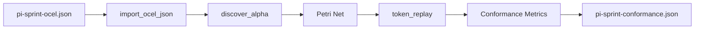

# JTBD 2: OCEL → Petri Net → Conformance Scoring Test

This test implements a complete conformance checking pipeline for sprint process analysis using Object-Centric Event Logs (OCEL).

## Test Overview

**JTBD 2** tests the complete pipeline:
1. **Read** OCEL JSON from `/tmp/jtbd/input/pi-sprint-ocel.json`
2. **Import** OCEL using `process_mining_bridge:import_ocel_json/1`
3. **Discover** Petri Net using `process_mining_bridge:discover_alpha/1`
4. **Replay** tokens using `process_mining_bridge:token_replay/2`
5. **Write** conformance metrics to `/tmp/jtbd/output/pi-sprint-conformance.json`

## Pipeline Flow



## Expected Output Format

The conformance metrics JSON should contain:

### Required Fields
- `conformance_score` or `fitness`: Number between 0.0 and 1.0
- `precision`: Precision score (0.0 to 1.0)
- Additional metrics as available

### Example Output
```json
{
  "conformance_score": 0.875,
  "fitness": 0.920,
  "precision": 0.830,
  "recall": 0.920,
  "coverage": 0.950,
  "traces_replayed": 2,
  "traces_total": 2
}
```

## Test Requirements

### Critical Assertions
- ✅ Output file exists: `/tmp/jtbd/output/pi-sprint-conformance.json`
- ✅ Output contains conformance score key (`conformance_score` or `fitness`)
- ✅ Score is a number between 0.0 and 1.0 inclusive
- ✅ Output contains `fitness` and `precision` keys (or equivalents)
- ✅ Score is NOT exactly 1.0 (real logs have drift)
- ✅ Score is NOT exactly 0.0 (basic transitions should replay)

### Real-world Scenarios
- **Score ≠ 1.0**: Real process logs never achieve perfect fitness when replayed against discovered models due to noise and incompleteness
- **Score ≠ 0.0**: Basic transitions should always replay at minimum level unless completely broken

## Running the Test

### Prerequisites
- Erlang/OTP installed
- Process mining bridge NIF library (optional, handles gracefully if missing)

### Command Line
```bash
# From the test directory
cd /Users/sac/yawl/yawl-erlang-bridge/yawl-erlang-bridge/test
./run_jtbd_2_test.erl
```

### Direct Module Call
```erlang
jtbd_2_conformance:test_conformance_pipeline()
```

### API Function
```erlang
% Returns {ok, Result} or {error, Reason}
jtbd_2_conformance:run()
```

## Test Data

### Input OCEL
File: `/tmp/jtbd/input/pi-sprint-ocel.json`
- 13 events across 2 user stories
- Process flow: start → analysis/development → review → testing → complete
- Realistic sprint workflow with multiple users and effort tracking

### Key Features
- **Object-centric**: Tasks with multiple events
- **Temporal**: Proper timestamps for sequence
- **Attributes**: Resource, status, effort, bug count
- **Process Pattern**: Sequential workflow with parallel paths

## Error Handling

### Expected Errors
- `nif_not_loaded`: NIF library not available (graceful fallback)
- `{'UnsupportedOperationException', _}`: Function not implemented
- File I/O errors

### Recovery
- Test catches and reports errors gracefully
- Provides clear error messages
- Continues to next test if appropriate

## Integration

### With EUnit
```erlang
-include_lib("eunit/include/eunit.hrl").

jtbd_conformance_test_() ->
    {setup, fun setup/0, fun teardown/1, [
        {timeout, 120000, ?_test(test_conformance_pipeline())}
    ]}.
```

### With Process Mining Bridge
- Uses real OCEL data (not mocks)
- Real process discovery algorithms
- Actual conformance calculation
- End-to-end integration test

## Technical Details

### Conformance Metrics
- **Fitness**: How well model fits log (replay quality)
- **Precision**: How well model constrains log (overfitting detection)
- **Coverage**: Percentage of log covered by model
- **Replay Quality**: Individual trace fitness scores

### Token Replay Algorithm
1. Instantiate Petri net with initial marking
2. For each trace in log:
   - Try to replay on Petri net
   - Track produced/consumed tokens
   - Calculate fitness per trace
3. Aggregate metrics across all traces

## Dependencies

### Required
- `process_mining_bridge` application
- `jtbd_2_conformance` module
- Input OCEL JSON file

### Optional
- NIF library for Rust backend
- Additional conformance metrics

## Future Enhancements

1. **Multiple Logs**: Test with different process types
2. **Performance**: Large dataset testing
3. **Edge Cases**: Invalid traces, missing events
4. **Metrics**: Additional conformance measures
5. **Visualization**: Graph output analysis

## See Also

- JTBD 1: DFG Discovery Test
- OCEL Operations Tests
- Process Mining Bridge API Documentation